# Pipeline Engine: Architecture Overview

## Introduction

The Pipeline Engine is a powerful and flexible data processing system designed for building complex, scalable, and language-agnostic data workflows. It excels at document extraction and manipulation, making it an ideal foundation for creating sophisticated search engine pipelines. Out of the box, the system allows you to define multiple data processing pipelines that can ingest data from various sources (like websites, file systems, or databases), process it through a series of transformation steps (like parsing, chunking, and embedding), and load it into search backends like OpenSearch.

### Separation of concerns

The system is set up to be a true microservice architecture, with each component running in its own container. This means that each component is self-contained and can be deployed independently.

As such, it's important to know the key parts at play: the **Engine**, the **modules**, and the **Repository Service**.

#### Diagram: engine, modules, and repository service

The system is designed so that processing steps can be extended and customized by developers. This allows teams to create custom modules for specific tasks such as parsing, chunking, or embedding.  To minimize the complexity of the system, the Engine is the central hub of the system. It receives data from one module, looks at the pipeline's configuration to decide what to do next, and then sends the data to the next module in the sequence. The modules themselves are simple, focused gRPC services that just do their one job and report the results back to the Engine.  Each step can be processed synchronously through grpc (which has a 2GB size limit) or asynchronously through kafka with an S3 payload that is stored through the repository service.

The design was done with this in mind, and having a language-agnostic module allows teams to use the best tool for the job or leverage existing codebases.

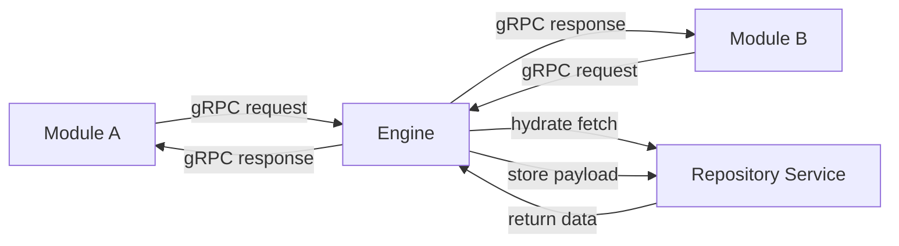

#### Engine

The Engine is the central hub of the system. It receives data from one module, looks at the pipeline's configuration to decide what to do next, and then sends the data to the next module in the sequence. The modules themselves are simple, focused gRPC services that just do their one job and report the results back to the Engine.

The engine works with a generic network design in mind - it manages a conceptual network of nodes (which are module instances) in a fan-in and fan-out fashion.  This creates a tree network of nodes that can be used to build complex pipelines. 

#### Modules

Modules are the workhorses of the pipeline, and they can be written in any programming language that supports gRPC (such as Python, Go, Node.js, or Rust). This allows teams to use the best tool for the job or leverage existing codebases.

Each module is responsible for a single, specific task, such as parsing a document, chunking text, or generating embeddings. They are language-agnostic.  Furthermore, custom configuration parameters can be passed to modules, which allows teams to customize the behavior of each module.  This is done with an OpenAPI specification that defines the module's interface, which automatically renders a UI for configuring the module.

#### Repository Service

The Repository Service manages digital assets and acts as a textual digital asset manager (TDAM). It can receive data from one module and offload the payload to minimize the size of engine communication overhead. It can also hydrate data when the engine requests it.  This is done with a simple gRPC interface that allows the engine to store and retrieve data.  The Repository Service is built on top of S3, which provides a scalable and reliable storage solution.  It's metadata is stored in a mysql database, which allows for fast lookups.

The Engine is the central hub that manages the entire data flow. It receives data from one module, looks at the pipeline's configuration to decide what to do next, and then sends the data to the next module in the sequence. The modules themselves are simple, focused gRPC services that just do their one job and report the results back to the Engine.

### Account Service (MVP)

The platform introduces a minimal Account Service to associate connectors with an owning entity and to prepare for authentication in ingestion flows. The service is currently implemented inside the `repo-service` application (`AccountServiceImpl` plus the `Account` entity and Flyway migration) and exposes create, get, and inactivate RPCs defined in `grpc/grpc-stubs/src/main/proto/repository/account/account_service.proto`. Work is underway in this branch to extract that logic into a dedicated Quarkus service while preserving the existing API surface. There are no users or roles yet.

Connectors and intake flows will (once the connector-intake service is in place) authenticate using account-scoped API keys; intake will enrich each document with `{ account_id, connector_id }` and optional storage hints. This separation keeps ingestion simple while enabling multi-tenant routing and storage strategies in downstream services like the Repository Service. For details, see: [Account Service (MVP)](./account/Account_Service_MVP.md).

### Network Graph Architecture

The pipeline is structured as a **network graph** where each node can:

- **Accept multiple inputs** from different sources
- **Generate multiple outputs** to different destinations
- **Connectors** are entry points with no incoming inputs
- **Sinks** are endpoints with no forwarding outputs

### Payload Hydration Strategy

When the Engine receives a gRPC or Kafka message, the payload handling follows this pattern:

- **Raw Data**: If no payload ID is set, raw data is passed directly to the module
- **Hydrated Data**: If a payload ID is set, the Engine requests data from the Repository Service to hydrate the full request before sending to the module
- **Engine Output**: Module results return to the Engine, which determines the next destination (gRPC, Kafka with repository offload, etc.)

Let's explore this with two examples.

## Core Concepts and Technologies

The Pipeline Engine is built on a set of modern, robust technologies designed for creating distributed systems. Its architecture provides significant flexibility, allowing developers to build and modify complex data pipelines dynamically.

### Architectural Flexibility

A key design principle of the engine is its dynamic nature. Pipeline definitions—the sequence of steps and their configurations—are stored externally in Consul. The Engine reads this configuration at runtime. This is managed through the `PipelineStepConfig` for each step, which defines the module to use, its parameters, and, crucially, where and how to send the output. This means you can:

* **Modify Pipelines without Redeployment:** Change the order of steps, add new steps, or alter a module's configuration on-the-fly. The Engine will detect the changes and adjust its behavior without needing to be restarted or redeployed.
* **Language-Agnostic Modules:** Modules are the workhorses of the pipeline, and they can be written in any programming language that supports gRPC (such as Python, Go, Node.js, or Rust). This allows teams to use the best tool for the job or leverage existing codebases.
* **Proxy for Enhanced Capabilities:** For modules not written in Java, the optional `proxy-module` can be used. This proxy sits in front of a non-Java module and automatically provides it with features from the Java ecosystem, such as advanced telemetry, metrics, security, and standardized testing endpoints, without the module developer needing to implement them.

For a complete breakdown of the configuration hierarchy, from clusters to individual steps, please see the [Pipeline Design](pipeline/Pipeline_design.md) document.

### Components at a Glance

| Component              | Role                                | Technology       | Description                                                                                                                                                                                     |
|:---------------------- |:----------------------------------- |:---------------- |:----------------------------------------------------------------------------------------------------------------------------------------------------------------------------------------------- |
| **Pipeline Engine**    | **Orchestrator**                    | Java (Quarkus)   | The central brain of the system. It reads pipeline configurations, discovers modules, and routes data between them using either gRPC for synchronous calls or Kafka for asynchronous messaging. |
| **Modules**            | **Workers**                         | Any (gRPC)       | Standalone gRPC services that perform a single, specific task, such as parsing a document, chunking text, or generating embeddings. They are language-agnostic.                                 |
| **Repository Service** | **Payload Hydration & Storage**     | Java (Quarkus)   | Manages payload storage and hydration. When the Engine receives a message with a payload ID, it requests full data from this service before sending to modules.                                 |
| **Consul**             | **Service Registry & Config Store** | HashiCorp Consul | Used for service discovery (so the Pipeline Engine can find modules) and as a Key-Value store for all pipeline configurations.                                                                  |
| **S3**                 | **Document Storage**                | S3/Min.io        | The initial implementation for storing document state and metadata. This will evolve into a generic document storage interface.                                                                 |
| **Kafka**              | **Message Bus (Optional)**          | Apache Kafka     | An optional but recommended transport for asynchronous communication between steps. It provides buffering, durability, and decoupling for high-throughput workflows.                            |
| **Prometheus**         | **Metrics (Optional)**              | Prometheus       | An optional but recommended component for collecting metrics from the Engine and modules for monitoring.                                                                                        |
| **Grafana**            | **Visualization (Optional)**        | Grafana          | An optional but recommended tool for creating dashboards to visualize metrics collected by Prometheus.                                                                                          |
| TODO: other components |                                     |                  |                                                                                                                                                                                                 |

### Technology Stack

* **gRPC:** The primary communication protocol between the Engine and all modules.
* **Protocol Buffers:** Defines the data contracts and service interfaces.
* **Java (Quarkus):** The core Engine is built using the Quarkus framework for high performance and a rich feature set.
* **Docker:** All components, including the Engine and modules, are designed to be run as containers.
* **Consul:** For service discovery and distributed configuration.
* **S3:** For document and state storage.
* **Apache Kafka (Optional):** For asynchronous messaging.
* **Prometheus (Optional):** For metrics collection.
* **Grafana (Optional):** For metrics visualization.

---

## Example 1: A Simple, Serial Document Processing Pipeline

In this scenario, we will trace a single document through a linear pipeline: a connector fetches the document, it gets parsed, chunked, embedded, and finally saved to a single destination.

### Step 1: Connector to Engine

The process starts when a Connector module (no inputs, only outputs) fetches a document and sends it to the Engine.

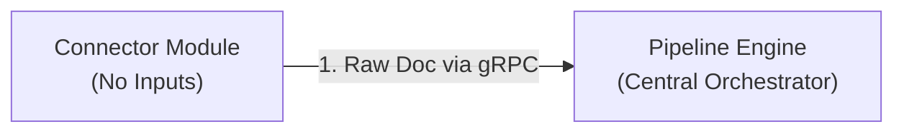

* The `Gutenberg Connector` fetches an e-book.
* It makes a single gRPC call to the **Engine**, sending the raw document data.
* **Key**: The connector has no incoming data streams - it's a source node.

### Step 2: Engine Orchestrates Parser Processing

The Engine determines the next step and handles all communication.

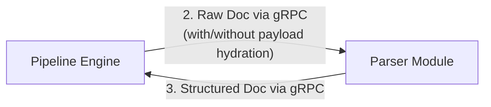

* The Engine may hydrate payload from Repository Service if needed before calling Parser
* The Engine calls the `Parser` module with the (potentially hydrated) document
* The `Parser` cleans the HTML, extracts plain text, and returns structured result **only to the Engine**
* **Key**: Parser never communicates directly with any other module

### Step 3: Engine to Chunker and Back

The pattern repeats. The Engine now sends the parsed text to the `Chunker`.

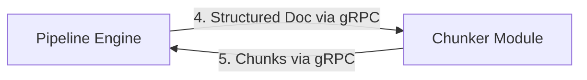

* The Engine calls the `Chunker` module with the structured document.
* The `Chunker` splits the text into smaller pieces and returns these chunks **back to the Engine**.

### Step 4: Engine to Embedder and Back

The chunks are now ready for vector embedding.

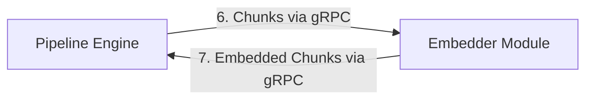

* The Engine calls the `Embedder` module with the document chunks.
* The `Embedder` uses a machine learning model to generate vector embeddings and returns the enriched chunks **back to the Engine**.

### Step 5: Engine to Sink

Finally, the Engine sends the fully processed data to its destination.

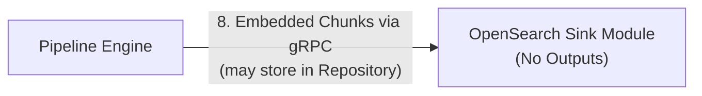

* The Engine may store large payloads in Repository Service and send only ID to Sink
* The Engine calls the `OpenSearch Sink` module with embedded chunks (or payload ID)
* The Sink may hydrate data from Repository Service if needed
* **Key**: Sink has no forwarding outputs - it's an endpoint node
* The Sink indexes data into OpenSearch but doesn't return processed data to Engine

This simple, step-by-step flow, orchestrated entirely by the Engine, forms the basis of all pipeline operations.

---

## Example 2: A Complex Pipeline with Fan-in and Fan-out

Now, let's look at a more advanced scenario that demonstrates the full power of the Engine's orchestration, including A/B testing of different embedding models.

### Step 1: Connectors to Engine (Fan-in)

The pipeline starts by ingesting documents from multiple sources simultaneously.

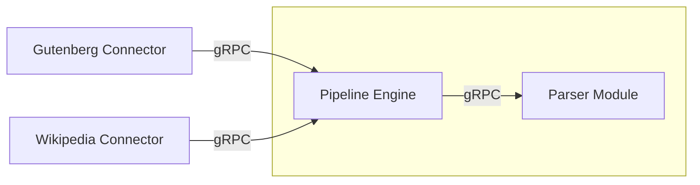

* Both the `Gutenberg Connector` and `Wikipedia Connector` run in parallel, sending their documents to the **Engine**.
* The Engine receives documents from both sources and, as per the configuration, sends each one to the `Parser` module. This is "fan-in".

### Step 2: Sequential Processing (Parser -> Chunker -> Chunker2)

The initial processing steps are sequential, just like in our simple example. The data flows from `Parser` -> `Engine` -> `Chunker` -> `Engine` -> `Chunker2` -> `Engine`.

### Step 3: Engine to Embedders (Fan-out for A/B Testing)

This is where the pipeline branches. The Engine receives the refined chunks from `Chunker2` and sends them to two different Embedder modules in parallel.

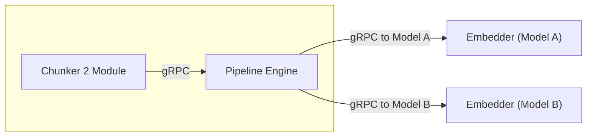

* The Engine makes two separate gRPC calls with the *same chunked data*.
* `Embedder1` uses a general-purpose embedding model.
* `Embedder2` uses a different, experimental model. This is "fan-out".

### Step 4: Embedders to Engine to Sinks (Fan-out to Destinations)

Each embedder returns its results to the Engine, which then sends them to separate destinations for A/B testing.

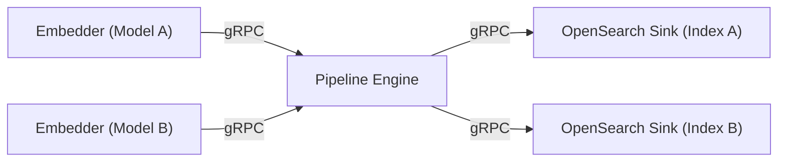

* `Embedder1` returns chunks with "Embedding A" to the Engine. The Engine forwards this data to `OpenSearch Sink 1`, which writes to `Index A`.
* `Embedder2` returns chunks with "Embedding B" to the Engine. The Engine forwards this data to `OpenSearch Sink 2`, which writes to `Index B`.
* Now you can run search queries against both OpenSearch indices to compare the performance of the two embedding models.

---

## How Kafka Fits In: An Engine-Managed Transport Option

So where does Kafka come in? Kafka is an **optional transport mechanism that the Engine can use internally** to communicate between engine steps. The modules themselves remain simple gRPC services and are unaware of kafka's existance. 

Kafka brings in the ability to reporocess data at anytime and reprocess errors should a step have a bug or an outage.

The choice between a direct gRPC call and sending a message via Kafka is defined in the `transportType` field within the output configuration of a pipeline step. This allows a single step to, for example, send its primary output to the next step via gRPC while also sending a copy to a Kafka topic for logging, auditing, or fast reprocessing.

### Standard Flow (gRPC)

gRPC is the default transport mechanism for all pipeline steps. The Engine handles the orchestration and routing logic, and modules are responsible for processing the data.  gRPC is utilized as a transport layer between engine nodes.  With a 2GB size limit, gRPC is a good choice for small data payloads and large alike.  It's superior over traditional REST interfaces and is quickly becoming an industry norm for processing.

The grpc flow will send data to the next node.  The call itself is asynchronous, but the call itself is synchronous.  This means that the engine will wait for a response from the module before proceeding to the next step in the pipeline.  However, that synchronous flow breaks once successful processing is done.

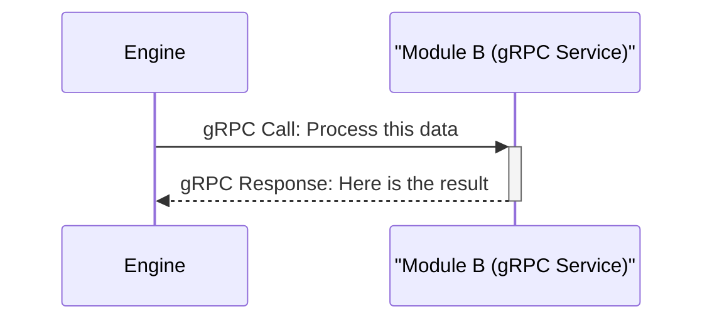

### Asynchronous Flow (Kafka)

Kafka transport would logically create the same output, but it "saves" it's progress along the way, allowing for that pipeline step to "rewind" and reprocess data through the administration of the pipeline.

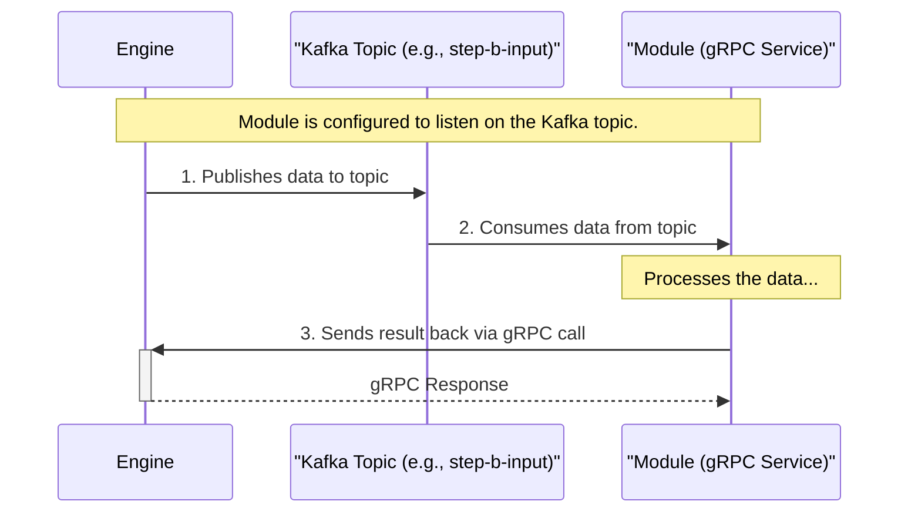

By managing the transport layer, the Engine provides flexibility and resilience. Developers creating modules don't need to worry about Kafka integration; they only need to implement the standard gRPC `PipeStepProcessor` service. This keeps modules simple and focused, while the Engine handles the complex orchestration and routing logic.

---

## Search Architecture: Building a Self-Configuring Search Platform

While the Pipeline Engine handles document processing orchestration, our search strategy focuses on creating a powerful, self-configuring search platform that can serve two distinct purposes:

### The Two Search Worlds

**1. Internal Metadata Search**

- **Purpose**: Fast CRUD operations for the Repository Service itself
- **What it indexes**: Document metadata, processing status, configuration data
- **Technology**: OpenSearch with keyword/filtering capabilities
- **Users**: The system itself for managing its own data efficiently

**2. Customer Document Search**

- **Purpose**: End-user search across processed document content
- **What it indexes**: Actual document text, embeddings, custom customer data
- **Technology**: OpenSearch with hybrid text + vector (kNN) search
- **Users**: End customers searching their document collections

### The Repository Service: A Digital Asset Manager for Text

Think of the Repository Service as a **high-performance Digital Asset Manager (DAM) specifically built for text processing**. It's not just storage - it's an intelligent system that:

- **Stores protobuf data as binary assets** with S3 versioning for speed and reliability
- **Maintains a database-backed ledger** to track every version and change
- **Provides search capabilities** to make CRUD operations lightning-fast
- **Handles payload hydration** - large documents stay in storage while pipeline steps pass around lightweight IDs

This architecture means when you have a 100MB document, the pipeline doesn't copy it 15 times through different processing steps. Instead, it stores it once and passes around a tiny ID that says "go get document X from the repository."

### Self-Configuring Vector Index Strategy

This section goes into a deeper dive as to how we will create a vector search.  It's an advanced feature that requires an understanding of at least basic vector indexing and KNN search.

#### The iPhone vs DSLR analogy

##### Building the DSLR for text mining

There are products that already exist that do turn-key solutions for indexing vectors and creating chunks for search engines.  They do well for most use cases, but for millions of documents and reprocessing, they can be expensive or impossible to scale.

However, to have a scalable solution it requires a little more knowledge into how text processing works. 

##### Photography Analogy: Fashion Week Model Runways

Imagine an event like Fashion Week in NYC - model runways could have over 100 photographers at them.  All of them will have an SLR and none of them an iPhone.  Despite the iPhone's powerful capabilities to handle over 95% of photography situations, the last 5% is the hardest.

Text processing has a similar (but less cool) situation - data hungry AI APIs and advanced search engines do not have a good one-size-fits-all solution because the problem itself is complex.  Managing vectors requires:

* A solid connector to retrieve data

* A pipeline to wrangle the data and clean it

* A chunking strategy for splitting the text up

* Managing the model assets for NLP and embeddings.

None of which are common and/or inexpensive without the overhead of a vendor-lock in.  Furthermore, this is not as much of a technology problem as it is a workflow issue.  The amount of work needed to get a custom off-the-shelf solution is the same amount of labor involved to stand up the same solution using industry standard components for searching and streaming.

That's where the engine comes in - this is an easy-to-use solution but requires the knowledge of the system to be used effectively.

##### Where automatic vector configuration comes in

We've build the iPhone of SLR development:

Here's what makes our approach revolutionary: **the system automatically configures itself for optimal search performance based on how you use it**.

**The Configuration Discovery Process:**

1. **Chunking + Embedding = Search Configuration**: Each "test" for an AB test can be a combination of on chunk configuration against one vector configuration.  So imagine that we take a single field, like a document body, and we use 3 different chunking strategies (sentence, token, or intelligent LLM driven).  Then the next step we can run the chunks through a set of vector embeddings.  When you run a document through 3 different chunking strategies and 5 different embedding models, you get 15 unique combinations
2. **Automatic Schema Generation**: The system tracks these combinations using `SemanticProcessingResult` data structures that capture both the chunking config ID and embedding config ID.  The `opensearch-manager` will automatically configure the OpenSearch indexes along the way to ensure that the search engine is self-configured along the way.
3. **Dynamic Index Updates**: As new embedding models are used, the system automatically feeds configuration changes to OpenSearch via Kafka protobuffer structures sent to it.
4. **A/B Testing Built-In**: Those 15 combinations become 15 different ways to search the same content, perfect for testing which approach works best for your use case.  Given this example, with just a few configurations attempts, we can have 15 use cases available for AB testing.

**Example**: If you process legal documents with:

- Chunking strategies: "paragraph_split", "sentence_split", "fixed_token_512"  
- Embedding models: "legal_bert", "general_ada", "domain_minilm"

The system automatically creates search configurations named like `"legal_paragraphs_legal_bert"` and `"legal_sentences_general_ada"` - each optimized for different search scenarios.

### Search status now

This is going to be the primary use of the first official version of the pipeline platform.  As such, we are first going to implement the Metadata search for internal entities that assist in the text DAM creation.

**Phase 1: Metadata Mastery**

- Build robust keyword and filtering search for repository metadata
- Enable fast CRUD operations across all repository entities
- Perfect the auto-configuration system with simpler data

**Phase 2: Hybrid Search Power**

- Add kNN vector search capabilities to the proven metadata foundation  
- Enable hybrid text + vector search for customer documents
- Leverage the mature auto-configuration system for vector indices

### Customer Customization Vision

**Protobuf-to-Search Magic**: Using Apicurio's schema registry, customers can define their own protobuf structures and the system will automatically:

- Transform any protobuf definition into an optimized OpenSearch index
- Apply naming conventions to ensure consistency and performance
- Offer embedding strategies: embedded vectors (all in one index) or external vectors (separate indices joined at search time)

**Why This Matters**: A legal firm could define a `LegalCase.proto` with fields for case type, jurisdiction, outcome, and full text. The system automatically creates search indices optimized for legal search patterns, with embeddings trained on legal documents, without any manual OpenSearch configuration.

### Component Relationships in Search Context

**OpenSearch-Sink ↔ OpenSearch-Manager Coupling:**

- **OpenSearch-Sink**: Receives processed documents from the pipeline and prepares search-optimized entities
- **OpenSearch-Manager**: Handles all direct OpenSearch API calls, index creation, and schema management  
- **Flow**: Sink processes the data → hands structured search entities to Manager → Manager indexes to OpenSearch
- **Benefit**: Clean separation allows us to optimize OpenSearch operations without mixing document processing logic

**Why Direct OpenSearch APIs**: Instead of using third-party libraries like hibernate's OpenSearch, we maintain direct control over OpenSearch operations. This approach:

- Keeps pace with OpenSearch updates without waiting for library updates
- Provides low-level optimization capabilities such as KNN managers
- Reduces dependencies and potential compatibility issues
- Leverages deep search engine expertise for maximum performance

This search architecture transforms document processing into a self-configuring, high-performance search platform that adapts to how customers actually use their data.

## Search Component Diagram

To better understand the ecosystem, below are component diagrams of how this works together.

We will go over an end-to-end - starting with a connector interface and ending with a detailed usability report on how effective our data is, allowing us to reiterate on improving the search experience and creating a test Digital Asset Manager along the way.

### Component Definitions

| Term                  | Definition                                                                                                                                                                                                                                                                      | Notes                                                                                                                                                                                                                                                                                                                                                          |
| --------------------- | ------------------------------------------------------------------------------------------------------------------------------------------------------------------------------------------------------------------------------------------------------------------------------- | -------------------------------------------------------------------------------------------------------------------------------------------------------------------------------------------------------------------------------------------------------------------------------------------------------------------------------------------------------------- |
| **Module**            | A processing application that takes in a document and outputs a document with a given set of configuration.                                                                                                                                                                     | Language agnositc, 100% gRPC driven.                                                                                                                                                                                                                                                                                                                           |
| **Node**              | An implementation of a Module.  Takes a module's processing and combined with a configuration.                                                                                                                                                                                  | Can be a connector, parser, processor, or sink.                                                                                                                                                                                                                                                                                                                |
| **Connector**         | a node with no inputs.  An intial step of the process that sends a single digitial asset for processing in the streaming ecosystem.                                                                                                                                             | Examples include JDBC connector, Wikipedia Dumper, Gutenberg Book Processor, and S3 crawler                                                                                                                                                                                                                                                                    |
| **Parser**            | A node that takes a digital asset and converts it into text for downstream processing.                                                                                                                                                                                          | Examples include PDF parsers, OCR recognition, AI engine parsers, etc.                                                                                                                                                                                                                                                                                         |
| **Processor**         | A node that takes in text and processes it for transformation and enhancement                                                                                                                                                                                                   | Examples include NER recognition, chunking, and embedding.                                                                                                                                                                                                                                                                                                     |
| **Sink**              | A node with no node outputs.  Takes data and saves it to another streaming platform or system.                                                                                                                                                                                  | Examples can include Kafka, Kenesis, Apache Fink, OpenSearch, PostgreSQL                                                                                                                                                                                                                                                                                       |
| **Engine Processor**  | Manages the node-to-node communication and configuration.                                                                                                                                                                                                                       |                                                                                                                                                                                                                                                                                                                                                                |
| **Pipeline Designer** | Creates a pipeline for processing.                                                                                                                                                                                                                                              |                                                                                                                                                                                                                                                                                                                                                                |
| **PipeStream**        | The structure that takes in a PipeDoc payload and metadata for processing through the engine.  It also contains logs and history of where the data has traversed through the network topology.                                                                                  | Similar in concept to a IP packet on the internet, it takes a payload (the PipeDoc)  and moves it through the network.  This is the structure for that data, which is just that metadata as well as the PipeDoc payload. **Please note: the PipeStream is not exposed to the module itself.  This is separate to hide the complexities of the engine nework.** |
| **PipeDoc**           | The payload that goes through the processing Pipeline.  Consists of the binary assets for parsing, the parsed entity output, and search metadata for search engine creation.                                                                                                    | The consumer-based data and metadata for processing.  This data is exposed to the module itself.  It allows for mapping of data so the entitiy can transform and create new data in a processing pipeline.                                                                                                                                                     |
| **SearchMetadata**    | Search-specific fields.  Rather than manipulate custom data types, the search metadata is more structured to handle search-specific challenges such as document-level data (title, keywrods), main data text (body text), and any advanced data (such as chunks and embeddigns) | This is the data that will be used for the search engine itself.                                                                                                                                                                                                                                                                                               |

### Components

#### Module

A Module is the fundamental processing unit that implements the gRPC service interface. Every module, regardless of programming language, provides the same three core methods:

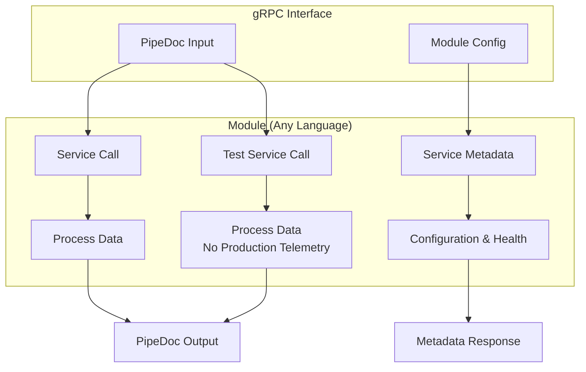

**Core Methods:**

- **Service Call**: Real processing steps that capture production telemetry
- **Test Service Call**: Same processing logic but guidelines to exclude production metrics
- **Service Metadata**: Returns configuration, health status, and capabilities

**Language Agnostic Design**: Modules can be implemented in Python, Go, Node.js, Rust, Java, or any language supporting gRPC, enabling teams to use the best tool for each task.

*Interface Reference: [module_service.proto](../../../grpc/grpc-stubs/src/main/proto/module_service.proto)*

#### Nodes

Nodes are specific implementations of modules configured for particular roles in the processing pipeline. Each node wraps a module with configuration and is managed through PipeStream objects by the engine.

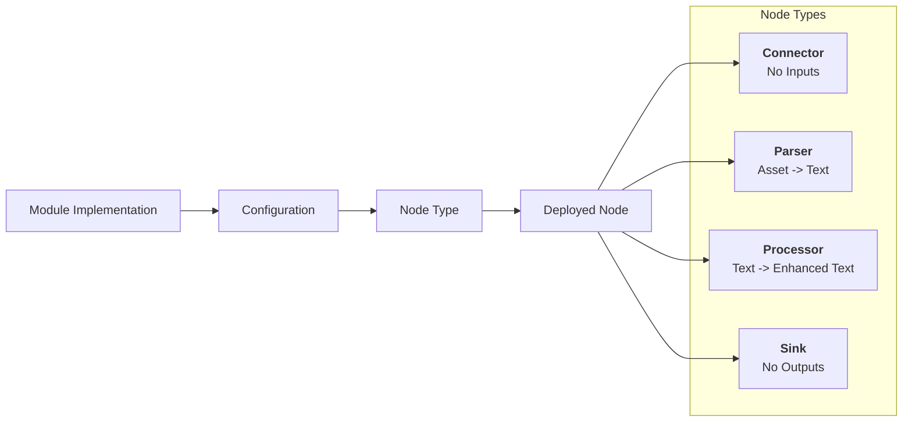

#### Connector

Connectors are entry point nodes that seed the pipeline with data from external systems. They have no inputs and initiate processing workflows.

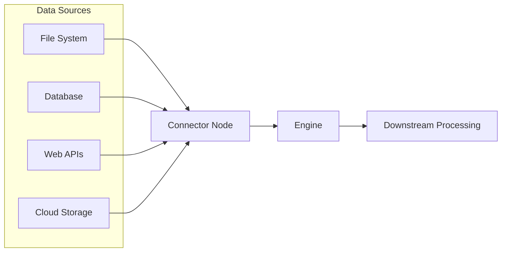

**Characteristics:**

- **No inputs**: Source nodes that start pipeline processing
- **External integration**: Connect to systems of record
- **Data extraction**: Fetch and format digital assets for processing

#### Parser

Parser nodes convert raw digital assets into structured text that downstream processors can understand and manipulate.

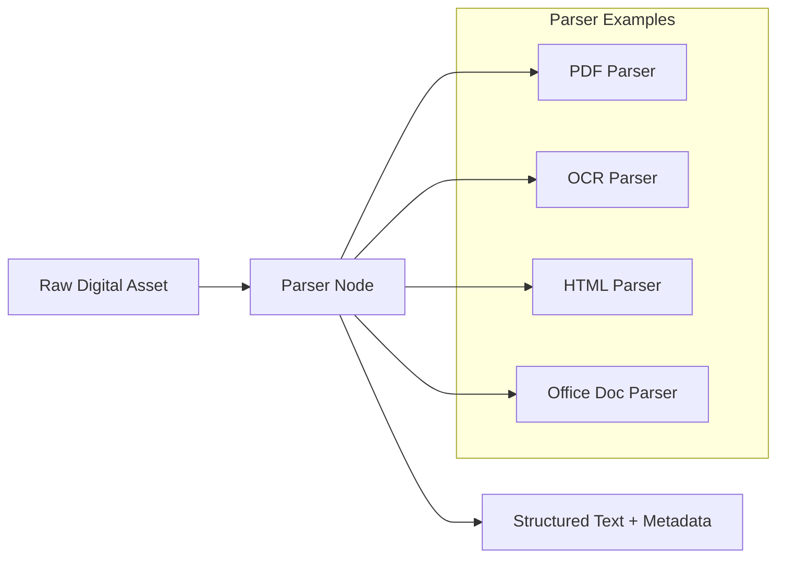

**Characteristics:**

- **Input**: Raw digital assets from connectors
- **Output**: Clean, structured text with extracted metadata
- **Optional**: Some connectors provide pre-parsed structured data

#### Processor

Processor nodes are the transformation workhorses that enhance and manipulate text through various algorithms and strategies.

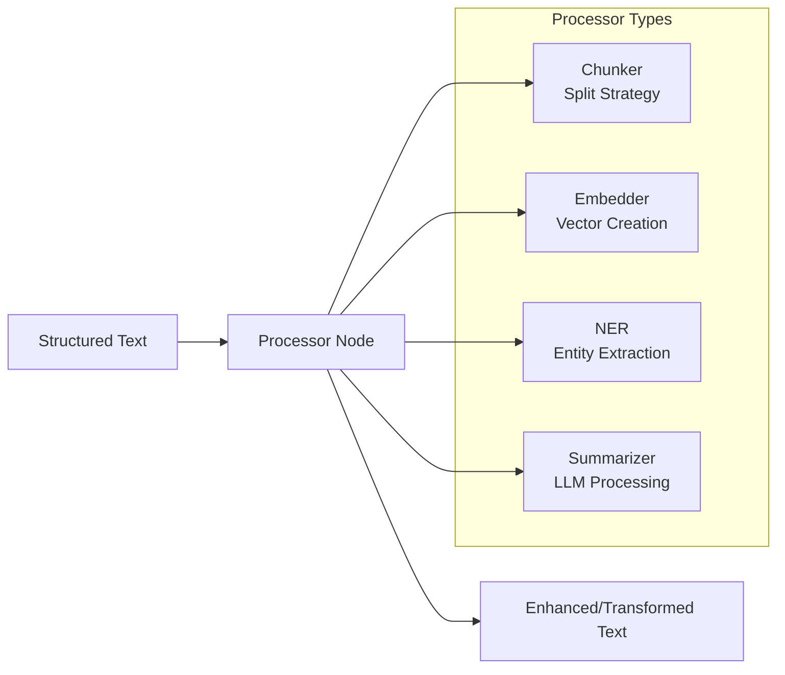

**Characteristics:**

- **Input**: Structured text from parsers or other processors
- **Output**: Enhanced or transformed text data
- **Chainable**: Multiple processors can be sequenced together

#### Sink

Sink nodes are endpoint destinations that save processed data to external systems or streaming platforms. They have no forwarding outputs.

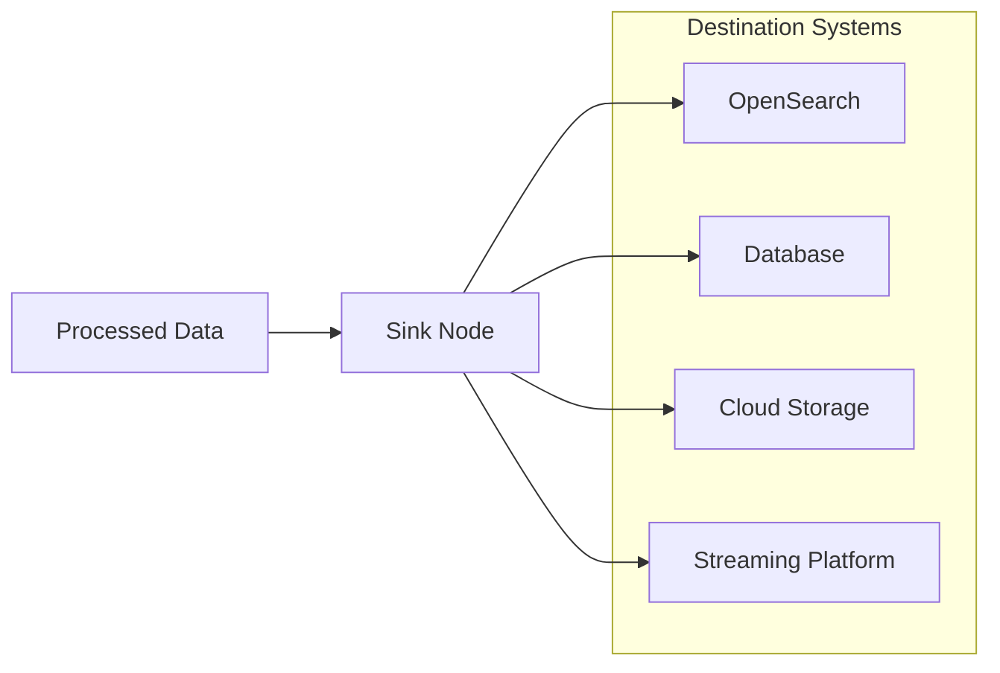

**Characteristics:**

- **No outputs**: Terminal nodes that end processing chains
- **Data persistence**: Store or transmit final processed results
- **System integration**: Connect to target storage or streaming platforms

#### PipeStream

PipeStream is the network-level transport structure that carries PipeDoc payloads through the engine, similar to how IP packets carry data through internet routing.

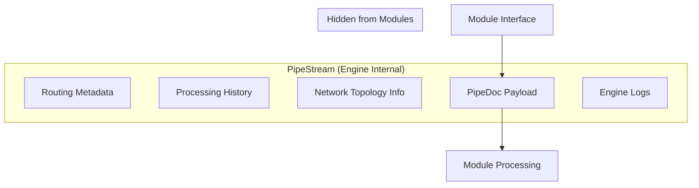

**Key Concepts:**

- **Engine Management**: PipeStream handles all routing and network complexities
- **Module Shielding**: Modules only see fully hydrated PipeDoc data, never PipeStream metadata
- **Network Packet Analogy**: Like TCP packets, PipeStream ensures reliable delivery while hiding transport details

**PipeStream Metadata Includes:**

- Routing information and next destinations
- Processing history and audit trail  
- Network topology traversal logs
- Engine-level configuration and state
- Performance metrics and timing data

#### PipeDoc

PipeDoc is the actual payload that modules process - the document data and metadata that flows through the pipeline processing chain.

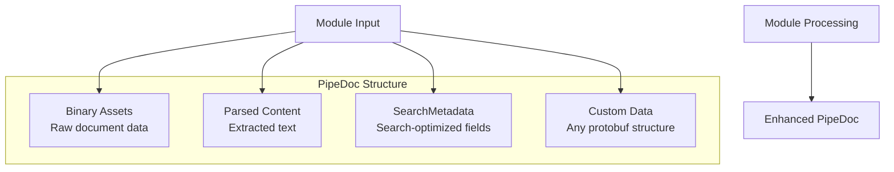

**Contents:**

- **Binary Assets**: Raw document data for parsing (images, PDFs, etc.)
- **Parsed Content**: Extracted and cleaned text from parsing steps  
- **SearchMetadata**: Structured fields optimized for search indexing
- **Custom Data**: Any additional protobuf structures for specific use cases

**Module Interaction**: Modules receive fully hydrated PipeDoc objects and return enhanced versions, never dealing with transport complexities.

*Data Structure Reference: [pipeline_core_types.proto](../../../grpc/grpc-stubs/src/main/proto/pipeline_core_types.proto)*

#### Engine Processor

The Engine Processor is the central orchestrator that manages all node-to-node communication, configuration, and routing decisions.

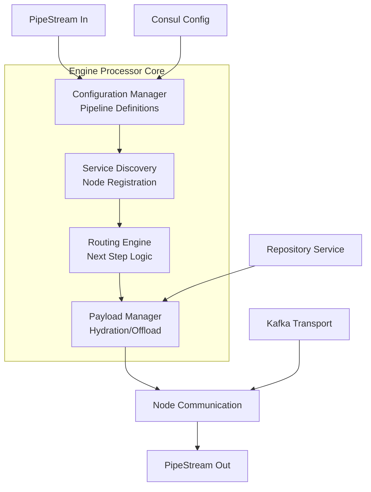

**Responsibilities:**

- **Pipeline Orchestration**: Routes data between nodes based on configuration
- **Service Discovery**: Finds and manages available processing nodes
- **Payload Management**: Handles data hydration and repository offloading
- **Transport Selection**: Chooses between gRPC and Kafka for each step

#### SearchMetadata

SearchMetadata contains structured, search-optimized fields that drive the self-configuring search engine capabilities.

```mermaid
graph TB
    subgraph "SearchMetadata Structure"
        A[Document Fields<br/>Title, Keywords, Author]
        B[Content Fields<br/>Body Text, Language]
        C[Processing Results<br/>SemanticProcessingResult]
        D[Technical Fields<br/>MIME Type, Dates, Length]
    end

    E[Search Engine] --> A
    E --> B
    E --> C
    E --> D

    F[Auto-Configuration] --> C
    C --> G[Index Schema Generation]
```

**Key Components:**

- **Document Metadata**: Title, keywords, author, category, language
- **Content Data**: Main body text and extracted content
- **Semantic Results**: Chunking and embedding configurations via `SemanticProcessingResult`
- **Technical Metadata**: File types, timestamps, content length, custom fields

**Self-Configuration**: The `SemanticProcessingResult` arrays drive automatic OpenSearch index creation based on chunking and embedding combinations used during processing.

*Field Definitions Reference: [pipeline_core_types.proto](../../../grpc/grpc-stubs/src/main/proto/pipeline_core_types.proto)*
