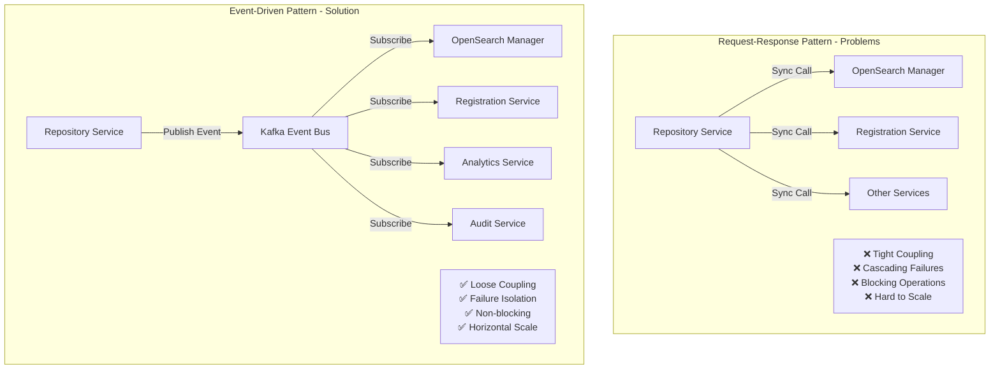
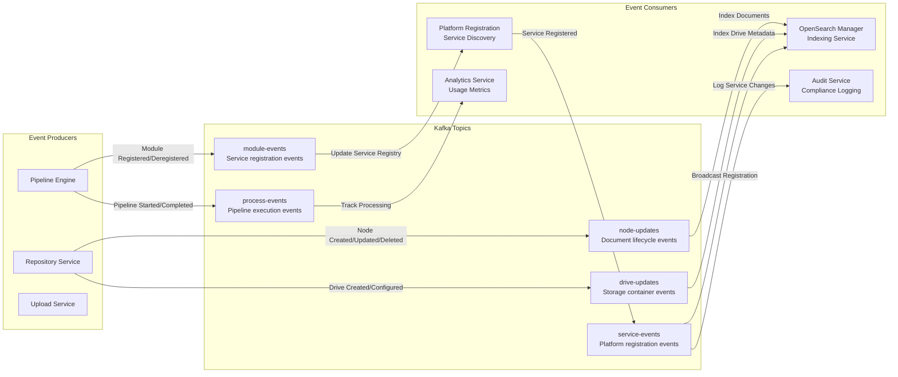
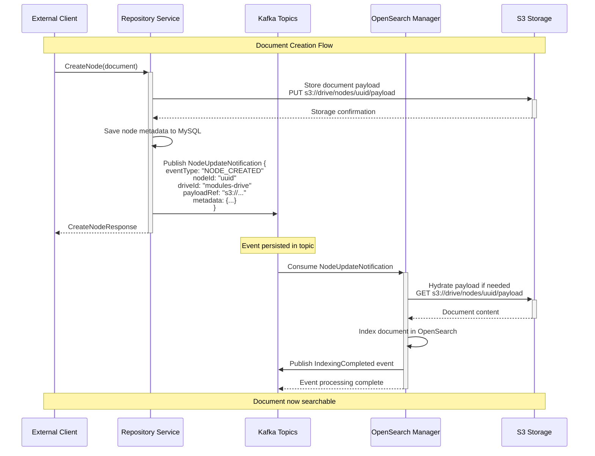
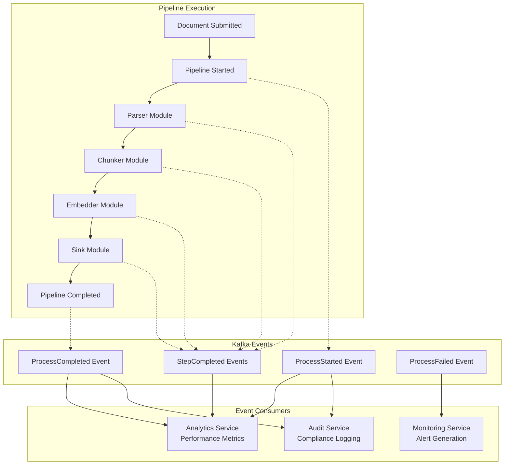
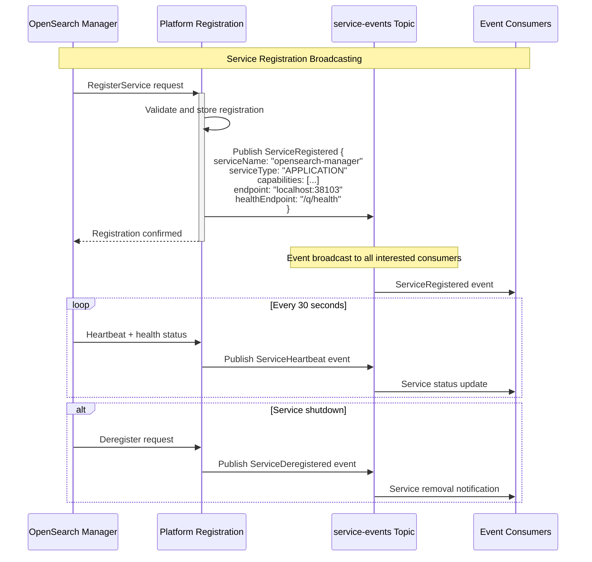
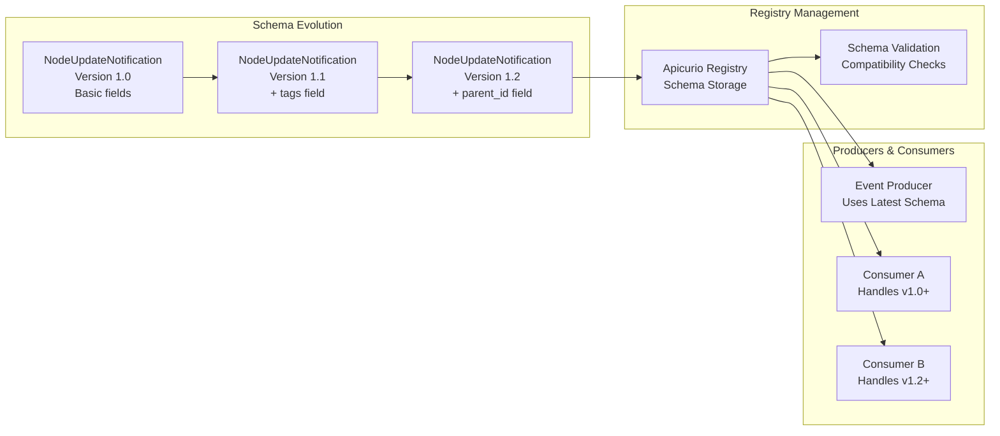

# Event-Driven Architecture and Kafka Integration

## Overview

The Pipeline Engine implements a sophisticated **event-driven architecture** using Apache Kafka as the backbone for asynchronous communication, real-time data streaming, and system-wide coordination. This architecture enables loose coupling between services, supports massive scale, and provides durability guarantees that are essential for data processing pipelines.

## Event-Driven vs Request-Response Architecture

Traditional request-response patterns create tight coupling and synchronous dependencies:



**Benefits of Event-Driven Architecture:**
- **Loose Coupling** - Services don't need to know about each other
- **Scalability** - Easy to add new event consumers without changing producers
- **Resilience** - Service failures don't cascade through the system
- **Auditability** - Complete event history provides audit trail
- **Real-time Processing** - Events flow immediately to interested consumers

## Kafka Topic Architecture

The system uses a **domain-driven topic structure** that reflects business operations:



### Topic Design Principles

| Topic | Partitioning Strategy | Retention | Use Case |
|-------|----------------------|-----------|----------|
| **node-updates** | By drive ID | 7 days | Document lifecycle management |
| **drive-updates** | By drive ID | 30 days | Storage container management |
| **process-events** | By correlation ID | 24 hours | Pipeline execution tracking |
| **module-events** | By service name | 1 hour | Service discovery updates |
| **service-events** | By service type | 3 days | Platform registration broadcasts |

## Event Flow Patterns

### 1. Document Lifecycle Events

When documents are created, updated, or deleted, the system publishes comprehensive lifecycle events:



**Event Schema (Protobuf):**
```protobuf
message NodeUpdateNotification {
  enum EventType {
    NODE_CREATED = 0;
    NODE_UPDATED = 1;
    NODE_DELETED = 2;
    NODE_MOVED = 3;
  }
  
  EventType event_type = 1;
  string node_id = 2;
  string drive_id = 3;
  string correlation_id = 4;
  google.protobuf.Timestamp event_time = 5;
  
  PayloadReference payload_ref = 6;
  map<string, string> metadata = 7;
  repeated string tags = 8;
  string parent_id = 9;
}

message PayloadReference {
  string type = 1;          // "S3", "FILE", "INLINE"
  string bucket = 2;        // S3 bucket name
  string key = 3;           // S3 object key
  int64 size = 4;           // Payload size in bytes
  string content_type = 5;  // MIME type
  string etag = 6;          // S3 ETag for versioning
}
```

### 2. Pipeline Processing Events

The Pipeline Engine publishes detailed processing events for monitoring and analytics:



**Processing Event Schema:**
```protobuf
message ProcessRequestUpdateNotification {
  string process_id = 1;
  string correlation_id = 2;
  ProcessStatus status = 3;
  google.protobuf.Timestamp start_time = 4;
  google.protobuf.Timestamp end_time = 5;
  
  repeated StepExecution steps = 6;
  ProcessMetrics metrics = 7;
  string error_message = 8;
  
  enum ProcessStatus {
    STARTED = 0;
    IN_PROGRESS = 1; 
    COMPLETED = 2;
    FAILED = 3;
    CANCELLED = 4;
  }
}

message StepExecution {
  string step_id = 1;
  string module_name = 2;
  StepStatus status = 3;
  google.protobuf.Duration execution_time = 4;
  int64 input_size = 5;
  int64 output_size = 6;
  
  enum StepStatus {
    QUEUED = 0;
    RUNNING = 1;
    COMPLETED = 2;
    FAILED = 3;
    SKIPPED = 4;
  }
}
```

### 3. Service Registration Events

Services broadcast their registration status for discovery and monitoring:



## Kafka Configuration and Optimization

### Producer Configuration

Services are configured as Kafka producers with optimized settings for the Pipeline Engine's use cases:

```properties
# Repository Service - Kafka Producer Configuration
kafka.bootstrap.servers=localhost:9094
%prod.kafka.bootstrap.servers=kafka:9092

# Producer optimization for throughput
kafka.producer.acks=all                    # Ensure durability
kafka.producer.retries=3                   # Retry failed sends
kafka.producer.batch.size=16384            # Batch size for throughput
kafka.producer.linger.ms=10                # Small latency for batching
kafka.producer.compression.type=snappy     # Compression for network efficiency

# Idempotent producer - prevent duplicates
kafka.producer.enable.idempotence=true
kafka.producer.max.in.flight.requests.per.connection=1

# Message size limits (for large payloads)
kafka.producer.max.request.size=104857600  # 100MB for large references
```

### Consumer Configuration

Event consumers are optimized for different processing patterns:

```properties  
# OpenSearch Manager - Kafka Consumer Configuration
kafka.consumer.group.id=opensearch-manager
kafka.consumer.auto.offset.reset=earliest  # Process all events on startup
kafka.consumer.enable.auto.commit=false    # Manual commit for reliability

# Consumer optimization for latency
kafka.consumer.fetch.min.bytes=1           # Process immediately
kafka.consumer.fetch.max.wait.ms=100       # Low latency
kafka.consumer.session.timeout.ms=30000    # Failure detection
kafka.consumer.heartbeat.interval.ms=3000  # Heartbeat frequency

# Parallel processing
kafka.consumer.max.poll.records=100        # Batch size for processing
kafka.consumer.max.partition.fetch.bytes=1048576  # 1MB per partition
```

### Topic Configuration

```properties
# Topic configuration optimized for different event types
## node-updates - High volume, medium retention
node.updates.partitions=12                 # Parallel processing
node.updates.replication.factor=3          # Durability
node.updates.retention.ms=604800000        # 7 days retention
node.updates.cleanup.policy=delete         # Time-based cleanup

## process-events - Medium volume, short retention  
process.events.partitions=6
process.events.retention.ms=86400000       # 1 day retention
process.events.segment.ms=3600000          # 1 hour segments

## service-events - Low volume, longer retention
service.events.partitions=3
service.events.retention.ms=259200000      # 3 days retention
service.events.cleanup.policy=compact      # Keep latest per key
```

## Event Consumer Implementation

### 1. Reactive Event Processing

Using SmallRye Reactive Messaging for non-blocking event processing:

```java
@ApplicationScoped
public class NodeUpdateConsumer {
    
    private static final Logger LOG = LoggerFactory.getLogger(NodeUpdateConsumer.class);
    
    @Inject
    OpenSearchIndexingService indexingService;
    
    @Incoming("node-updates-in")
    @Acknowledgment(Acknowledgment.Strategy.MANUAL)
    public Uni<Void> processNodeUpdate(Message<NodeUpdateNotification> message) {
        NodeUpdateNotification event = message.getPayload();
        
        LOG.infof("Processing node update: %s for node %s", 
            event.getEventType(), event.getNodeId());
        
        return switch (event.getEventType()) {
            case NODE_CREATED, NODE_UPDATED -> handleNodeCreateOrUpdate(event)
                .chain(ignored -> message.ack())
                .onFailure().call(error -> {
                    LOG.errorf(error, "Failed to process node update: %s", event.getNodeId());
                    return message.nack(error);
                });
                
            case NODE_DELETED -> handleNodeDeletion(event)
                .chain(ignored -> message.ack())
                .onFailure().call(error -> message.nack(error));
                
            case NODE_MOVED -> handleNodeMove(event)
                .chain(ignored -> message.ack())
                .onFailure().call(error -> message.nack(error));
        };
    }
    
    private Uni<Void> handleNodeCreateOrUpdate(NodeUpdateNotification event) {
        return indexingService.indexNode(event.getNodeId(), event.getPayloadRef())
            .onItem().invoke(() -> 
                LOG.infof("Successfully indexed node: %s", event.getNodeId()))
            .replaceWithVoid();
    }
    
    private Uni<Void> handleNodeDeletion(NodeUpdateNotification event) {
        return indexingService.deleteFromIndex(event.getNodeId())
            .onItem().invoke(() ->
                LOG.infof("Successfully deleted node from index: %s", event.getNodeId()))
            .replaceWithVoid();
    }
}
```

### 2. Batch Processing Pattern

For high-throughput scenarios, events can be processed in batches:

```java
@ApplicationScoped
public class BatchNodeProcessor {
    
    @Incoming("node-updates-batch")
    @Acknowledgment(Acknowledgment.Strategy.MANUAL) 
    @Blocking // Use worker thread pool for batch processing
    public Uni<Void> processBatch(Message<List<NodeUpdateNotification>> message) {
        List<NodeUpdateNotification> events = message.getPayload();
        
        LOG.infof("Processing batch of %d node updates", events.size());
        
        // Group events by type for efficient processing
        Map<NodeUpdateNotification.EventType, List<NodeUpdateNotification>> groupedEvents = 
            events.stream().collect(Collectors.groupingBy(NodeUpdateNotification::getEventType));
        
        return Uni.combine().all().unis(
            processBatchCreations(groupedEvents.get(NODE_CREATED)),
            processBatchUpdates(groupedEvents.get(NODE_UPDATED)),  
            processBatchDeletions(groupedEvents.get(NODE_DELETED))
        ).asTuple()
        .chain(results -> {
            LOG.infof("Batch processing completed: %d successes", 
                results.getItem1() + results.getItem2() + results.getItem3());
            return message.ack();
        })
        .onFailure().call(error -> {
            LOG.errorf(error, "Batch processing failed");
            return message.nack(error);
        });
    }
}
```

### 3. Dead Letter Queue Pattern

For handling poison messages and processing failures:

```java
@ApplicationScoped
public class NodeUpdateConsumerWithDLQ {
    
    @Incoming("node-updates-in")
    @Outgoing("node-updates-dlq") // Dead letter queue
    @Acknowledgment(Acknowledgment.Strategy.MANUAL)
    public Uni<Message<NodeUpdateNotification>> processWithDLQ(
        Message<NodeUpdateNotification> message) {
        
        return processNodeUpdate(message.getPayload())
            .onItem().transform(ignored -> {
                message.ack();
                return null; // No DLQ message needed
            })
            .onFailure().transform(error -> {
                LOG.errorf(error, "Processing failed, sending to DLQ: %s", 
                    message.getPayload().getNodeId());
                
                // Create DLQ message with failure metadata
                NodeUpdateNotification dlqPayload = message.getPayload().toBuilder()
                    .putMetadata("failure_reason", error.getMessage())
                    .putMetadata("failure_time", Instant.now().toString())
                    .putMetadata("retry_count", "1")
                    .build();
                    
                message.nack(error);
                return Message.of(dlqPayload);
            });
    }
}
```

## Event Schema Evolution

### Protobuf Schema Management

The system uses **Apicurio Registry** for schema versioning and evolution:



**Schema Configuration:**
```properties
# Apicurio Registry for schema management
mp.messaging.outgoing.node-updates.apicurio.registry.auto-register=true
mp.messaging.outgoing.node-updates.apicurio.registry.artifact-id=node-updates-value
mp.messaging.outgoing.node-updates.apicurio.registry.artifact-type=PROTOBUF

# Schema evolution settings
mp.messaging.outgoing.node-updates.apicurio.registry.compatibility-check=BACKWARD
mp.messaging.outgoing.node-updates.apicurio.registry.serde.validate-payload=true

# Consumer schema handling
mp.messaging.incoming.node-updates-in.apicurio.registry.serde.find-latest=true
mp.messaging.incoming.node-updates-in.apicurio.registry.deserializer.value.return-class=io.pipeline.repository.filesystem.NodeUpdateNotification
```

## Event Monitoring and Observability

### Kafka Metrics Integration

```properties
# Prometheus metrics for Kafka
kafka.consumer.metrics.recording.level=INFO
kafka.producer.metrics.recording.level=INFO

# Custom application metrics
mp.metrics.appName=repository-service
```

**Key Metrics to Monitor:**
```promql
# Event processing rate
rate(kafka_consumer_records_consumed_total[5m])

# Processing latency  
kafka_consumer_record_processing_time_max

# Consumer lag (events waiting to be processed)
kafka_consumer_lag_sum

# Failed event processing
rate(kafka_consumer_failed_total[5m])

# Dead letter queue size
kafka_topic_partitions{topic="node-updates-dlq"}
```

### Event Tracing

Events include correlation IDs for distributed tracing:

```java
@ApplicationScoped
public class EventPublisher {
    
    @Channel("node-updates-out")
    Emitter<NodeUpdateNotification> nodeUpdateEmitter;
    
    public Uni<Void> publishNodeCreated(String nodeId, String driveId) {
        String correlationId = MDC.get("correlation-id"); // From HTTP request
        
        NodeUpdateNotification event = NodeUpdateNotification.newBuilder()
            .setEventType(NODE_CREATED)
            .setNodeId(nodeId) 
            .setDriveId(driveId)
            .setCorrelationId(correlationId)
            .setEventTime(Timestamp.newBuilder()
                .setSeconds(Instant.now().getEpochSecond())
                .build())
            .build();
            
        return nodeUpdateEmitter.send(Message.of(event)
            .withMetadata(TracingMetadata.withSpanContext(getCurrentSpan())));
    }
}
```

## Best Practices and Patterns

### 1. Event Design Principles

- **Events are facts** - Represent things that have already happened
- **Include enough context** - Consumers shouldn't need additional API calls
- **Use domain language** - Event names reflect business operations
- **Immutable events** - Never modify published events, publish new ones
- **Schema evolution** - Design for backward and forward compatibility

### 2. Consumer Patterns

- **Idempotent processing** - Handle duplicate events gracefully
- **At-least-once delivery** - Design for potential event duplication
- **Graceful failure handling** - Use dead letter queues for poison messages
- **Ordered processing** - Use partitioning when event order matters
- **Monitoring and alerting** - Track consumer lag and processing failures

### 3. Performance Optimization

- **Batch processing** - Group related events for efficiency
- **Async processing** - Use reactive patterns for non-blocking I/O
- **Partitioning strategy** - Distribute events for parallel processing
- **Compression** - Use Snappy/LZ4 for network efficiency
- **Connection pooling** - Reuse Kafka connections across threads

This event-driven architecture provides the foundation for a scalable, resilient, and observable distributed system that can handle massive volumes of real-time data processing while maintaining loose coupling between services.