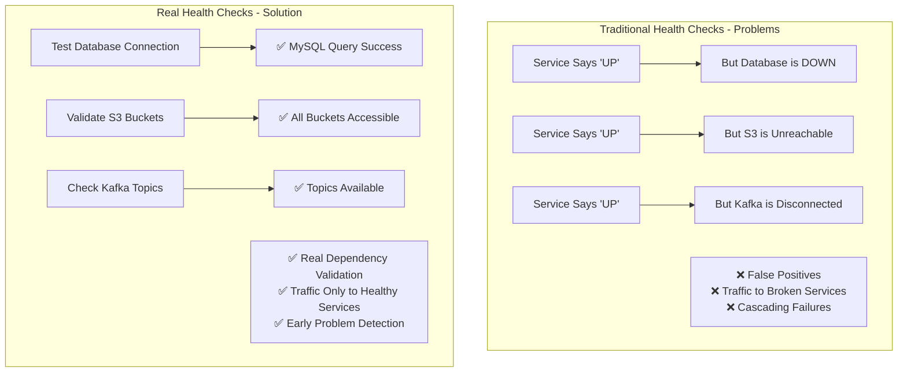
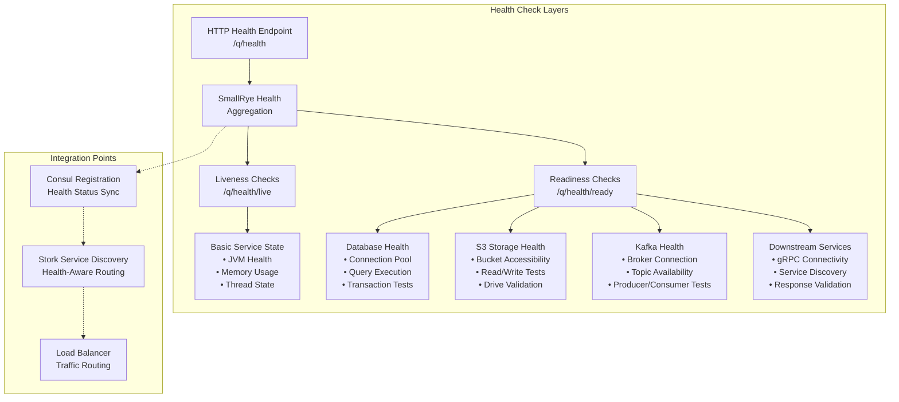
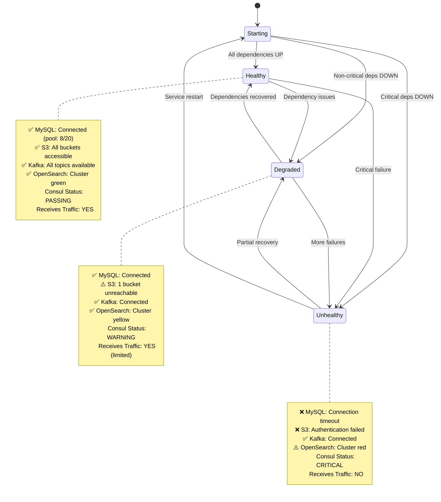
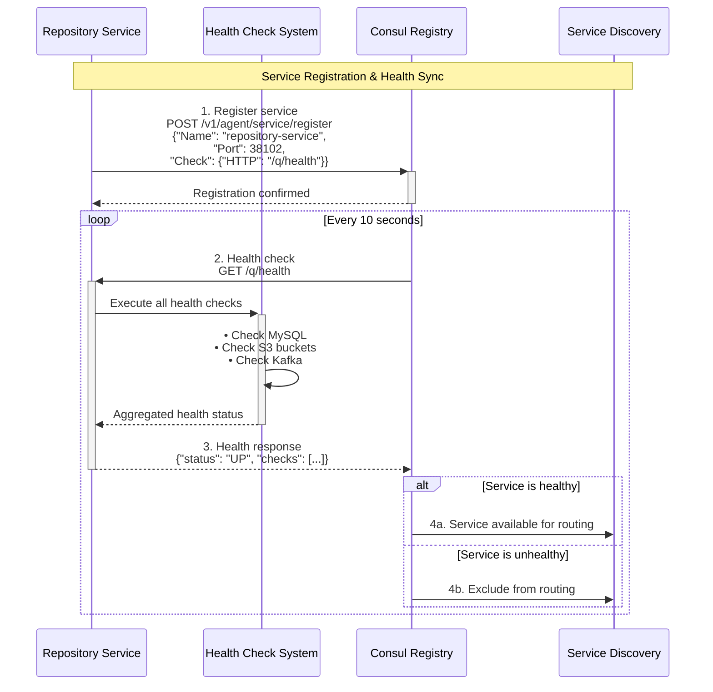
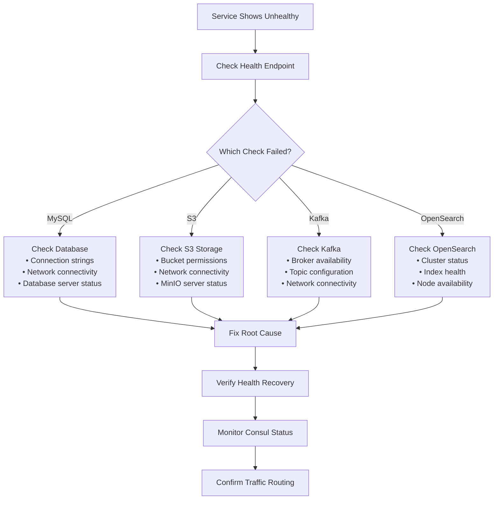

# Health Checks and Service Registration

## Overview

The Pipeline Engine implements **comprehensive health monitoring and service registration** that goes far beyond simple "ping" responses. The system validates real dependencies, provides meaningful health states, and integrates seamlessly with service discovery to ensure only healthy services receive traffic. This approach prevents cascading failures and provides operators with actionable health information.

## The Problem: Fake Health Checks

Traditional microservice health checks often provide false confidence:



**Common fake health check patterns to avoid:**
- Always returning `200 OK` regardless of dependencies
- Only checking internal service state, not external dependencies  
- Using cached health status that doesn't reflect current reality
- Generic "ping" endpoints that don't validate business functionality

## Real Health Check Architecture

### Multi-Layer Health Validation

The Pipeline Engine implements **layered health validation** that checks dependencies at multiple levels:



### Health State Management

Services maintain detailed health state with actionable information:



## Implementation Examples

### 1. Repository Service Health Checks

The repository service implements comprehensive dependency validation:

```java
@ApplicationScoped
@Readiness // This is a readiness check - service isn't ready until deps are healthy
public class DependentServicesHealthCheck implements HealthCheck {
    
    @Inject
    Mutiny.SessionFactory sessionFactory;
    
    @Inject
    S3AsyncClient s3Client;
    
    @Override
    public HealthCheckResponse call() {
        return Uni.combine().all().unis(
            checkMySQL(),
            checkS3Buckets(),
            checkKafka()
        ).asTuple()
        .map(this::aggregateHealthResults)
        .await().atMost(Duration.ofSeconds(10));
    }
    
    private Uni<HealthStatus> checkMySQL() {
        return Panache.withSession(() -> {
            // Real query - not just connection test
            return DriveEntity.count()
                .map(count -> HealthStatus.builder()
                    .name("mysql")
                    .status(UP)
                    .data("drive_count", count)
                    .data("connection_pool_size", getPoolSize())
                    .build());
        })
        .ifNoItem().after(Duration.ofSeconds(5))
        .recoverWithItem(error -> HealthStatus.builder()
            .name("mysql")
            .status(DOWN) 
            .data("error", error.getMessage())
            .data("last_success", getLastSuccessTime())
            .build());
    }
    
    private Uni<HealthStatus> checkS3Buckets() {
        // Get all drive names from database (real bucket names)
        return DriveEntity.getAllDriveNames()
            .chain(driveNames -> {
                // Check each bucket exists and is accessible
                List<Uni<Boolean>> bucketChecks = driveNames.stream()
                    .map(this::validateBucketExists)
                    .collect(Collectors.toList());
                    
                return Uni.combine().all().unis(bucketChecks).asTuple();
            })
            .map(results -> {
                long accessibleBuckets = results.stream()
                    .mapToLong(accessible -> accessible ? 1 : 0)
                    .sum();
                    
                boolean allHealthy = accessibleBuckets == results.size();
                
                return HealthStatus.builder()
                    .name("s3")
                    .status(allHealthy ? UP : DOWN)
                    .data("total_buckets", results.size())
                    .data("accessible_buckets", accessibleBuckets)
                    .data("s3_endpoint", s3Config.getEndpoint())
                    .build();
            });
    }
    
    private Uni<Boolean> validateBucketExists(String bucketName) {
        HeadBucketRequest request = HeadBucketRequest.builder()
            .bucket(bucketName)
            .build();
            
        return Uni.createFrom().completionStage(
            s3Client.headBucket(request)
        ).map(response -> true)
        .onFailure().recoverWithItem(false);
    }
    
    private HealthCheckResponse aggregateHealthResults(Tuple3<HealthStatus, HealthStatus, HealthStatus> results) {
        HealthStatus mysql = results.getItem1();
        HealthStatus s3 = results.getItem2(); 
        HealthStatus kafka = results.getItem3();
        
        // Service is UP only if ALL critical dependencies are UP
        HealthCheckResponse.Status overallStatus = 
            (mysql.getStatus() == UP && s3.getStatus() == UP && kafka.getStatus() == UP) 
                ? HealthCheckResponse.Status.UP 
                : HealthCheckResponse.Status.DOWN;
        
        return HealthCheckResponse.named("dependent-services")
            .status(overallStatus)
            .withData("mysql", mysql.toMap())
            .withData("s3", s3.toMap())
            .withData("kafka", kafka.toMap())
            .withData("last_check", Instant.now().toString())
            .build();
    }
}
```

### 2. OpenSearch Manager Health Checks

The OpenSearch manager validates both OpenSearch cluster health and its own dependencies:

```java
@ApplicationScoped
@Readiness
public class OpenSearchHealthCheck implements HealthCheck {
    
    @Inject
    OpenSearchClient openSearchClient;
    
    @Override
    public HealthCheckResponse call() {
        return Uni.combine().all().unis(
            checkOpenSearchCluster(),
            checkSchemaManager(),
            checkKafkaConsumers()
        ).asTuple()
        .map(this::buildHealthResponse)
        .await().atMost(Duration.ofSeconds(15));
    }
    
    private Uni<ClusterHealthStatus> checkOpenSearchCluster() {
        return Uni.createFrom().completionStage(
            openSearchClient.cluster().health()
        ).map(health -> ClusterHealthStatus.builder()
            .status(mapOpenSearchStatus(health.status()))
            .numberOfNodes(health.numberOfNodes())
            .numberOfDataNodes(health.numberOfDataNodes())
            .activePrimaryShards(health.activePrimaryShards())
            .activeShards(health.activeShards())
            .relocatingShards(health.relocatingShards())
            .initializingShards(health.initializingShards())
            .unassignedShards(health.unassignedShards())
            .build())
        .onFailure().recoverWithItem(
            ClusterHealthStatus.builder()
                .status(HealthCheckResponse.Status.DOWN)
                .error("Failed to connect to OpenSearch cluster")
                .build()
        );
    }
    
    private HealthCheckResponse.Status mapOpenSearchStatus(ClusterStatus status) {
        return switch (status) {
            case GREEN -> HealthCheckResponse.Status.UP;
            case YELLOW -> HealthCheckResponse.Status.UP; // Acceptable for single-node
            case RED -> HealthCheckResponse.Status.DOWN;
        };
    }
}
```

### 3. Liveness vs Readiness Distinction

The system properly distinguishes between liveness and readiness checks:

```java
@ApplicationScoped
@Liveness // Service is alive - don't restart it
public class ServiceLivenessCheck implements HealthCheck {
    
    @Override
    public HealthCheckResponse call() {
        // Quick checks that indicate the service process is alive
        return HealthCheckResponse.named("service-liveness")
            .status(HealthCheckResponse.Status.UP)
            .withData("uptime", getUptimeSeconds())
            .withData("memory_usage", getMemoryUsagePercent())
            .withData("cpu_usage", getCpuUsagePercent())
            .withData("thread_count", getActiveThreadCount())
            .build();
    }
}

@ApplicationScoped  
@Readiness // Service is ready to receive traffic
public class ServiceReadinessCheck implements HealthCheck {
    
    @Override
    public HealthCheckResponse call() {
        // Thorough checks of all dependencies
        return checkAllDependencies()
            .map(allHealthy -> HealthCheckResponse.named("service-readiness")
                .status(allHealthy ? UP : DOWN)
                .withData("dependencies_checked", getDependencyCount())
                .withData("last_check", Instant.now())
                .build())
            .await().atMost(Duration.ofSeconds(30));
    }
}
```

## Service Registration Integration

### Consul Integration Pattern

Services automatically register with Consul and sync their health status:



### Registration Configuration

```properties
# Stork Consul Self-Registration
quarkus.stork.repository-service.service-registrar.type=consul
quarkus.stork.repository-service.service-registrar.consul-host=${CONSUL_HOST:consul}
quarkus.stork.repository-service.service-registrar.consul-port=${CONSUL_PORT:8500}

# Health Check Configuration
quarkus.smallrye-health.root-path=/q/health
quarkus.smallrye-health.liveness-path=/q/health/live
quarkus.smallrye-health.readiness-path=/q/health/ready

# Consul Health Check Settings
consul.health.check.interval=10s
consul.health.check.timeout=3s
consul.health.check.deregister-critical-after=30s
```

## Health Check Endpoints and Responses

### Endpoint Structure

| Endpoint | Purpose | Use Case |
|----------|---------|----------|
| `/q/health` | Overall health aggregation | Load balancer decisions |
| `/q/health/live` | Liveness check | Kubernetes restart decisions |
| `/q/health/ready` | Readiness check | Traffic routing decisions |
| `/q/health/group/custom` | Custom health groups | Specific monitoring needs |

### Response Format Examples

**Healthy Service Response:**
```json
{
  "status": "UP",
  "checks": [
    {
      "name": "dependent-services",
      "status": "UP",
      "data": {
        "mysql": {
          "status": "UP",
          "drive_count": 5,
          "connection_pool_size": "8/20",
          "response_time_ms": 15
        },
        "s3": {
          "status": "UP", 
          "total_buckets": 5,
          "accessible_buckets": 5,
          "s3_endpoint": "http://localhost:9000"
        },
        "kafka": {
          "status": "UP",
          "connected_brokers": 3,
          "available_topics": 12
        },
        "last_check": "2025-08-27T14:30:45.123Z"
      }
    },
    {
      "name": "service-liveness",
      "status": "UP",
      "data": {
        "uptime": 3600,
        "memory_usage": 45,
        "cpu_usage": 12,
        "thread_count": 25
      }
    }
  ]
}
```

**Unhealthy Service Response:**
```json
{
  "status": "DOWN",
  "checks": [
    {
      "name": "dependent-services", 
      "status": "DOWN",
      "data": {
        "mysql": {
          "status": "DOWN",
          "error": "Connection timeout after 5000ms",
          "last_success": "2025-08-27T14:25:30.456Z"
        },
        "s3": {
          "status": "UP",
          "total_buckets": 5,
          "accessible_buckets": 5
        },
        "kafka": {
          "status": "UP", 
          "connected_brokers": 3
        },
        "last_check": "2025-08-27T14:30:45.789Z"
      }
    }
  ]
}
```

## Monitoring and Alerting Integration

### Prometheus Metrics

Health checks expose detailed metrics for monitoring systems:

```properties
# Health check metrics
application_health_check_duration_seconds{name, outcome}
application_health_check_total{name, outcome}
application_dependency_status{name, type}
consul_service_health_status{service_name, instance_id}
```

### Grafana Dashboard Queries

```promql
# Service health status over time
application_dependency_status{name="mysql"} 

# Health check execution time
rate(application_health_check_duration_seconds[5m])

# Unhealthy service count
count(consul_service_health_status == 0)

# Health check failure rate
rate(application_health_check_total{outcome="failure"}[5m])
```

### Alerting Rules

```yaml
# Prometheus alerting rules
groups:
- name: service-health
  rules:
  - alert: ServiceUnhealthy
    expr: consul_service_health_status == 0
    for: 30s
    labels:
      severity: critical
    annotations:
      summary: "Service {{ $labels.service_name }} is unhealthy"
      description: "Service has failed health checks for 30 seconds"
      
  - alert: DatabaseConnectionFailed
    expr: application_dependency_status{name="mysql"} == 0
    for: 15s
    labels:
      severity: critical
    annotations:
      summary: "Database connection failed"
      description: "MySQL health check failing in {{ $labels.instance }}"
```

## Operational Procedures

### Health Check Debugging

When services show as unhealthy, follow this debugging process:



### Health Check Tuning

**Timeout Configuration:**
```properties
# Health check timeouts (balance thoroughness vs speed)
health.check.mysql.timeout=5s        # Database queries
health.check.s3.timeout=10s          # S3 bucket validation  
health.check.kafka.timeout=8s        # Kafka connectivity
health.check.opensearch.timeout=15s  # Cluster health check

# Overall health check timeout
health.check.global.timeout=30s
```

**Check Intervals:**
```properties  
# How often Consul checks health
consul.health.check.interval=10s      # Production: 10s, Dev: 30s
consul.health.check.timeout=3s        # Must be < interval
consul.health.deregister.after=60s    # Remove after 1min down
```

## Best Practices

### 1. Dependency Classification

**Critical Dependencies (Readiness):**
- Database connections (service can't function without data)
- Required message queues (needed for core functionality)
- Essential external services (primary business logic dependencies)

**Non-Critical Dependencies (Custom checks):**
- Caching systems (degraded performance, but functional)
- Monitoring systems (important but not blocking)  
- Optional integrations (features may be disabled)

### 2. Health Check Design Principles

- **Test real functionality** - Don't just ping, execute actual operations
- **Include meaningful data** - Provide context for troubleshooting
- **Set appropriate timeouts** - Balance thoroughness with responsiveness
- **Distinguish liveness vs readiness** - Different purposes, different checks
- **Provide actionable information** - Help operators understand what's wrong

### 3. Performance Considerations

- **Cache expensive checks** - Don't hit databases on every health check
- **Use timeouts liberally** - Prevent health checks from hanging
- **Parallel dependency checking** - Check multiple deps simultaneously  
- **Graceful degradation** - Some failures shouldn't kill entire service

This comprehensive health check system ensures that only truly healthy services receive traffic, provides operators with actionable diagnostic information, and integrates seamlessly with service discovery for automatic traffic management.