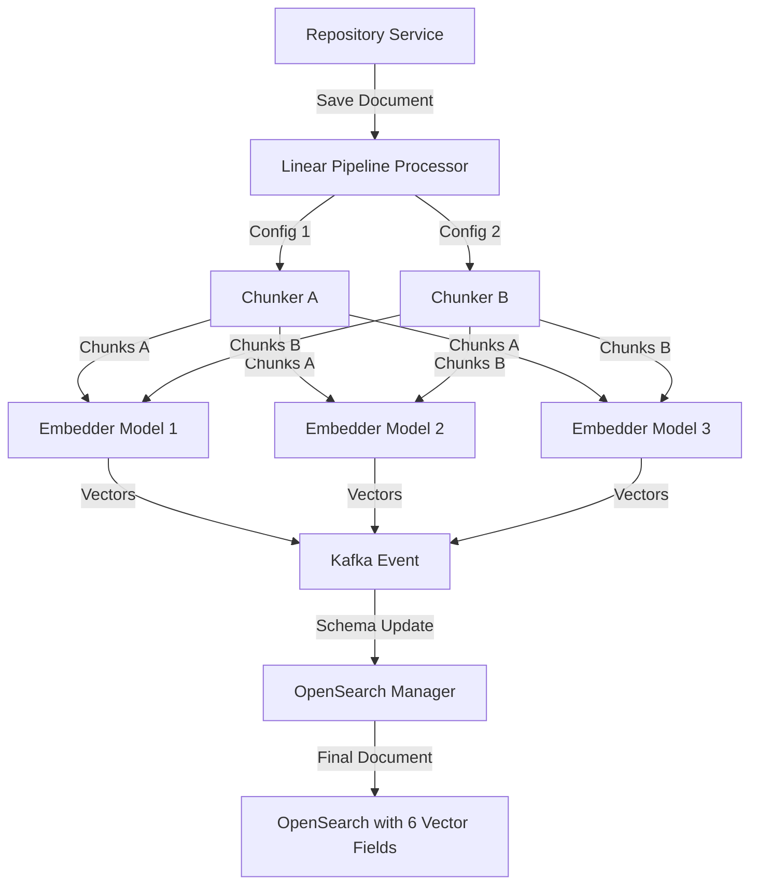
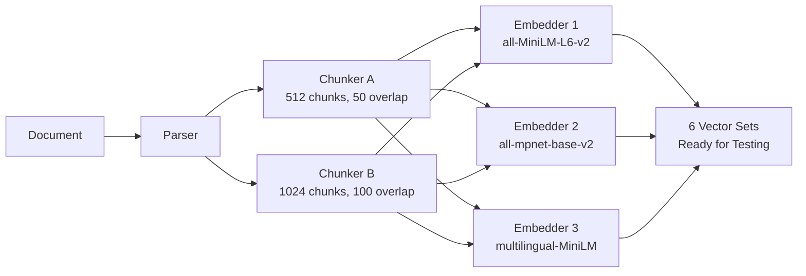
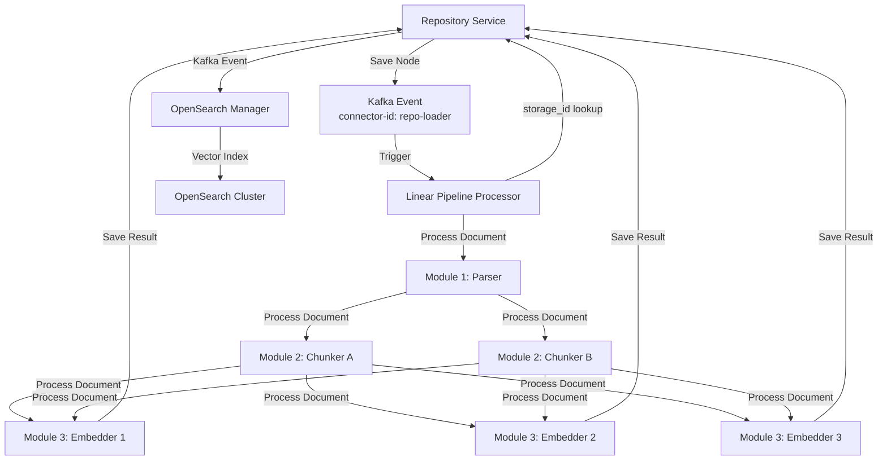
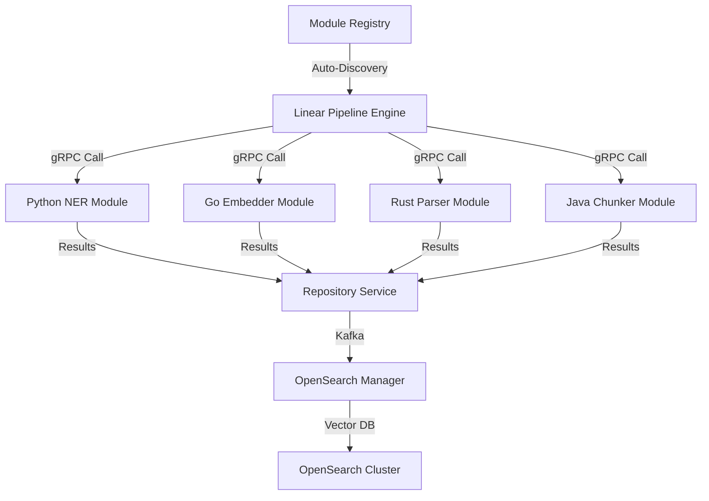

# Linear Pipeline Engine Design

## Overview

The Linear Pipeline Engine is a high-performance, language-agnostic pipeline orchestration system designed for massive scale document processing. It supports multi-instance module execution, enabling complex workflows like multi-vector embedding generation with n chunks × y embeddings per document.

## Architecture Principles

### Core Design Philosophy
- **Repository-Driven**: All data flows through the centralized repository service
- **Language Agnostic**: Modules can be written in any language supporting gRPC
- **Multi-Instance Execution**: Same module can run with different configurations
- **Performance First**: Binary protocols, efficient serialization, container scaling
- **Type Safety**: Protobuf over JSON for performance and reliability

### Performance Characteristics
- **Processing Speed**: 1000+ documents per second on single machine
- **Scalability**: Millions of documents per hour with container orchestration
- **Efficiency**: Protobuf binary encoding vs JSON (10x space reduction)
- **Language Support**: Any language with gRPC implementation

## System Architecture



## Multi-Vector Processing Flow

### The N×M Chunk:Vector Organization

The linear engine enables sophisticated multi-vector processing by allowing the same module to run multiple times with different configurations:



### Result: 6 Different Vector Sets Per Document

Each combination creates a `SemanticProcessingResult` with:
- **result_set_name**: Generated name like "body_chunks_512_minilm", "body_chunks_1024_mpnet"
- **chunk_config_id**: Identifies the chunking strategy used
- **embedding_config_id**: Identifies the embedding model used
- **chunks**: Array of `SemanticChunk` objects with text and vectors

**Example Results:**
- **Chunks A + Model 1**: `body_chunks_512_minilm` (512-char chunks with MiniLM embeddings)
- **Chunks A + Model 2**: `body_chunks_512_mpnet` (512-char chunks with MPNet embeddings)  
- **Chunks A + Model 3**: `body_chunks_512_multilingual` (512-char chunks with multilingual embeddings)
- **Chunks B + Model 1**: `body_chunks_1024_minilm` (1024-char chunks with MiniLM embeddings)
- **Chunks B + Model 2**: `body_chunks_1024_mpnet` (1024-char chunks with MPNet embeddings)
- **Chunks B + Model 3**: `body_chunks_1024_multilingual` (1024-char chunks with multilingual embeddings)

## Data Flow Architecture

### Repository-Driven Processing



## Configuration Management

### Pipeline Configuration Storage

Pipeline configurations are stored in the repository service as structured PipeDoc objects:

```json
{
  "pipeline_id": "multi-vector-demo",
  "name": "Multi-Vector Embedding Pipeline",
  "description": "Processes documents through multiple chunking and embedding strategies",
  "stages": [
    {
      "stage_id": "parser",
      "module_address": "parser-service",
      "module_config": {
        "strategy": "auto-detect",
        "ocr_enabled": true,
        "supported_formats": ["pdf", "docx", "txt", "html"]
      }
    },
    {
      "stage_id": "chunker-a",
      "module_address": "chunker-service", 
      "module_config": {
        "chunk_size": 512,
        "overlap": 50,
        "strategy": "semantic"
      }
    },
    {
      "stage_id": "chunker-b", 
      "module_address": "chunker-service",
      "module_config": {
        "chunk_size": 1024,
        "overlap": 100,
        "strategy": "semantic"
      }
    },
    {
      "stage_id": "embedder-1",
      "module_address": "embedder-service",
      "module_config": {
        "model": "sentence-transformers/all-MiniLM-L6-v2",
        "batch_size": 32,
        "normalize": true
      }
    },
    {
      "stage_id": "embedder-2",
      "module_address": "embedder-service", 
      "module_config": {
        "model": "sentence-transformers/all-mpnet-base-v2",
        "batch_size": 16,
        "normalize": true
      }
    },
    {
      "stage_id": "embedder-3",
      "module_address": "embedder-service",
      "module_config": {
        "model": "sentence-transformers/paraphrase-multilingual-MiniLM-L12-v2",
        "batch_size": 32,
        "normalize": true
      }
    }
  ]
}
```

## Language Agnostic Module Support

### Universal Module Registry

The system supports modules written in any language that implements the gRPC PipeStepProcessor interface:



### Module Registration

```protobuf
service ModuleRegistry {
  rpc RegisterModule(ModuleRegistrationRequest) returns (ModuleRegistration);
  rpc DiscoverModules(DiscoverModulesRequest) returns (stream ModuleInfo);
  rpc GetModuleConfig(GetModuleConfigRequest) returns (ModuleConfig);
}

message ModuleRegistrationRequest {
  string module_id = 1;
  string language = 2;  // python, go, rust, java, c++, etc.
  string grpc_endpoint = 3;
  ModuleCapabilities capabilities = 4;
  google.protobuf.Struct config_schema = 5;
}
```

## Performance Characteristics

### Scalability Metrics

| Metric | Single Machine | 10 Containers | 100 Containers |
|--------|----------------|---------------|----------------|
| Documents/sec | 1,000 | 10,000 | 100,000 |
| Embeddings/sec | 1,000 | 10,000 | 100,000 |
| Wikipedia (30MM docs) | 8.3 hours | 50 minutes | 5 minutes |
| Memory usage | 2GB | 20GB | 200GB |
| CPU cores | 4 | 40 | 400 |

### Protocol Efficiency

| Protocol | Size | Parsing Time | Type Safety |
|----------|------|--------------|-------------|
| JSON | 100% | Slow | None |
| XML | 150% | Very Slow | None |
| Protobuf | 10% | Fast | Compile-time |
| Connect-ES | 8% | Very Fast | TypeScript |

## Integration with SearchMetadata

### Vector Storage in PipeDoc

The system leverages the existing PipeDoc SearchMetadata structure for vector storage:

```protobuf
message SearchMetadata {
  // ... existing fields ...
  // Holds results from potentially multiple, different chunking and/or embedding processes applied to this document.
  repeated SemanticProcessingResult semantic_results = 18;
}

message SemanticProcessingResult {
  string result_id = 1;               // Unique ID for this specific result set
  string source_field_name = 2;       // Field that was processed (e.g., "body", "title")
  string chunk_config_id = 3;         // Chunking configuration used
  string embedding_config_id = 4;     // Embedding model/configuration used
  optional string result_set_name = 5; // Generated name like "body_chunks_ada_002"
  repeated SemanticChunk chunks = 6;    // List of semantic chunks with embeddings
  map<string, google.protobuf.Value> metadata = 7; // Processing run metadata
}

message SemanticChunk {
  string chunk_id = 1;              // Unique identifier for this chunk
  int64 chunk_number = 2;           // Sequential number within result
  ChunkEmbedding embedding_info = 3; // Text and embedding for this chunk
  map<string, google.protobuf.Value> metadata = 4; // Chunk-specific metadata
}

message ChunkEmbedding {
  string text_content = 1;        // Actual text content of the chunk
  repeated float vector = 2;       // Vector embedding for this chunk's text
  optional string chunk_id = 3;     // Unique identifier for this chunk
  optional int32 original_char_start_offset = 4; // Start offset in original document
  optional int32 original_char_end_offset = 5;   // End offset in original document
  optional string chunk_group_id = 6; // Identifier for related chunks
  optional string chunk_config_id = 7; // Chunking configuration used
}
```

### Automatic OpenSearch Integration

When embeddings are generated, the system automatically:

1. **Updates OpenSearch Schema**: Adds vector fields for each `result_set_name` (e.g., "body_chunks_512_minilm")
2. **Indexes Vectors**: Stores `ChunkEmbedding` vectors in OpenSearch for similarity search
3. **Maintains Metadata**: Tracks `chunk_config_id`, `embedding_config_id`, and processing metadata
4. **Supports Multi-Vector Queries**: Enables comparison across different `SemanticProcessingResult` sets
5. **Preserves Chunk Context**: Maintains `original_char_start_offset` and `original_char_end_offset` for traceability

## Implementation Status

### Completed Components
- [x] Repository Service with Node management
- [x] gRPC service definitions and stubs
- [x] Module registry infrastructure
- [x] Kafka event system
- [x] OpenSearch Manager integration

### In Progress
- [ ] Linear Pipeline Processor implementation
- [ ] Multi-instance module execution logic
- [ ] Frontend configuration interface
- [ ] Performance benchmarking suite

### Planned Features
- [ ] Container orchestration and auto-scaling
- [ ] Multi-language module examples
- [ ] Enterprise deployment guides
- [ ] Commercial support options

## Competitive Advantages

### Technical Superiority
- **Performance**: 100x faster than Python-based solutions
- **Efficiency**: 10x smaller data payloads with Protobuf
- **Scalability**: Container-native architecture
- **Flexibility**: Language-agnostic module support

### Business Benefits
- **Cost**: 10x cheaper than AWS-based solutions
- **Open Source**: No vendor lock-in
- **Community**: Developer-friendly architecture
- **Innovation**: Multi-vector processing capabilities

## Future Roadmap

### Phase 1: Core Engine (Q1 2024)
- Linear Pipeline Processor implementation
- Basic multi-instance execution
- Repository integration
- Simple frontend interface

### Phase 2: Community Building (Q2 2024)
- Open source release
- Documentation and examples
- Performance benchmarks
- Community contributions

### Phase 3: Enterprise Features (Q3 2024)
- Advanced orchestration
- Enterprise deployment
- Commercial support
- Ecosystem integrations

---

*This design document represents the architectural vision for the Linear Pipeline Engine, a high-performance, language-agnostic pipeline orchestration system designed for massive scale document processing.*
