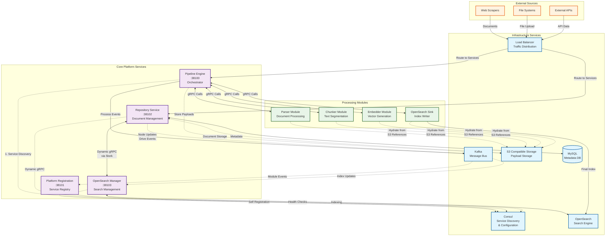
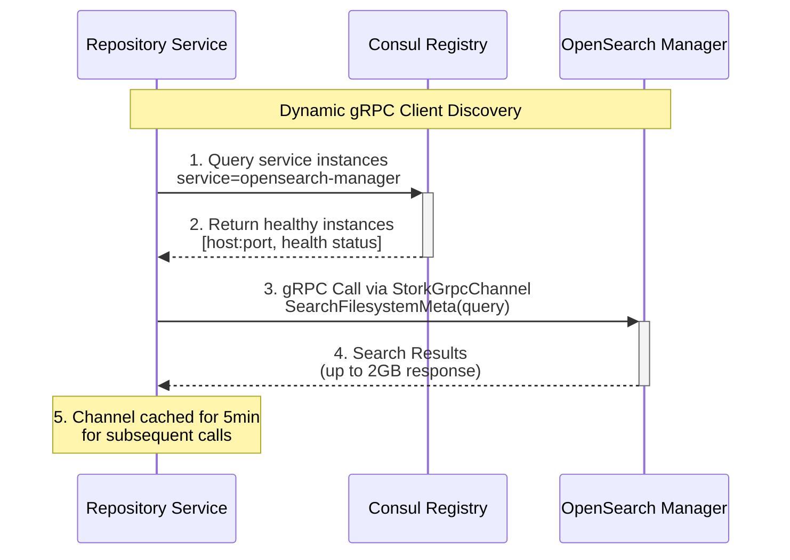
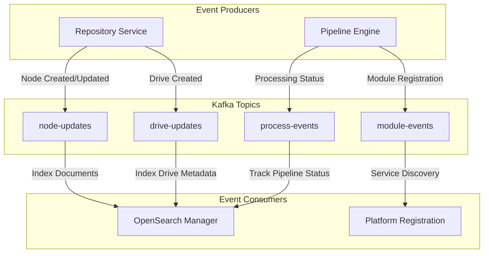
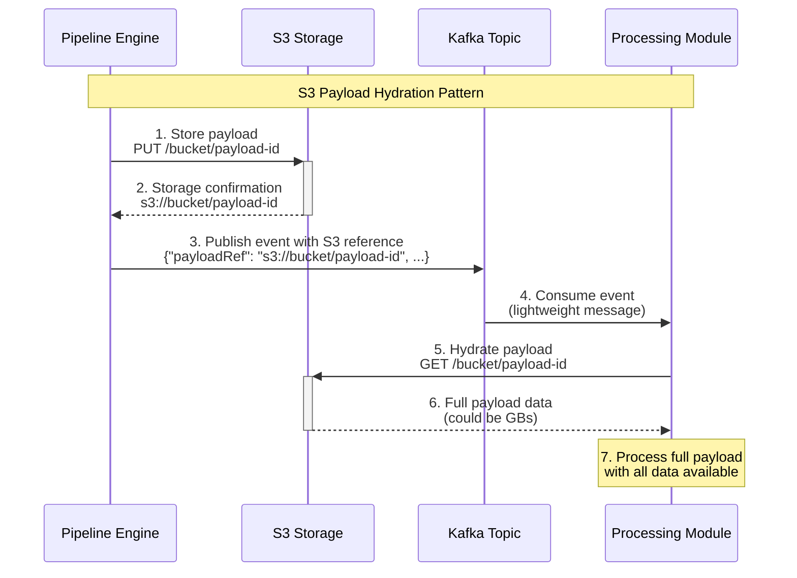

# Pipeline Engine: System Network Overview

## Introduction

This document provides a comprehensive network-level view of the Pipeline Engine system, showing how all services communicate through dynamic gRPC discovery, event-driven Kafka messaging, and S3 payload hydration patterns. This architecture supports the core principle that **modules never talk to each other directly - they only communicate through the Engine**.

## Complete System Network Architecture

## Key Communication Patterns

### 1. Dynamic gRPC Service Discovery

The system uses **SmallRye Stork** with **Consul** for dynamic service discovery, eliminating hardcoded service endpoints:

**Benefits:**
- **No hardcoded URLs** - Services discover each other at runtime
- **Health-aware routing** - Only calls healthy service instances  
- **Automatic failover** - Falls back to other instances if one fails
- **Load balancing** - Distributes calls across available instances

### 2. Event-Driven Kafka Architecture

**Kafka Topics** decouple services for async processing and real-time data flow:

### 3. S3 Payload Hydration Pattern

Kafka and file payloads are stored in **S3** with **references** passed through Kafka for efficiency:

**Benefits:**
- **Kafka stays lightweight** - Only metadata and references in messages
- **Scalable payload sizes** - No Kafka message size limits
- **Efficient storage** - Deduplicated payloads in S3
- **On-demand hydration** - Modules only fetch what they need

## Service Port Allocation

The canonical port allocation strategy for all services and infrastructure is defined in the **[Port Allocation Strategy](./endpoints/Port_allocations.md)** document. This is the single source of truth for all port assignments.

## Infrastructure Dependencies

| Component | Purpose | Production | Development |
|-----------|---------|------------|-------------|
| **Consul** | Service discovery, health checks, config KV store | Multi-datacenter cluster | Single-node local |
| **Kafka** | Async messaging, event streaming | Managed Kafka service | Local Kafka cluster |
| **S3 Compatible Storage** | Document and payload storage | AWS S3, Google Cloud Storage, Azure Blob | MinIO (local S3-compatible) |
| **MySQL** | Metadata and relationship storage | Managed MySQL service | Local MySQL container |
| **OpenSearch** | Full-text search and vector similarity | Managed OpenSearch cluster | Local OpenSearch |
| **Load Balancer** | Traffic distribution and SSL termination | Cloud Load Balancer (ALB, GLB, etc.) | Traefik (dev proxy only) |

## Development vs Production Deployment

### Development Environment
- **Traefik** - Local reverse proxy and SSL termination for development
- **MinIO** - S3-compatible object storage for local testing
- **Local containers** - All infrastructure runs in Docker containers
- **Frontend Development Server** - Node.js development server with hot reload

### Production Environment  
- **Cloud Load Balancer** - AWS ALB, Google Cloud Load Balancer, Azure Load Balancer
- **Managed Object Storage** - AWS S3, Google Cloud Storage, Azure Blob Storage
- **Managed Services** - Cloud-provided Kafka, OpenSearch, MySQL services
- **Static Frontend Hosting** - CDN-hosted static assets with API gateway routing

### Key Architectural Differences
| Aspect | Development | Production |
|--------|-------------|------------|
| **Load Balancing** | Traefik (local proxy) | Cloud Load Balancer |
| **Object Storage** | MinIO (S3-compatible) | Native cloud storage (S3, GCS, Azure) |
| **Service Discovery** | Local Consul | Multi-datacenter Consul cluster |
| **Frontend** | Development server | Static hosting + CDN |
| **TLS/SSL** | Self-signed certificates | Cloud-managed certificates |
| **Scaling** | Single instance | Auto-scaling groups |

## Next Steps

This network overview provides the foundation for understanding:

1. **[Dynamic Service Discovery](dynamic-service-discovery.md)** - How services find each other
2. **[Event-Driven Flows](event-driven-flows.md)** - Kafka message patterns  
3. **[gRPC Communication Patterns](grpc-communication-patterns.md)** - Synchronous service calls
4. **[S3 Payload Hydration](s3-payload-hydration.md)** - Large data handling patterns

Each of these patterns work together to create a resilient, scalable, and maintainable distributed system.