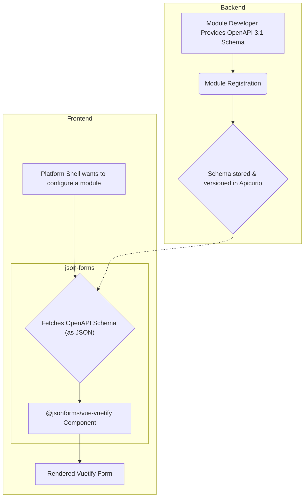

# Module UI Rendering Architecture

## 1. Overview and Philosophy

When developing a module for a pipeline, a developer should spend most of the time on the processing of the module and have the ability to easily configure it.

Often times pipelines systems do not offer a type safe way to easily include configuration without custom code or a complex system to template an input for the pipeline step.

The Pipeline Engine allows a developer to simply provide a standard OpenAPI 3.1 configuration schema and the platform will automatically render a professional, interactive configuration form in the UI. Furthermore, the platform will automatically validate the configuration and provide feedback to the user if it is invalid. All versions of the schema are tracked through the Apicurio Registry and can be viewed through the Apicurio UI.

The Pipeline Engine provides a solution to this problem through the use of **schema-driven UI generation**. Using standardized OpenAPI 3.1 JSON Schema definitions, the Pipeline Engine can automatically generate a professional, interactive configuration form for any module. The Pipeline Engine uses the `@jsonforms/vue-vuetify` library to render the form.

A core design principle of the Pipeline Engine is to allow developers to create processing modules in any gRPC-supported language without requiring them to write any frontend code.

So a developer workflow looks like this:

1.  Create a module in any language that supports gRPC.
2.  Define an OpenAPI 3.1 JSON file that defines the configuration parameters for the module.
3.  Register the module with the Pipeline Engine, providing the schema.
4.  Configure the module in the Pipeline Engine UI, which displays a professional, interactive form rendered from the provided JSON Schema.
5.  Run the pipeline.

## 2. The Schema Lifecycle (Backend Process)

The foundation of the UI rendering process is a robust backend workflow for managing module schemas. This process is seamless and automatic for the module developer.

1.  **Schema Definition:** A module developer defines their configuration parameters in an OpenAPI 3.1 specification document.
2.  **Module Registration:** When the module starts, it registers itself with the `platform-registration-service` and provides this OpenAPI schema as a JSON string.
3.  **Centralized Storage (Apicurio):** The platform integrates with **Apicurio Registry** as a centralized schema repository. The provided OpenAPI schema is automatically versioned and stored in Apicurio. This provides a durable, canonical source of truth for every version of every module's configuration schema.

## 3. The UI Rendering Pipeline (Frontend Process)

When a user needs to configure a module in the Platform Shell, the frontend executes the following pipeline to render the UI:

1.  **Schema Fetch:** The frontend fetches the OpenAPI 3.1 schema (as a JSON object) for the desired module from the backend.
2.  **Form Rendering:** This JSON Schema object is passed as a prop directly to the `@jsonforms/vue-vuetify` Vue component.
3.  **Result:** The component uses the schema to automatically render a complete, interactive form using standard Vuetify components. It handles the layout, input types, and validation based entirely on the provided OpenAPI 3.1 specification.