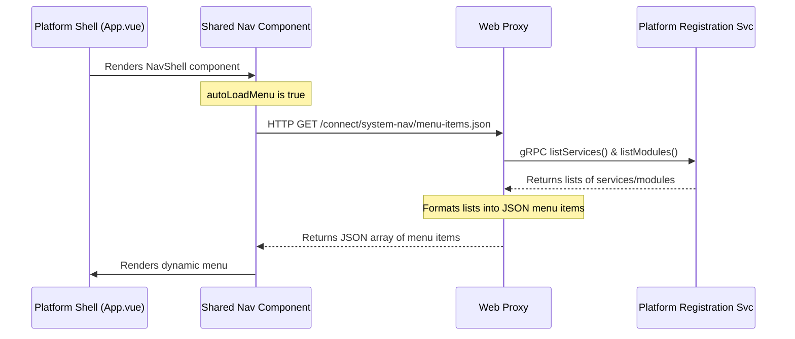

# Platform Shell Architecture

## 1. Overview

The Platform Shell is the central user interface for the entire Pipeline Engine. It acts as the main dashboard and entry point, providing a consistent layout and user experience for all the different service frontends.

Its most important feature is a **dynamic navigation menu** that automatically discovers and displays links to all available service UIs at runtime.

## 2. Architecture and Data Flow

The system uses a combination of a shared Vue component and a custom HTTP endpoint in the `web-proxy` to create the dynamic menu.

### 2.1. The `platform-shell` Application
*   **What it is:** A standalone Vue.js application located at `applications/node/platform-shell/`.
*   **Role:** It serves as the main landing page for users. Traefik is configured to route all root (`/`) traffic to this application.
*   **Composition:** It is a lightweight application that is primarily composed of components imported from shared libraries like `@pipeline/shared-nav` and `@pipeline/shared-components`.

### 2.2. The `@pipeline/shared-nav` Component
*   **What it is:** A reusable Vue component that provides the standard application bar and navigation drawer.
*   **Dynamic Loading:** When its `autoLoadMenu` property is true, it fetches its navigation items from the URL provided in its `items-url` property.

### 2.3. The Dynamic Menu Endpoint (in Web Proxy)
*   **What it is:** A temporary, custom HTTP endpoint implemented in the `web-proxy`'s `index.ts` file.
*   **URL:** `GET /connect/system-nav/menu-items.json`
*   **Functionality:**
    1.  Receives the GET request from the navigation component.
    2.  Makes backend gRPC calls to `platform-registration-service` to get the full list of registered services and modules.
    3.  Filters and transforms these lists into a simple JSON array of menu items.
    4.  Returns this JSON array in the HTTP response.
*   **Future Work:** A `TODO` comment in the code indicates this endpoint will eventually be replaced by a formal `SystemNavService` gRPC service as originally envisioned in RFC-001.

### 2.4. Required Service Convention
For a service's frontend to be automatically discovered by this system, it must be registered in Consul with:
*   **A known name** that is mapped in the `web-proxy`'s route handler to a path (e.g., `'repository-service': '/repository/'`).
