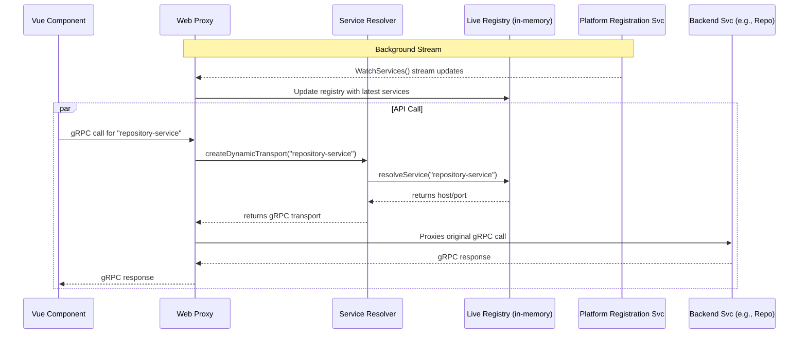
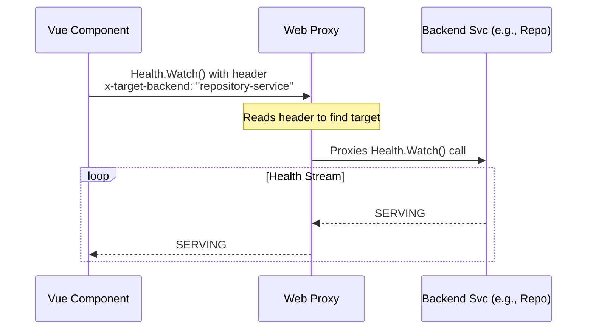
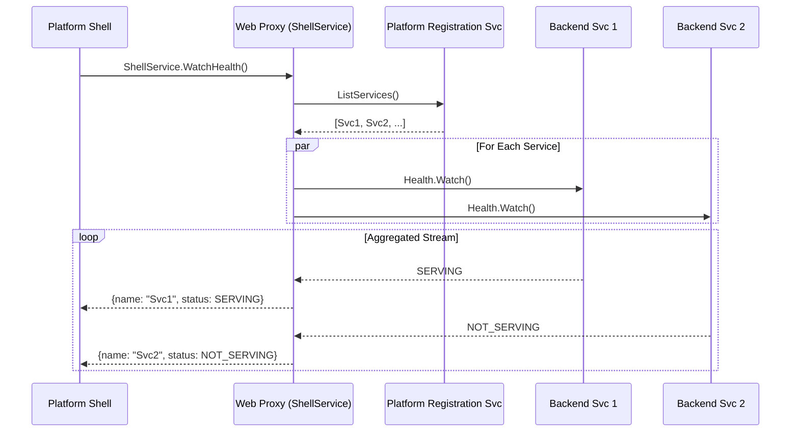

# Frontend Service Discovery and Health

This document explains the mechanisms by which frontend applications discover the network locations of backend services and monitor their health status.

## 1. Service Discovery

The core principle of the architecture is that frontend applications do not need to know the specific host and port of the backend services they need to communicate with. This is handled automatically by the **web-proxy**.

The core service discovery is handled on Consul service discovery.  This resides on the Java side to manage, which would allow for a seamless transation to another service discovery mechanism should one be needed.  

The web-proxy makes service discovery calls in a streaming fashion, and maintains a persistent connection to the service registry.  This allows for the web-proxy to be able to respond to service discovery changes in real-time. 

### End-to-End Discovery Flow

#### Diagram of end-to-end

#### Description of end-to-end
When a component in a Vue.js application (e.g., the Repository UI) needs to call a backend gRPC service (e.g., `repository-service`), the following sequence occurs:

1.  **Client Call:** The Vue component makes a type-safe call using a client generated by Connect-RPC.
2.  **Proxy Route:** The request is sent to the `web-proxy`, which matches the call to a specific service route in `connectRoutes.ts`.
3.  **Transport Creation:** The route handler calls `createDynamicTransport("repository-service")`.
4.  **Live Registry Lookup:** This function calls `resolveService("repository-service")` inside `serviceResolver.ts`. This is a simple, synchronous lookup against an in-memory map that contains the live locations of all healthy services.
5.  **Registry Maintenance:** This in-memory map is kept continuously up-to-date by a background process in the `web-proxy` that maintains a persistent, streaming `WatchServices` call to the `platform-registration-service`.
6.  **gRPC Connection:** The `web-proxy` uses the host and port from the registry to create a native gRPC transport and forwards the request to the correct backend service instance.

This entire process is transparent to the frontend developer, who only needs to know the string name of the service they wish to call (e.g., `"repository-service"`).

## 2. Health Checking

The platform supports two methods for monitoring the health of backend services from the frontend.  The two methods are described below.

### Method 1: Direct Health Checks

#### Diagram of direct health checks

#### Description of direct health checks

Individual components can monitor the health of a specific backend service using the standard gRPC Health Checking Protocol.

*   **Mechanism:** A frontend component makes a streaming `watch` call to the `grpc.health.v1.Health` service on the `web-proxy`.
*   **Targeting:** To specify which backend service to check, the client must include the `x-target-backend` header in the request (e.g., `x-target-backend: "repository-service"`).
*   **Routing:** The `web-proxy` reads this header and dynamically routes the health check request to the specified service.
*   **Use Case:** This is ideal for components that are tightly coupled to a single backend, such as a status indicator within the Repository Service UI. The shared `@pipeline/shared-components` library contains a `GrpcHealthStatus` component that implements this logic.

### Method 2: Aggregated Health Stream

#### Diagram of aggregated health stream

#### Description of aggregated health stream

For a high-level overview of the entire platform's status, the `web-proxy` provides a custom, aggregated health stream.

*   **Mechanism:** The `web-proxy` exposes a custom `ShellService` with a `WatchHealth` RPC.
*   **Functionality:** When called, this service internally checks the health of *all* registered backend services and multiplexes their statuses into a single, convenient gRPC stream.
*   **Use Case:** This is designed specifically for the main **Platform Shell**.
    > The Platform Shell consumes this aggregated stream to dynamically build its list of available services and display their real-time health status in a centralized dashboard, without needing to connect to each service individually. For more details on how the shell's UI is implemented, please see the [Platform Shell Architecture](./Platform_Shell.md) document.