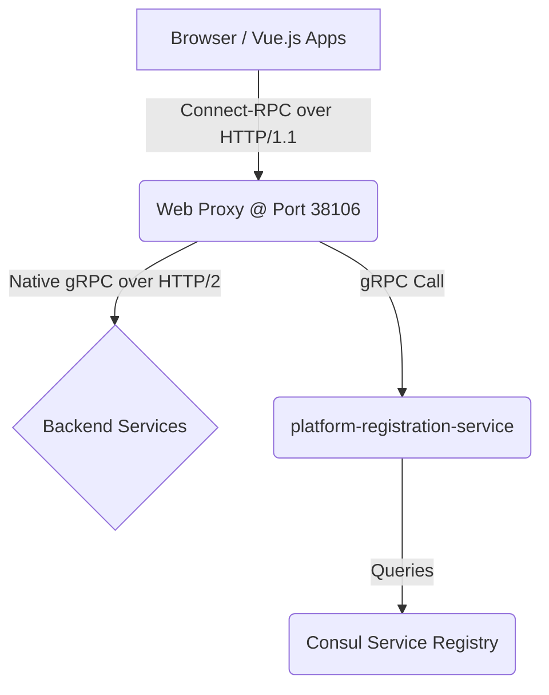

# Web Proxy Architecture

## 1. Purpose and Role

The **web-proxy** (located at `applications/node/web-proxy/`) is a critical component that bridges the gap between browser-based frontends and backend gRPC services. Since browsers cannot make native HTTP/2 connections required for gRPC, the web-proxy serves as an intelligent gateway that provides several key capabilities:

*   **Protocol Translation**: Converts browser-friendly Connect-RPC (gRPC-web over HTTP/1.1) to native gRPC (HTTP/2) for the backend services.
*   **Dynamic Service Discovery**: Automatically finds the network location of healthy service instances by querying the `platform-registration-service`.
*   **Centralized API Gateway**: Provides a single, stable endpoint (`http://localhost:38106` by default, configurable) for all frontend applications to consume backend services, simplifying client-side configuration.
*   **Service Aggregation**: Can combine or aggregate data from multiple services, such as the `ShellService` which provides a unified health stream for the main UI.

This is accomplished using the modern [Connect-RPC](https://connectrpc.com/) library suite from Buf (`@connectrpc/connect`, `@connectrpc/connect-express`). This allows the frontend to make what feel like type-safe function calls to the backend. Under the hood, these calls are transported over standard HTTP/1.1, but unlike traditional REST APIs that use verbose JSON, Connect uses the efficient Protobuf binary format for its payloads, resulting in smaller and faster communication.


## 2. Architecture Details

The proxy sits between the browser and the backend, translating protocols and routing requests dynamically.



This allows for front end code to call the gRRPC services without needing to know where they are or how to talk to them.  This happens by "watching" the platform services for which services are discoverable and then routing the request to the appropriate backend.

## 3. Key Features & Implementation

### 3.1. Live Service Discovery

The web-proxy uses a real-time, streaming approach for service discovery, ensuring it always has an up-to-date list of healthy backend services. It does **not** use a polling or time-based cache mechanism.

*   **Implementation:** On startup, the `serviceResolver.ts` establishes a persistent gRPC streaming connection to the `platform-registration-service` by calling the `WatchServices` RPC. The resolver then listens for updates. Whenever a service is registered, unregistered, or changes its health status, the registration service sends a complete, new list of all healthy services. This list is used to populate an in-memory map, which acts as a live service registry.

*   **Resolution:** When a request for a service comes in, the resolver performs a simple, synchronous lookup against this in-memory map. This is highly efficient and avoids any network latency for resolution.

    ```typescript
    // Simplified from src/lib/serviceResolver.ts

    // This map holds the live state of all healthy, registered services.
    const serviceRegistry = new Map<string, ServiceDetails>();

    /**
     * Watches the platform-registration-service for real-time updates.
     * This function runs continuously in the background.
     */
    async function watchAndCacheServices() {
      try {
        const stream = registrationClient.watchServices(new Empty());
        for await (const response of stream) {
          // Atomically update the in-memory registry with the new list
          const newRegistry = new Map<string, ServiceDetails>();
          for (const service of response.services) {
            newRegistry.set(service.serviceName, service);
          }
          serviceRegistry.clear();
          for (const [key, value] of newRegistry.entries()) {
            serviceRegistry.set(key, value);
          }
        }
      } catch (error) {
        // Retry connection on failure
        setTimeout(watchAndCacheServices, 5000);
      }
    }

    /**
     * Resolves a service name from the live registry (synchronous lookup).
     */
    export function resolveService(serviceName: string): { host: string; port: number } {
      const serviceDetails = serviceRegistry.get(serviceName);
      if (!serviceDetails) {
        throw new Error(`Service "${serviceName}" not found in live registry.`);
      }
      // ... return host and port
    }

    // Start watching for service updates in the background.
    watchAndCacheServices();
    ```

### 3.2. Service Routing

The proxy uses `@connectrpc/connect-express` to define routes for each gRPC service in `src/routes/connectRoutes.ts`.

*   **Standard Service Routing:** For most services, the proxy simply resolves the service by its name (e.g., "mapping-service") and forwards the request.

    ```typescript
    // from src/routes/connectRoutes.ts
    router.service(MappingService, {
      async applyMapping(req, context) {
        const transport = await createDynamicTransport("mapping-service");
        const client = createClient(MappingService, transport);
        return await client.applyMapping(req);
      }
    });
    ```

*   **Advanced Routing with `x-target-backend`:** For generic services like `grpc.health.v1.Health`, the proxy uses a special `x-target-backend` request header to determine the destination. This allows the frontend to check the health of *any* registered service through a single RPC endpoint.

    ```typescript
    // from src/routes/connectRoutes.ts
    router.service(Health, {
      async *watch(req, context) {
        const targetBackend = context.requestHeader.get("x-target-backend");
        const transport = await createDynamicTransport(targetBackend); // Resolves the service specified in the header
        const client = createClient(Health, transport);
        for await (const resp of client.watch(req)) {
          yield resp;
        }
      }
    });
    ```

### 3.3. Service Aggregation (`ShellService`)

A `ShellService` is implemented directly within the web-proxy. This service is not a simple pass-through; it acts as a Backend-for-Frontend (BFF). It calls the health check endpoint of *all* registered services and aggregates their statuses into a single, convenient gRPC stream for the Platform Shell UI.

### 3.4. Proto Generation Pipeline

The web-proxy maintains its own copy of the project's `.proto` files and uses `buf` to generate the necessary TypeScript types for its own use. The `pnpm run prebuild` script ensures protos are synced and generated before the application is built.

## 4. Future Enhancements & Proposed Refinements

Based on our architectural review, the following enhancement is proposed:

*   **Improved Fault Tolerance:** If the `platform-registration-service` is down, all requests will fail.
    *   **Proposed Solution:** As a minor improvement, the service resolver could be modified to return a stale cached address for a short period if a live lookup fails, providing a small window of resilience for already-discovered services.
