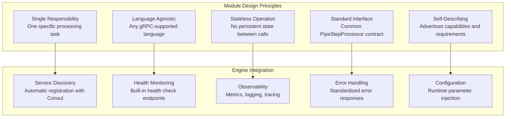

# Module Development Guide

## Overview

The Pipeline Engine's **module system** enables developers to create language-agnostic processing components that integrate seamlessly with the orchestration engine. Modules are standalone gRPC services that implement a standard interface, allowing developers to use their preferred programming language while benefiting from the engine's infrastructure capabilities.

## Module Architecture Principles

### Core Design Philosophy

Modules in the Pipeline Engine follow these fundamental principles:



### Module Types and Patterns

| Module Type | Purpose | Input/Output | Examples |
|-------------|---------|--------------|----------|
| **Extractor** | Extract data from sources | URL/File → Document | Web Scraper, File Reader, API Connector |
| **Transformer** | Process/modify content | Document → Document | Parser, Chunker, Text Cleaner |
| **Enricher** | Add information to content | Document → Enriched Document | Embedder, Metadata Extractor, Translator |
| **Sink** | Store/output final results | Document → Storage | OpenSearch Sink, Database Writer, File Writer |
| **Router** | Conditional processing | Document → Multiple Paths | Content Classifier, A/B Test Router |

## Standard Module Interface

### gRPC Service Contract

All processing modules must implement the `PipeStepProcessor` interface:

```protobuf
// Standard interface for all processing modules
service PipeStepProcessor {
  // Main processing method - handles one step of the pipeline
  rpc ProcessStep(ProcessStepRequest) returns (ProcessStepResponse);
  
  // Health check for service discovery and monitoring
  rpc HealthCheck(HealthCheckRequest) returns (HealthCheckResponse);
  
  // Capability advertisement - what this module can do
  rpc GetCapabilities(Empty) returns (CapabilitiesResponse);
  
  // Configuration schema - what parameters this module accepts
  rpc GetConfigurationSchema(Empty) returns (ConfigurationSchemaResponse);
  
  // Processing statistics for monitoring and optimization
  rpc GetProcessingStats(Empty) returns (ProcessingStatsResponse);
}

message ProcessStepRequest {
  string step_id = 1;                    // Unique identifier for this processing step
  string correlation_id = 2;             // Request correlation for tracing
  google.protobuf.Any input_data = 3;    // Input data (flexible type)
  map<string, string> parameters = 4;    // Configuration parameters
  string output_format = 5;              // Expected output format
  ProcessingContext context = 6;         // Additional context information
}

message ProcessStepResponse {
  ProcessingStatus status = 1;           // Success, failure, or partial
  google.protobuf.Any output_data = 2;   // Processed output (flexible type)
  repeated ProcessingError errors = 3;   // Any errors or warnings
  ProcessingMetrics metrics = 4;         // Performance metrics
  map<string, string> metadata = 5;     // Additional metadata about processing
}

enum ProcessingStatus {
  SUCCESS = 0;              // Processing completed successfully
  PARTIAL_SUCCESS = 1;      // Processing completed with warnings
  FAILURE = 2;              // Processing failed completely
  REQUIRES_RETRY = 3;       // Temporary failure, retry recommended
  UNSUPPORTED_INPUT = 4;    // Input type not supported by this module
}
```

### Capability Advertisement

Modules advertise their capabilities to enable dynamic pipeline construction:

```protobuf
message CapabilitiesResponse {
  string module_name = 1;               // Human-readable module name
  string module_version = 2;            // Semantic version
  string description = 3;               // What this module does
  
  repeated string supported_input_types = 4;    // MIME types or custom types
  repeated string supported_output_types = 5;   // What this module produces
  repeated string required_parameters = 6;      // Configuration parameters needed
  repeated string optional_parameters = 7;      // Optional configuration
  
  ProcessingCapabilities processing = 8;        // Processing characteristics
  ResourceRequirements resources = 9;           // Resource requirements
}

message ProcessingCapabilities {
  bool supports_streaming = 1;          // Can handle streaming input
  bool supports_batch = 2;              // Can handle batch processing
  int64 max_input_size = 3;            // Maximum input size in bytes
  google.protobuf.Duration typical_processing_time = 4;  // Expected processing time
  repeated string supported_languages = 5;      // For language-specific modules
}

message ResourceRequirements {
  int32 cpu_cores_recommended = 1;      // Recommended CPU cores
  int64 memory_mb_recommended = 2;      // Recommended memory in MB
  bool gpu_required = 3;                // Requires GPU acceleration
  repeated string external_dependencies = 4;    // External services needed
}
```

## Module Implementation Examples

### 1. Text Parser Module (Java/Quarkus)

A complete implementation of a document parsing module:

```java
@ApplicationScoped
@GrpcService
public class TextParserModule implements PipeStepProcessor {
    
    private static final Logger LOG = LoggerFactory.getLogger(TextParserModule.class);
    
    @Inject
    DocumentParsingService parsingService;
    
    @Inject
    MeterRegistry meterRegistry;
    
    @Override
    public Uni<ProcessStepResponse> processStep(ProcessStepRequest request) {
        Timer.Sample sample = Timer.start(meterRegistry);
        
        return validateRequest(request)
            .chain(ignored -> extractInputDocument(request))
            .chain(document -> parseDocument(document, request.getParametersMap()))
            .map(parsedDocument -> buildSuccessResponse(parsedDocument))
            .onFailure().transform(this::handleProcessingError)
            .onItem().invoke(response -> {
                sample.stop(Timer.builder("module.processing.duration")
                    .tag("module", "text-parser")
                    .tag("status", response.getStatus().name())
                    .register(meterRegistry));
            });
    }
    
    private Uni<Void> validateRequest(ProcessStepRequest request) {
        if (request.getStepId().isEmpty()) {
            return Uni.createFrom().failure(
                new IllegalArgumentException("Step ID is required"));
        }
        
        if (!request.getInputData().is(TextDocument.class)) {
            return Uni.createFrom().failure(
                new UnsupportedOperationException("Expected TextDocument input"));
        }
        
        return Uni.createFrom().voidItem();
    }
    
    private Uni<TextDocument> extractInputDocument(ProcessStepRequest request) {
        try {
            TextDocument document = request.getInputData().unpack(TextDocument.class);
            return Uni.createFrom().item(document);
        } catch (InvalidProtocolBufferException e) {
            return Uni.createFrom().failure(
                new IllegalArgumentException("Failed to unpack TextDocument", e));
        }
    }
    
    private Uni<ParsedDocument> parseDocument(TextDocument input, 
                                            Map<String, String> parameters) {
        
        ParsingOptions options = ParsingOptions.builder()
            .enableMetadataExtraction(Boolean.parseBoolean(
                parameters.getOrDefault("extract_metadata", "true")))
            .preserveFormatting(Boolean.parseBoolean(
                parameters.getOrDefault("preserve_formatting", "false")))
            .language(parameters.getOrDefault("language", "auto-detect"))
            .build();
            
        return parsingService.parseDocument(input.getContent(), options);
    }
    
    private ProcessStepResponse buildSuccessResponse(ParsedDocument parsed) {
        return ProcessStepResponse.newBuilder()
            .setStatus(ProcessingStatus.SUCCESS)
            .setOutputData(Any.pack(parsed))
            .setMetrics(ProcessingMetrics.newBuilder()
                .setProcessingTimeMs(parsed.getProcessingTimeMs())
                .setInputSizeBytes(parsed.getOriginalSizeBytes())
                .setOutputSizeBytes(parsed.getParsedSizeBytes())
                .build())
            .putMetadata("pages_processed", String.valueOf(parsed.getPageCount()))
            .putMetadata("language_detected", parsed.getDetectedLanguage())
            .build();
    }
    
    @Override
    public Uni<CapabilitiesResponse> getCapabilities(Empty request) {
        return Uni.createFrom().item(
            CapabilitiesResponse.newBuilder()
                .setModuleName("Text Parser")
                .setModuleVersion("1.2.0")
                .setDescription("Extracts and parses text content from various document formats")
                .addSupportedInputTypes("application/pdf")
                .addSupportedInputTypes("application/msword")
                .addSupportedInputTypes("text/html")
                .addSupportedInputTypes("text/plain")
                .addSupportedOutputTypes("application/x-parsed-document")
                .addOptionalParameters("extract_metadata")
                .addOptionalParameters("preserve_formatting")
                .addOptionalParameters("language")
                .setProcessing(ProcessingCapabilities.newBuilder()
                    .setSupportsStreaming(false)
                    .setSupportsBatch(true)
                    .setMaxInputSize(100 * 1024 * 1024) // 100MB
                    .setTypicalProcessingTime(Duration.newBuilder()
                        .setSeconds(2)
                        .build())
                    .build())
                .setResources(ResourceRequirements.newBuilder()
                    .setCpuCoresRecommended(2)
                    .setMemoryMbRecommended(512)
                    .setGpuRequired(false)
                    .build())
                .build()
        );
    }
    
    @Override
    public Uni<HealthCheckResponse> healthCheck(HealthCheckRequest request) {
        return parsingService.isHealthy()
            .map(healthy -> HealthCheckResponse.newBuilder()
                .setStatus(healthy ? ServingStatus.SERVING : ServingStatus.NOT_SERVING)
                .putDetails("parsing_engine", healthy ? "operational" : "failed")
                .putDetails("version", "1.2.0")
                .putDetails("uptime_seconds", String.valueOf(getUptimeSeconds()))
                .build());
    }
}
```

### 2. Python Embedder Module

A Python implementation using the same interface:

```python
import grpc
from concurrent import futures
import logging
from transformers import AutoTokenizer, AutoModel
import torch
import numpy as np
from google.protobuf.any_pb2 import Any
from google.protobuf.duration_pb2 import Duration

# Generated from protobuf definitions
from pipeline_pb2_grpc import PipeStepProcessorServicer, add_PipeStepProcessorServicer_to_server
from pipeline_pb2 import *

class EmbedderModule(PipeStepProcessorServicer):
    """
    Text embedding module using Hugging Face transformers
    """
    
    def __init__(self):
        self.logger = logging.getLogger(__name__)
        self.model_name = "sentence-transformers/all-MiniLM-L6-v2" 
        self.tokenizer = AutoTokenizer.from_pretrained(self.model_name)
        self.model = AutoModel.from_pretrained(self.model_name)
        self.device = torch.device("cuda" if torch.cuda.is_available() else "cpu")
        self.model.to(self.device)
        
    def ProcessStep(self, request, context):
        """Main processing method"""
        try:
            # Validate input
            if not request.input_data.Is(TextChunks.DESCRIPTOR):
                return ProcessStepResponse(
                    status=ProcessingStatus.UNSUPPORTED_INPUT,
                    errors=[ProcessingError(
                        message="Expected TextChunks input",
                        error_code="INVALID_INPUT_TYPE"
                    )]
                )
            
            # Extract chunks from request
            text_chunks = TextChunks()
            request.input_data.Unpack(text_chunks)
            
            # Process chunks
            embeddings = self._generate_embeddings(
                text_chunks.chunks, 
                request.parameters
            )
            
            # Build response
            embedded_chunks = EmbeddedChunks()
            embedded_chunks.chunks.extend(embeddings)
            
            output_data = Any()
            output_data.Pack(embedded_chunks)
            
            return ProcessStepResponse(
                status=ProcessingStatus.SUCCESS,
                output_data=output_data,
                metrics=ProcessingMetrics(
                    processing_time_ms=embeddings.processing_time_ms,
                    input_size_bytes=len(text_chunks.SerializeToString()),
                    output_size_bytes=len(embedded_chunks.SerializeToString())
                ),
                metadata={
                    "model_used": self.model_name,
                    "chunks_processed": str(len(text_chunks.chunks)),
                    "embedding_dimension": str(len(embeddings[0].vector) if embeddings else 0)
                }
            )
            
        except Exception as e:
            self.logger.exception(f"Processing failed: {e}")
            return ProcessStepResponse(
                status=ProcessingStatus.FAILURE,
                errors=[ProcessingError(
                    message=str(e),
                    error_code="PROCESSING_FAILED"
                )]
            )
    
    def _generate_embeddings(self, chunks, parameters):
        """Generate embeddings for text chunks"""
        batch_size = int(parameters.get("batch_size", "32"))
        max_length = int(parameters.get("max_length", "512"))
        
        embeddings = []
        
        for i in range(0, len(chunks), batch_size):
            batch = chunks[i:i + batch_size]
            texts = [chunk.text for chunk in batch]
            
            # Tokenize and encode
            inputs = self.tokenizer(
                texts, 
                padding=True, 
                truncation=True, 
                max_length=max_length,
                return_tensors="pt"
            ).to(self.device)
            
            # Generate embeddings
            with torch.no_grad():
                outputs = self.model(**inputs)
                # Mean pooling
                vectors = outputs.last_hidden_state.mean(dim=1).cpu().numpy()
            
            # Create embedded chunks
            for j, (chunk, vector) in enumerate(zip(batch, vectors)):
                embedded_chunk = EmbeddedChunk(
                    chunk_id=chunk.chunk_id,
                    text=chunk.text,
                    vector=vector.tolist(),
                    metadata=chunk.metadata
                )
                embeddings.append(embedded_chunk)
        
        return embeddings
    
    def GetCapabilities(self, request, context):
        """Advertise module capabilities"""
        return CapabilitiesResponse(
            module_name="Text Embedder",
            module_version="1.0.0", 
            description="Generates dense vector embeddings for text using transformer models",
            supported_input_types=["application/x-text-chunks"],
            supported_output_types=["application/x-embedded-chunks"],
            optional_parameters=["batch_size", "max_length", "model_name"],
            processing=ProcessingCapabilities(
                supports_streaming=False,
                supports_batch=True,
                max_input_size=10 * 1024 * 1024,  # 10MB
                typical_processing_time=Duration(seconds=5)
            ),
            resources=ResourceRequirements(
                cpu_cores_recommended=4,
                memory_mb_recommended=2048,
                gpu_required=False,  # Recommended but not required
                external_dependencies=["huggingface-transformers", "pytorch"]
            )
        )
    
    def HealthCheck(self, request, context):
        """Health check implementation"""
        try:
            # Test model inference
            test_input = self.tokenizer("Health check test", return_tensors="pt")
            with torch.no_grad():
                _ = self.model(**test_input.to(self.device))
            
            return HealthCheckResponse(
                status=ServingStatus.SERVING,
                details={
                    "model": "loaded",
                    "device": str(self.device),
                    "gpu_available": str(torch.cuda.is_available())
                }
            )
        except Exception as e:
            return HealthCheckResponse(
                status=ServingStatus.NOT_SERVING,
                details={"error": str(e)}
            )

def serve():
    """Start the gRPC server"""
    server = grpc.server(futures.ThreadPoolExecutor(max_workers=10))
    add_PipeStepProcessorServicer_to_server(EmbedderModule(), server)
    
    # Configure server
    listen_addr = '[::]:50051'
    server.add_insecure_port(listen_addr)
    
    # Start server
    server.start()
    logging.info(f"Embedder module serving on {listen_addr}")
    server.wait_for_termination()

if __name__ == '__main__':
    logging.basicConfig(level=logging.INFO)
    serve()
```

### 3. Go Chunker Module

A Go implementation demonstrating language diversity:

```go
package main

import (
    "context"
    "fmt"
    "log"
    "net"
    "strings"
    "time"

    "google.golang.org/grpc"
    "google.golang.org/grpc/health"
    "google.golang.org/grpc/health/grpc_health_v1"
    "google.golang.org/protobuf/types/known/anypb"
    "google.golang.org/protobuf/types/known/durationpb"

    pb "github.com/pipeline-engine/grpc-stubs/go"
)

type ChunkerModule struct {
    pb.UnimplementedPipeStepProcessorServer
    healthServer *health.Server
}

func NewChunkerModule() *ChunkerModule {
    return &ChunkerModule{
        healthServer: health.NewServer(),
    }
}

func (c *ChunkerModule) ProcessStep(ctx context.Context, req *pb.ProcessStepRequest) (*pb.ProcessStepResponse, error) {
    log.Printf("Processing step %s with correlation %s", req.StepId, req.CorrelationId)
    
    // Validate input type
    var document pb.TextDocument
    if err := req.InputData.UnmarshalTo(&document); err != nil {
        return &pb.ProcessStepResponse{
            Status: pb.ProcessingStatus_UNSUPPORTED_INPUT,
            Errors: []*pb.ProcessingError{{
                Message:   fmt.Sprintf("Expected TextDocument, got: %v", err),
                ErrorCode: "INVALID_INPUT_TYPE",
            }},
        }, nil
    }
    
    // Extract parameters
    chunkSize := getIntParam(req.Parameters, "chunk_size", 1000)
    overlap := getIntParam(req.Parameters, "overlap", 200)
    
    // Chunk the document
    chunks := c.chunkText(document.Content, chunkSize, overlap)
    
    // Build response
    textChunks := &pb.TextChunks{
        DocumentId: document.Id,
        Chunks:     chunks,
    }
    
    outputData, err := anypb.New(textChunks)
    if err != nil {
        return &pb.ProcessStepResponse{
            Status: pb.ProcessingStatus_FAILURE,
            Errors: []*pb.ProcessingError{{
                Message:   fmt.Sprintf("Failed to pack output: %v", err),
                ErrorCode: "OUTPUT_PACKING_FAILED",
            }},
        }, nil
    }
    
    return &pb.ProcessStepResponse{
        Status:     pb.ProcessingStatus_SUCCESS,
        OutputData: outputData,
        Metrics: &pb.ProcessingMetrics{
            ProcessingTimeMs: 150, // Would be measured in real implementation
            InputSizeBytes:   int64(len(document.Content)),
            OutputSizeBytes:  int64(len(textChunks.String())),
        },
        Metadata: map[string]string{
            "chunks_created": fmt.Sprintf("%d", len(chunks)),
            "chunk_size":     fmt.Sprintf("%d", chunkSize),
            "overlap":        fmt.Sprintf("%d", overlap),
        },
    }, nil
}

func (c *ChunkerModule) chunkText(text string, chunkSize, overlap int) []*pb.TextChunk {
    var chunks []*pb.TextChunk
    
    words := strings.Fields(text)
    start := 0
    chunkID := 0
    
    for start < len(words) {
        end := start + chunkSize
        if end > len(words) {
            end = len(words)
        }
        
        chunkText := strings.Join(words[start:end], " ")
        chunk := &pb.TextChunk{
            ChunkId:  fmt.Sprintf("chunk-%d", chunkID),
            Text:     chunkText,
            Position: int32(start),
            Metadata: map[string]string{
                "word_count": fmt.Sprintf("%d", end-start),
                "start_pos":  fmt.Sprintf("%d", start),
                "end_pos":    fmt.Sprintf("%d", end),
            },
        }
        
        chunks = append(chunks, chunk)
        
        // Move start position with overlap
        start = end - overlap
        if start < 0 {
            start = 0
        }
        chunkID++
    }
    
    return chunks
}

func (c *ChunkerModule) GetCapabilities(ctx context.Context, req *pb.Empty) (*pb.CapabilitiesResponse, error) {
    return &pb.CapabilitiesResponse{
        ModuleName:    "Text Chunker",
        ModuleVersion: "1.1.0",
        Description:   "Splits text documents into overlapping chunks for processing",
        SupportedInputTypes:  []string{"application/x-text-document"},
        SupportedOutputTypes: []string{"application/x-text-chunks"},
        OptionalParameters:   []string{"chunk_size", "overlap", "split_method"},
        Processing: &pb.ProcessingCapabilities{
            SupportsStreaming:      false,
            SupportsBatch:          true,
            MaxInputSize:           50 * 1024 * 1024, // 50MB
            TypicalProcessingTime:  durationpb.New(500 * time.Millisecond),
        },
        Resources: &pb.ResourceRequirements{
            CpuCoresRecommended:  1,
            MemoryMbRecommended:  256,
            GpuRequired:          false,
        },
    }, nil
}

func (c *ChunkerModule) HealthCheck(ctx context.Context, req *pb.HealthCheckRequest) (*pb.HealthCheckResponse, error) {
    return &pb.HealthCheckResponse{
        Status: pb.ServingStatus_SERVING,
        Details: map[string]string{
            "status":  "healthy",
            "version": "1.1.0",
            "uptime":  fmt.Sprintf("%.0f", time.Since(startTime).Seconds()),
        },
    }, nil
}

var startTime = time.Now()

func getIntParam(params map[string]string, key string, defaultValue int) int {
    if val, ok := params[key]; ok {
        if parsed, err := strconv.Atoi(val); err == nil {
            return parsed
        }
    }
    return defaultValue
}

func main() {
    lis, err := net.Listen("tcp", ":50051")
    if err != nil {
        log.Fatalf("Failed to listen: %v", err)
    }
    
    s := grpc.NewServer()
    module := NewChunkerModule()
    
    // Register services
    pb.RegisterPipeStepProcessorServer(s, module)
    grpc_health_v1.RegisterHealthServer(s, module.healthServer)
    
    // Set health status
    module.healthServer.SetServingStatus("", grpc_health_v1.HealthCheckResponse_SERVING)
    
    log.Printf("Chunker module serving on :50051")
    if err := s.Serve(lis); err != nil {
        log.Fatalf("Failed to serve: %v", err)
    }
}
```

## Module Testing Strategies

### 1. Unit Testing

Test module logic independently of gRPC infrastructure:

```java
@QuarkusTest
class TextParserModuleTest {
    
    @Inject
    TextParserModule parserModule;
    
    @Test
    void testPdfParsing() {
        // Given
        TextDocument pdfDocument = createTestPdfDocument();
        ProcessStepRequest request = ProcessStepRequest.newBuilder()
            .setStepId("test-step")
            .setCorrelationId("test-correlation")
            .setInputData(Any.pack(pdfDocument))
            .putParameters("extract_metadata", "true")
            .build();
        
        // When
        ProcessStepResponse response = parserModule.processStep(request)
            .await().atMost(Duration.ofSeconds(10));
        
        // Then
        assertThat(response.getStatus()).isEqualTo(ProcessingStatus.SUCCESS);
        assertThat(response.hasOutputData()).isTrue();
        
        ParsedDocument parsed = response.getOutputData().unpack(ParsedDocument.class);
        assertThat(parsed.getContent()).isNotEmpty();
        assertThat(parsed.getMetadata()).containsKey("page_count");
    }
    
    @Test
    void testUnsupportedInputType() {
        // Given - wrong input type
        ImageDocument imageDocument = createTestImageDocument();
        ProcessStepRequest request = ProcessStepRequest.newBuilder()
            .setInputData(Any.pack(imageDocument))
            .build();
        
        // When
        ProcessStepResponse response = parserModule.processStep(request)
            .await().atMost(Duration.ofSeconds(5));
        
        // Then
        assertThat(response.getStatus()).isEqualTo(ProcessingStatus.UNSUPPORTED_INPUT);
        assertThat(response.getErrorsCount()).isGreaterThan(0);
    }
}
```

### 2. Integration Testing

Test gRPC communication and service integration:

```java
@QuarkusTest
@TestProfile(ModuleIntegrationTestProfile.class)
class ModuleIntegrationTest {
    
    @GrpcClient("text-parser")
    PipeStepProcessorGrpc.PipeStepProcessorBlockingStub parserClient;
    
    @Test
    void testGrpcCommunication() {
        // Test gRPC service communication
        CapabilitiesResponse capabilities = parserClient.getCapabilities(Empty.newBuilder().build());
        
        assertThat(capabilities.getModuleName()).isEqualTo("Text Parser");
        assertThat(capabilities.getSupportedInputTypesCount()).isGreaterThan(0);
    }
    
    @Test
    void testServiceDiscovery() {
        // Test service registration with Consul
        ConsulClient consulClient = new ConsulClient("localhost", 8500);
        List<ServiceHealth> services = consulClient.getHealthyServiceInstances("text-parser");
        
        assertThat(services).isNotEmpty();
        assertThat(services.get(0).getService().getPort()).isEqualTo(9001);
    }
}
```

### 3. Contract Testing

Validate protobuf contract compatibility:

```java
@Test
void testProtobufContractCompatibility() {
    // Test that module can handle different schema versions
    ProcessStepRequest.Builder requestBuilder = ProcessStepRequest.newBuilder()
        .setStepId("test")
        .setCorrelationId("test");
    
    // Test with minimal request (backward compatibility)
    ProcessStepRequest minimalRequest = requestBuilder.build();
    ProcessStepResponse response = parserModule.processStep(minimalRequest)
        .await().atMost(Duration.ofSeconds(5));
    
    assertThat(response.getStatus()).isNotEqualTo(ProcessingStatus.FAILURE);
    
    // Test with full request (forward compatibility)  
    ProcessStepRequest fullRequest = requestBuilder
        .setInputData(Any.pack(createTestDocument()))
        .putParameters("param1", "value1")
        .setOutputFormat("application/json")
        .build();
    
    response = parserModule.processStep(fullRequest)
        .await().atMost(Duration.ofSeconds(5));
    
    assertThat(response.getStatus()).isEqualTo(ProcessingStatus.SUCCESS);
}
```

## Module Deployment and Operations

### 1. Container Configuration

Modules are deployed as Docker containers:

```dockerfile
# Multi-stage build for Java module
FROM maven:3.8-openjdk-17 AS build
COPY .. /app
WORKDIR /app
RUN mvn clean package -Pnative

FROM registry.access.redhat.com/ubi8/ubi-minimal:8.6
WORKDIR /app
COPY --from=build /app/target/*-runner ./application

# gRPC port
EXPOSE 50051
# Health check port  
EXPOSE 8080

# Health check
HEALTHCHECK --interval=30s --timeout=3s --start-period=10s --retries=3 \
  CMD curl -f http://localhost:8080/q/health || exit 1

ENTRYPOINT ["./application"]
```

### 2. Kubernetes Deployment

```yaml
apiVersion: apps/v1
kind: Deployment
metadata:
  name: text-parser-module
  labels:
    app: text-parser-module
    version: v1.2.0
spec:
  replicas: 3
  selector:
    matchLabels:
      app: text-parser-module
  template:
    metadata:
      labels:
        app: text-parser-module
        version: v1.2.0
    spec:
      containers:
      - name: text-parser
        image: pipeline-engine/text-parser:1.2.0
        ports:
        - containerPort: 50051
          name: grpc
        - containerPort: 8080  
          name: http
        env:
        - name: CONSUL_HOST
          value: "consul.infrastructure.svc.cluster.local"
        - name: GRPC_SERVER_PORT
          value: "50051"
        resources:
          requests:
            memory: "512Mi"
            cpu: "500m"
          limits:
            memory: "1Gi" 
            cpu: "1000m"
        livenessProbe:
          httpGet:
            path: /q/health/live
            port: 8080
          initialDelaySeconds: 30
          periodSeconds: 10
        readinessProbe:
          httpGet:
            path: /q/health/ready
            port: 8080
          initialDelaySeconds: 5
          periodSeconds: 5
---
apiVersion: v1
kind: Service
metadata:
  name: text-parser-service
  labels:
    app: text-parser-module
spec:
  selector:
    app: text-parser-module
  ports:
  - port: 50051
    targetPort: 50051
    name: grpc
  - port: 8080
    targetPort: 8080
    name: http
```

### 3. Configuration Management

```properties
# Module-specific configuration
module.name=text-parser
module.version=1.2.0
module.description=Advanced text parsing and extraction

# gRPC server configuration
grpc.server.port=50051
grpc.server.max-inbound-message-size=52428800  # 50MB

# Service discovery
consul.enabled=true
consul.host=${CONSUL_HOST:localhost}
consul.port=${CONSUL_PORT:8500}
consul.service.name=${module.name}
consul.service.tags=parser,text-processing,v1.2.0

# Processing configuration
parser.timeout.seconds=30
parser.max-file-size=100MB
parser.supported-formats=pdf,doc,docx,txt,html

# Observability
metrics.enabled=true
tracing.enabled=true
logging.level.io.pipeline.parser=INFO
```

## Best Practices for Module Development

### 1. Design Principles

- **Single Responsibility** - Each module should do one thing well
- **Stateless Processing** - No persistent state between requests
- **Idempotent Operations** - Same input should always produce same output
- **Graceful Error Handling** - Provide meaningful error messages
- **Resource Management** - Clean up resources properly

### 2. Performance Optimization

- **Lazy Loading** - Load expensive resources only when needed
- **Connection Pooling** - Reuse database/HTTP connections
- **Batch Processing** - Process multiple items together when possible
- **Caching** - Cache expensive computations
- **Memory Management** - Monitor and limit memory usage

### 3. Observability Integration

- **Structured Logging** - Use correlation IDs and structured formats
- **Metrics Collection** - Expose processing metrics via Prometheus
- **Distributed Tracing** - Propagate trace context through calls
- **Health Checks** - Implement meaningful health validation

### 4. Security Considerations

- **Input Validation** - Validate all inputs thoroughly
- **Resource Limits** - Prevent resource exhaustion attacks
- **Authentication** - Support mutual TLS for production
- **Secrets Management** - Use external secret management systems
- **Audit Logging** - Log security-relevant events

This comprehensive module development guide provides the foundation for creating robust, scalable, and maintainable processing modules that integrate seamlessly with the Pipeline Engine's orchestration capabilities.