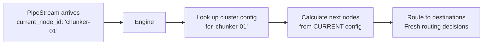
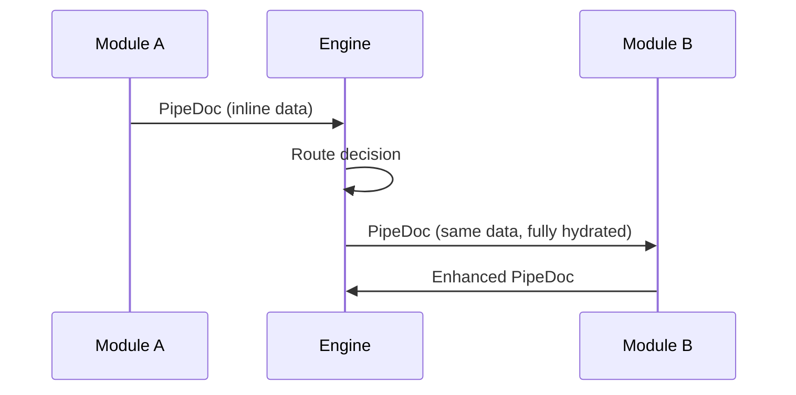
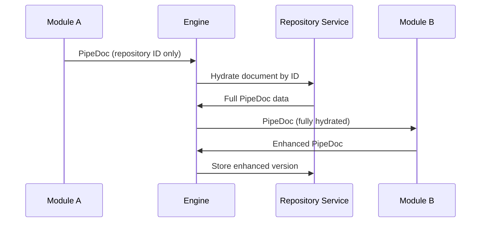
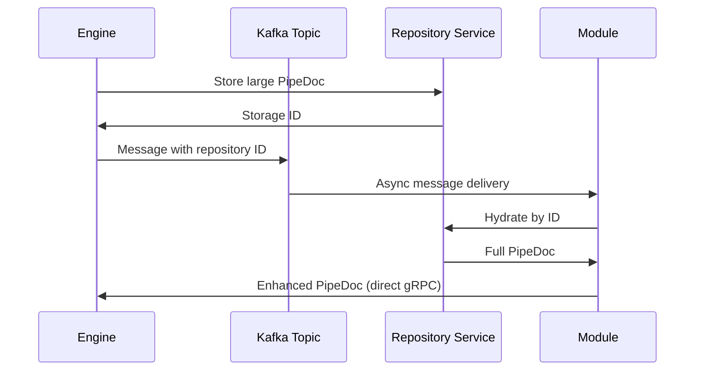

# Pipeline Data Models: Design and Implementation

## Introduction

The Pipeline Engine data model is designed around a core principle: **clean separation between execution metadata and document payload data**. This separation enables efficient processing, payload hydration strategies, and clear module interfaces while supporting the complex routing and network graph execution model.

## Design Philosophy

### The Two-Layer Approach

The system uses two distinct but related data structures to handle different concerns:

1. **PipeDoc**: The actual document and processing payload that modules work with.  This includes all document data, search metadata, and binary assets. 
2. **PipeStream**: The execution envelope that carries current processing context and history. This includes the current node location, processing history, performance metrics, and execution metadata.  The engine handles all routing and network concerns through the graph cluster.

So this concept is similar to how DNS routing can occur.  The network graph calculates the next hop after the processing is complete.  Therefore, modules only see the clean payload (like application data) while the engine handles all the network routing complexity (similar to how DNS routing works).

### Why This Separation Matters

**Performance Benefits:**
- Large documents can be stored once in Repository Service and referenced by ID.  This is the encouraged approach for large binary assets when dealing with pipeline architecture, especially for kafka-based processing. 
- Modules get fully hydrated data without handling storage complexity.  This allows module developers to focus on document processing logic.
- Engine can route lightweight references or full payloads based on transport choice (gRPC vs Kafka).  This allows engine to handle all network routing concerns while modules only see clean data. 

**Development Benefits:**
- Module developers only see clean, relevant data (PipeDoc)
- Engine complexity is hidden from module implementations
- Clean interfaces enable language-agnostic module development

**Operational Benefits:**
- Audit trails and processing history are maintained separately from document data.  This is often a pitfall when dealing with dynamic streams - a lack of an audit trail can lead to confusion and data loss.
- Routing decisions don't pollute document structure.
- Error handling and retries can be managed at the transport level.

---

## PipeDoc: The Document Payload

PipeDoc represents the actual document data that flows through processing modules. It's designed to be the **standard interface** that all modules understand, regardless of their implementation language.

### Core Structure

*Reference: [pipeline_core_types.proto](../../../grpc/grpc-stubs/src/main/proto/pipeline_core_types.proto)*

The PipeDoc structure is designed to be flexible and extensible.  It includes all the standard fields needed for document processing, but also allows for customer-specific data. It consists of four main fields:

* `doc_id`: Unique identifier for the document
* `search_metadata`: Structured search-optimized fields
* `blobBag`: Binary assets needed for parsing or downstream processing
* `structured_data`: Customer-defined protobuf data 

```protobuf
message PipeDoc {
  string doc_id = 1;                              // Unique document identifier
  SearchMetadata search_metadata = 2;             // Structured search-optimized fields  
  BlobBag blobBag = 3;                           // Binary assets for parsing
  google.protobuf.Any structured_data = 4;       // Customer-provided protobuf data
}
```

### Field-by-Field Breakdown

#### `doc_id` (string)
- **Purpose**: Unique identifier that follows the document through all processing steps.  This is converted to a UUID internally, allowing for easy tracking, deduplication, and consistent partitioning in Kafka.
- **Format**: Usually UUID or structured ID like `gutenberg_12345` 
- **Immutable**: Should not change during processing pipeline
- **Usage**: Enables tracking, deduplication, and result correlation

#### `search_metadata` (SearchMetadata)
- **Purpose**: Structured, search-optimized fields designed for indexing, retrieval, and vector/embedding processing
- **Flexibility**: Can be extended with custom fields 
- **Design Goal**: Provide OOTB (out-of-the-box) search capabilities without custom schemas
- **Standards**: Common fields that most search use cases need (title, body, author, etc.)
- **Self-Configuration**: Contains `SemanticProcessingResult` arrays that drive automatic index creation

#### `blobBag` (BlobBag) 
- **Purpose**: Binary assets needed for parsing (images, PDFs, raw files)
- **Use Cases**: OCR processing, image analysis, binary document parsing
- **Storage Strategy**: Can reference Repository Service for large blobs
- **Parser Input**: Primary data source for Parser-type modules

#### `structured_data` (google.protobuf.Any)
- **Purpose**: Customer-defined protobuf structures for domain-specific data
- **Flexibility**: Any protobuf message type can be embedded
- **Search Integration**: ALL data here goes into search engine unless configured otherwise
- **Performance**: Dynamic message handling if type unknown (slower but functional)
- **Schema Managed**: Apicurio-managed schema validation and versioning
- **Schema Evolution**: New fields can be added without breaking existing modules

---

## SearchMetadata: Search-Optimized Document Fields

SearchMetadata is the heart of the self-configuring search system. It provides standardized fields that work across all document types while enabling advanced semantic processing.

Much like how google provides SEO standards for search engines, SearchMetadata provides a common set of fields that are optimized for search.  It includes standard document fields (title, body, author, etc.) as well as enhanced fields for semantic processing (keywords, tags, document outline, etc.).

This data is separate from the document payload so that it can be indexed and queried independently.  It also allows for the same document to be processed by multiple modules, each with its own set of search metadata.

This allows for the application to have a more managed and consistent search schema.  It also allows for the same document to be processed by multiple modules, each with its own set of search metadata.

Finally, customers can add their own fields to SearchMetadata without breaking existing modules.  This allows for a more flexible and extensible search system.

SearchMetadata is designed to be hydrated through the mapping service, so it's not designed to be used directly by modules.  It's designed to be the **standard interface** that all modules understand, regardless of their implementation language.


### Standard Document Fields

```protobuf
// Core document information
optional string title = 1;                    // Document title
optional string body = 2;                     // Main text content
optional string document_type = 4;            // MIME type or logical type
optional string source_uri = 5;               // Origin URL or path
optional string language = 10;                // Detected or specified language
optional string author = 11;                  // Document author/creator
optional string category = 12;                // Business category/classification
```

### Search Enhancement Fields
These are advanced fields that enable advanced search capabilities.  The example below shows the standard fields, followed by the enhanced fields.   The enhanced fields capture a document structure that's common between multiple document types (PDF, HTML, Markdown, word docs, etc.).

#### Keywords

The Keywords field is a list of keywords extracted from the document.  It's designed to be used for keyword search.  It's also designed to be used for faceted search.

#### Tags

The Tags field is a list of tags extracted from the document.  It's designed to be used for tag search.  It's also designed to be used for faceted search.

#### DocOutline

The DocOutline field is a hierarchical structure that represents the document structure.  It's designed to be used for navigation and assistance with chunking documents.

#### LinkReference

The LinkReference field is a list of links extracted from the document.  It's designed to be used for link search.  It's also designed to be used for faceted search, keyword extraction from slugs, and tracking internal and external links.

#### Source Path and Source Path Segments

The Source Path and Source Path Segments fields are used for faceted search and keyword extraction.  They're designed to be used for faceted search and hierarchical search. 

#### Protobuf definition

```protobuf
// Search-specific enhancements  
optional Keywords keywords = 3;               // Extracted keywords
optional Tags tags = 13;                     // Flexible tag system
optional DocOutline doc_outline = 20;        // Document structure for navigation
repeated LinkReference discovered_links = 21; // Internal and external links
optional string source_path = 22;            // URL path for categorization
repeated string source_path_segments = 23;   // Split path for faceted search
```

### Semantic Processing Results

The most powerful feature of SearchMetadata is the semantic processing tracking:

```protobuf
repeated SemanticProcessingResult semantic_results = 18;
```

**This is where the self-configuring magic happens:**
- Tracks every chunking strategy + embedding model combination
- Enables automatic OpenSearch index configuration
- Supports A/B testing with multiple processing approaches
- Drives naming conventions for search field generation
- Naming convention allows for consistent search field names across documents and drives maximum flexibility with working on multiple vectors.

This is a powerful feature as the structure allows for in-place hydration as it goes through the pipeline.  It's designed to be used by modules, not by the application.  It's designed to be the **standard interface** that all modules understand, regardless of their implementation language.

This allows for developers to quickly swap out both chunking and embedding models without having to re-process the entire corpus and save each of these vector strategies within the same document or on their own collections within open search.  It also allows for the same document to be processed by multiple modules, each with its own set of search metadata.

---

## SemanticProcessingResult: The Self-Configuration Engine

Each `SemanticProcessingResult` represents one complete chunking + embedding process applied to a document field, enabling the system to automatically configure search indices.

### Configuration Tracking

```protobuf
message SemanticProcessingResult {
  string result_id = 1;                    // Unique ID for this processing run
  string source_field_name = 2;           // Which field was processed ("body", "title")
  string chunk_config_id = 3;             // Chunking strategy identifier
  string embedding_config_id = 4;         // Embedding model identifier
  string result_display_name = 6;         // Generated name (e.g., "body_chunks_ada_002")
  // ... chunk data and metadata ...
}
```

The fields above identify the chunking strategy, embedding model, and the resulting search index.  The `result_display_name` is a generated name that's used for the search index.  It's designed to be human-readable and easy to remember.  It's also designed to be used for faceted search and keyword extraction. When designing a sink module, the developer will have a highly structured set of embeddings and all necessary metadata to generate the any application KNN-style search.


## BlobBag: Binary Asset Management

BlobBag handles binary data needed for parsing operations, with intelligent storage strategies.  It's designed to be used by Parser-type modules, but can also be used by other modules.  Examples can include the ability to extract images from PDFs, or to parse binary files, or to have an LLM evaluate a video or image.

### Storage Strategy Design

```protobuf
message BlobBag {
  repeated BlobItem blobs = 1;
}

message BlobItem {
  string blob_id = 1;                     // Unique identifier
  string mime_type = 2;                   // Content type
  // Storage options (one of these will be set):
  bytes inline_data = 3;                  // Small data stored directly
  string repository_reference = 4;        // Large data stored in Repository Service
}
```

The blob item contains the following fields:

- **Small files** (< 1MB): Stored inline for speed
- **Large files** (> 1MB): Stored in Repository Service, referenced by ID
- **gRPC transport**: Can handle up to 2GB, choice depends on performance vs cost goals
- **Kafka transport**: Always uses repository references for large payloads

---

## PipeStream: Execution Context (Engine Internal)

PipeStream is the network packet that carries PipeDoc through the engine's routing system. Modules never see PipeStream directly - they only receive fully hydrated PipeDoc objects.

### Actual Structure

*Reference: [pipeline_core_types.proto](../../../grpc/grpc-stubs/src/main/proto/pipeline_core_types.proto)*

```protobuf
message PipeStream {
  string stream_id = 1;                         // Unique execution flow identifier
  StreamMetadata metadata = 2;                  // Stream-level metadata and history
  PipeDoc document = 3;                         // The actual document payload
  
  // Current processing context
  string cluster_id = 4;                        // Which cluster is processing this
  string current_node_id = 5;                   // Current node location
  int64 hop_count = 6;                          // Number of processing steps
  repeated string processing_path = 7;          // Node IDs traversed so far
  
  // Node-specific processing config
  NodeProcessingConfig node_processing_config = 8; // Current node configuration
}
```

### Dynamic Routing Design

**The Clean Architecture Insight:** PipeStream contains **ONLY** the current location (`current_node_id`) - **NOT** the next destinations. Here's why this is brilliant:



**Benefits:**
- **Hot configuration updates**: Change pipeline config → routing immediately updates
- **A/B testing**: Redirect flows without touching in-flight data  
- **Clean payloads**: No stale "next step" data in streams
- **Centralized routing**: All logic in engine configuration, not distributed in payloads

### StreamMetadata: Execution History

```protobuf
message StreamMetadata {
  string source_id = 2;                         // Stream origin identifier
  google.protobuf.Timestamp created_at = 3;     // Stream creation time
  google.protobuf.Timestamp last_processed_at = 4; // Latest processing time
  string trace_id = 5;                          // Distributed tracing correlation
  repeated StepExecutionRecord history = 6;     // Complete processing history
  optional ErrorData stream_error = 7;          // Critical stream-level errors
  map<string, string> context_params = 8;       // Stream-level context (tenant_id, etc.)
}
```

**Execution History Benefits:**
- **Audit trail**: Complete record of which nodes processed this document
- **Performance tracking**: Timing data for each processing step
- **Error correlation**: Link errors to specific processing steps
- **Debugging**: Full visibility into execution path

### Why Modules Are Shielded

**Engine Handles (Hidden from Modules):**
- Current node lookup and routing decisions
- Repository Service hydration when payload ID is provided  
- Processing history and audit trail maintenance
- Performance metrics and timing data
- Error handling and retry logic
- Transport selection (gRPC vs Kafka)

**Modules Handle (Clean Interface):**
- Document processing logic only
- Receive fully hydrated PipeDoc objects
- Return enhanced PipeDoc objects  
- Never deal with storage, routing, or network concerns

### Network Packet Analogy

Just like TCP/IP networking:
- **Application Layer** (Module): Sees clean data, focused on business logic
- **Transport Layer** (PipeStream): Handles routing, reliability, flow control
- **Network Layer** (Engine): Manages addressing and forwarding decisions
- **Physical Layer** (Repository/Kafka/gRPC): Actual data transmission

---

## Data Flow Patterns

### Pattern 1: Small Document (Direct gRPC)



### Pattern 2: Large Document (Repository Hydration)



### Pattern 3: Kafka Async Processing



---

## Evolution and Extensibility

### Backwards Compatibility Strategy

**Field Evolution:**
- New optional fields can be added to SearchMetadata without breaking existing modules
- `structured_data` allows customer extensions without core schema changes
- `custom_fields` provides escape hatch for unforeseen requirements

**Processing Enhancement:**
- Additional `SemanticProcessingResult` entries support new chunking/embedding strategies
- Existing processing results remain unchanged
- Search indices can be versioned and migrated

### Future Enhancements

**Planned Additions:**
- Advanced multimedia blob support (video, audio metadata)
- Temporal data processing for time-series documents
- Collaborative editing metadata for multi-user document workflows
- Provenance tracking for data lineage and compliance

**Performance Optimizations:**
- Streaming support for very large documents
- Partial payload hydration for bandwidth optimization
- Caching strategies for frequently accessed processing results

---

## Implementation Guidelines

### For Module Developers

**What You Get (PipeDoc):**
- Clean, fully hydrated document data
- Standard search metadata fields for common operations
- Customer structured data for domain-specific logic
- Binary assets ready for processing (images, files, etc.)

**What You Don't Deal With:**
- Storage and retrieval logistics
- Routing and destination decisions  
- Performance metrics and monitoring
- Network topology and error handling

### For Frontend Developers

**SearchMetadata Integration:**
- Use standard fields (title, body, author) for consistent UI
- Leverage semantic_results for advanced search features
- Build search interfaces around doc_outline for navigation
- Utilize tags and categories for faceted search

### For Operations Teams

**Monitoring Integration:**
- PipeDoc processing metrics flow through LGTM stack
- Repository Service provides storage performance data
- Search effectiveness tracked via semantic_results utilization
- Error patterns emerge from processing history analysis

---

## References

- **Primary Definition**: [pipeline_core_types.proto](../../../grpc/grpc-stubs/src/main/proto/pipeline_core_types.proto)
- **Module Interface**: [module_service.proto](../../../grpc/grpc-stubs/src/main/proto/module_service.proto)  
- **Architecture Context**: [Architecture_overview.md](../Architecture_overview.md)
- **Implementation Guide**: [Module_Development_Guide.md](../modules/Module_Development_Guide.md)