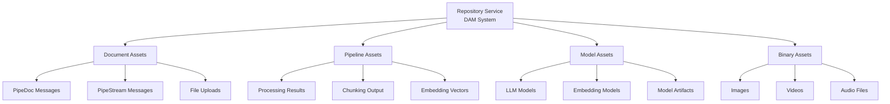
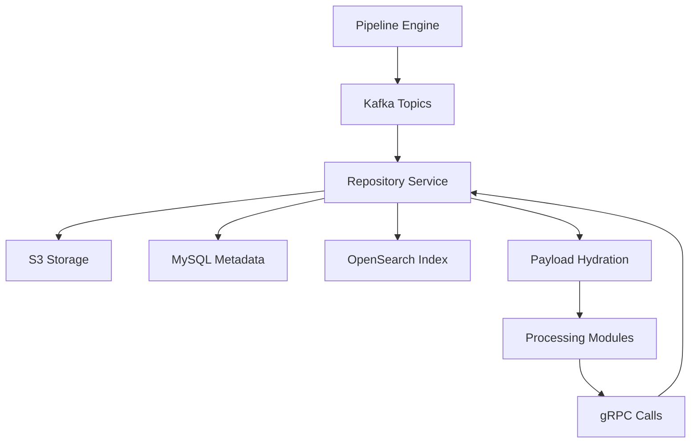
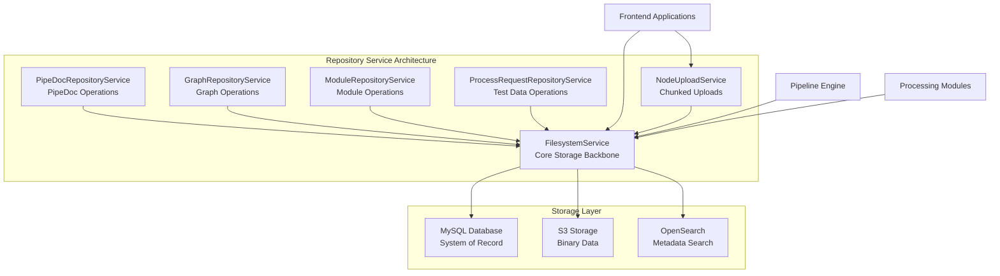
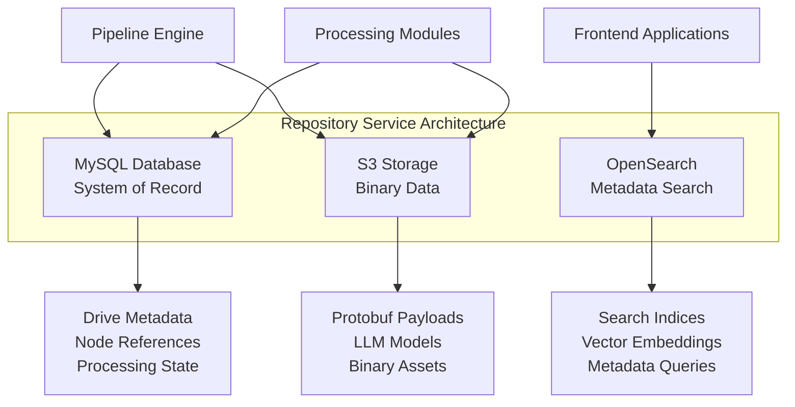

# Repository Service Architecture - Section 1: Overview & Design Philosophy

## Overview

The Repository Service is the central storage and metadata management system for the Pipeline Engine. It implements a **multi-service architecture** built around a core FilesystemService that separates metadata storage (MySQL) from payload storage (S3), enabling efficient processing of large documents while maintaining comprehensive audit trails and search capabilities.

The service architecture consists of:
- **FilesystemService**: Core storage backbone handling all CRUD operations
- **Specialized Services**: Domain-specific services built on top of FilesystemService
- **Search Integration**: OpenSearch integration for advanced search capabilities

## Design Philosophy

### Core Principles

1. **A DAM for assets in the application**: We will use this service to store and manage all assets in the application, including documents, folders, and metadata. Some usages: kafka payloads (typically a PipeDoc or PipeStream), file uploads, LLM Models for embeddings, and other assets.

2. **NO PAYLOAD IN DATABASE**: Document payloads are stored in S3, not in MySQL

3. **Metadata-Driven**: Database stores only metadata, references, and processing state

4. **Protobuf-First**: Pipeline data is stored as protobuf messages in S3 for consistency

5. **Blocking Hibernate**: Uses Hibernate ORM Panache for simplicity and reliability

6. **Document-Centric**: Focuses on document processing rather than filesystem operations

### DAM (Digital Asset Management) Architecture

The Repository Service functions as a comprehensive Digital Asset Management system for the entire application:

**Asset Types Managed:**
- **Kafka Payloads**: PipeDoc and PipeStream messages
- **File Uploads**: User-uploaded documents and media
- **LLM Models**: Embedding models and related artifacts
- **Processing Results**: Parser, chunker, and embedder outputs
- **Binary Assets**: Images, videos, audio, and other media files

### Protobuf Storage Strategy

The Repository Service stores various types of protobuf data:
- **Pipeline Documents**: Core PipeDoc messages for document processing
- **LLM Models**: Embedding models and related artifacts
- **Request/Response Data**: gRPC and Kafka message payloads
- **Processing Results**: Parser, chunker, and embedder outputs

**File Naming Convention:**
- **Encrypted**: Binary files with key reference stored in MySQL
- **Unencrypted**: `.pb` files when encryption is disabled
- **Frontend Integration**: SVG definitions for each protobuf type

### Pipeline Integration

The Repository Service is central to the pipeline architecture:

**Kafka Integration:**
- Kafka messages contain lightweight references to payloads
- Repository Service handles storage and rehydration
- Modules receive fully hydrated data via gRPC

### Service Architecture

### Architecture Separation

**Storage Ownership:**
- **MySQL**: System of record for all metadata and references
- **S3**: Repository Service owns multiple S3 buckets referenced in MySQL
- **OpenSearch**: Metadata search and indexing for the repository service

### Documentation Structure

This architecture documentation is organized into the following sections:

1. **Overview & Design Philosophy** - High-level architecture and design principles
2. **Technology Stack** - Technologies and frameworks used
3. **Data Model - Drive Entity** - Drive entity design and database schema
4. **Data Model - Node Entity** - Node entity design and database schema
5. **Repository Pattern** - Repository design patterns and use cases
6. **Service Layer Architecture** - Core FilesystemService implementation
7. **S3 Storage Strategy** - S3 integration and storage patterns
8. **Configuration** - Service configuration and environment setup
9. **Testing Strategy** - Testing approaches and strategies
10. **Migration & Performance** - Performance considerations and monitoring
11. **Specialized Services** - Domain-specific services built on FilesystemService

### Target Audience

This document serves:
- **Architects**: Understanding system design and integration patterns
- **Developers**: Implementation details and code examples
- **DevOps**: Configuration, deployment, and monitoring
- **Operations**: Troubleshooting and performance optimization