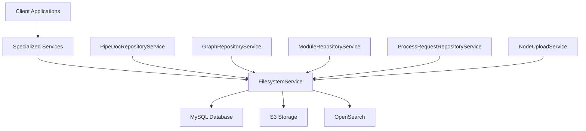
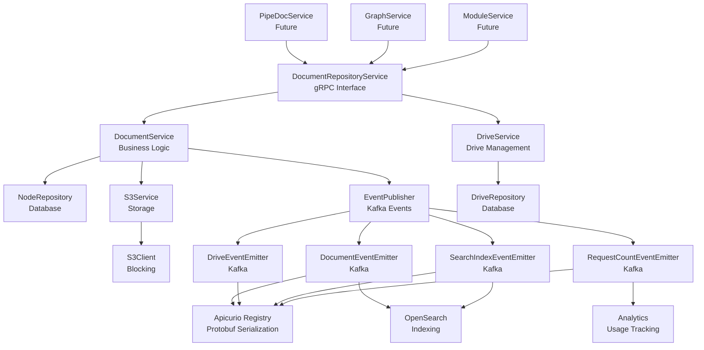

# Repository Service Architecture - Section 6: Service Layer Architecture

## Multi-Service Architecture

**Strategy:**
- **FilesystemService**: Core storage backbone handling all CRUD operations
- **Specialized Services**: Domain-specific services built on top of FilesystemService
- **Service Composition**: Specialized services call FilesystemService internally
- **Single Storage Interface**: Only FilesystemService directly accesses MySQL/S3

## Service Hierarchy



## Hybrid Reactive/Blocking Approach

**Strategy:**
- **gRPC Interface**: Mutiny stubs for async gRPC communication
- **Business Logic**: Blocking operations for simplicity and reliability
- **S3 Operations**: Blocking S3 client wrapped in `Uni.createFrom().item()` for compatibility
- **Database**: Blocking Hibernate Panache operations

## FilesystemService Architecture

```java
@ApplicationScoped
public class FilesystemServiceImpl implements FilesystemService {
    
    @Inject
    NodeRepository nodeRepository;
    
    @Inject
    DriveRepository driveRepository;
    
    @Inject
    S3Service s3Service;
    
    @Inject
    EventPublisher eventPublisher;
    
    // Mutiny gRPC interface - async communication
    @Override
    public Uni<Node> createNode(CreateNodeRequest request) {
        return Uni.createFrom().item(() -> {
            // Blocking business logic
            return createNodeInternal(request);
        }).chain(node -> {
            // Publish event
            return eventPublisher.publishNodeCreated(node)
                .map(v -> node);
        });
    }
    
    @Override
    public Uni<GetDocumentResponse> getDocument(GetDocumentRequest request) {
        return Uni.createFrom().item(() -> {
            // Blocking business logic
            return documentService.getDocument(request);
        }).map(response -> GetDocumentResponse.newBuilder()
            .setDocument(response.getDocument())
            .build());
    }
    
    @Override
    public Uni<UpdateDocumentResponse> updateDocument(UpdateDocumentRequest request) {
        return Uni.createFrom().item(() -> {
            // Blocking business logic
            return documentService.updateDocument(request);
        }).map(response -> UpdateDocumentResponse.newBuilder()
            .setDocument(response.getDocument())
            .build());
    }
    
    @Override
    public Uni<DeleteDocumentResponse> deleteDocument(DeleteDocumentRequest request) {
        return Uni.createFrom().item(() -> {
            // Blocking business logic
            return documentService.deleteDocument(request);
        }).map(success -> DeleteDocumentResponse.newBuilder()
            .setSuccess(success)
            .build());
    }
    
    // Tree operations deprecated - return UNIMPLEMENTED
    @Override
    @Deprecated(since = "2.0", forRemoval = true)
    public Uni<GetChildrenResponse> getChildren(GetChildrenRequest request) {
        return Uni.createFrom().failure(
            new StatusRuntimeException(Status.UNIMPLEMENTED.withDescription("Tree operations moved to SearchService"))
        );
    }
}
```

## Business Logic Services

```java
@ApplicationScoped
public class DocumentService {
    
    @Inject
    NodeRepository nodeRepository;
    
    @Inject
    S3Service s3Service;
    
    @Inject
    KafkaEventPublisher eventPublisher;
    
    // Blocking operations - simple and reliable
    @Transactional
    public CreateDocumentResult createDocument(CreateDocumentRequest request) {
        try {
            // Generate document ID
            String documentId = UUID.randomUUID().toString();
            
            // Create node entity
            Node node = new Node();
            node.documentId = documentId;
            node.name = request.getName();
            node.nodeTypeId = getNodeTypeId(request.getNodeType());
            node.s3Key = generateS3Key(documentId, request.getPayloadType());
            node.size = (long) request.getPayload().size();
            node.createdAt = OffsetDateTime.now();
            
            nodeRepository.persist(node);
            
            // Upload to S3 (blocking)
            S3UploadResult s3Result = s3Service.uploadPayloadSync(node.s3Key, request.getPayload().toByteArray());
            
            // Publish event
            eventPublisher.publishDocumentCreated(node);
            
            return new CreateDocumentResult(documentId, node.s3Key, s3Result.getETag());
            
        } catch (Exception e) {
            throw new RuntimeException("Failed to create document", e);
        }
    }
    
    @Transactional
    public GetDocumentResult getDocument(GetDocumentRequest request) {
        Node node = nodeRepository.findByDocumentId(request.getDocumentId());
        if (node == null) {
            throw new RuntimeException("Document not found: " + request.getDocumentId());
        }
        
        if (request.getIncludePayload()) {
            // Download from S3 (blocking)
            byte[] payload = s3Service.downloadPayloadSync(node.s3Key);
            return new GetDocumentResult(node, payload);
        } else {
            return new GetDocumentResult(node, null);
        }
    }
    
    @Transactional
    public UpdateDocumentResult updateDocument(UpdateDocumentRequest request) {
        Node node = nodeRepository.findByDocumentId(request.getDocumentId());
        if (node == null) {
            throw new RuntimeException("Document not found: " + request.getDocumentId());
        }
        
        // Update metadata if provided
        if (request.hasName()) {
            node.name = request.getName();
        }
        if (request.hasMetadata()) {
            node.metadata = request.getMetadata();
        }
        
        // Update payload if provided
        if (request.hasPayload()) {
            // Update S3 (blocking)
            S3UpdateResult s3Result = s3Service.updatePayloadSync(node.s3Key, request.getPayload().toByteArray());
            node.size = (long) request.getPayload().size();
        }
        
        node.updatedAt = OffsetDateTime.now();
        nodeRepository.persist(node);
        
        // Publish event
        eventPublisher.publishDocumentUpdated(node);
        
        return new UpdateDocumentResult(node);
    }
    
    @Transactional
    public boolean deleteDocument(DeleteDocumentRequest request) {
        Node node = nodeRepository.findByDocumentId(request.getDocumentId());
        if (node == null) {
            return false;
        }
        
        try {
            // Delete from S3 (blocking)
            boolean s3Deleted = s3Service.deletePayloadSync(node.s3Key);
            
            if (s3Deleted) {
                // Delete from database
                nodeRepository.deleteNode(request.getDocumentId());
                
                // Publish event
                eventPublisher.publishDocumentDeleted(request.getDocumentId(), node.s3Key);
                return true;
            }
            return false;
            
        } catch (Exception e) {
            throw new RuntimeException("Failed to delete document", e);
        }
    }
    
    private Long getNodeTypeId(String nodeTypeCode) {
        // Implementation to get node type ID
        return 1L; // Placeholder
    }
    
    private String generateS3Key(String documentId, String protobufTypeUrl) {
        String typeName = extractTypeName(protobufTypeUrl);
        return String.format("%s.pb", documentId);
    }
    
    private String extractTypeName(String protobufTypeUrl) {
        return protobufTypeUrl.substring(protobufTypeUrl.lastIndexOf('.') + 1);
    }
}
```

## S3 Service (Blocking with Multi-part Support)

```java
@ApplicationScoped
public class S3Service {
    
    @Inject
    S3Client s3Client; // Blocking S3 client
    
    @Inject
    DriveRepository driveRepository;
    
    // Multi-part upload for large files
    public S3UploadResult uploadPayloadSync(String s3Key, byte[] payload) {
        if (payload.length < 5 * 1024 * 1024) { // Less than 5MB
            return uploadSinglePart(s3Key, payload);
        } else {
            return uploadMultiPart(s3Key, payload);
        }
    }
    
    // Single-part upload for small files
    private S3UploadResult uploadSinglePart(String s3Key, byte[] payload) {
        try {
            PutObjectRequest request = PutObjectRequest.builder()
                .bucket(getBucketName())
                .key(s3Key)
                .contentLength((long) payload.length)
                .build();
                
            PutObjectResponse response = s3Client.putObject(request, RequestBody.fromBytes(payload));
            return new S3UploadResult(s3Key, payload.length, response.eTag());
            
        } catch (Exception e) {
            throw new RuntimeException("Failed to upload to S3", e);
        }
    }
    
    // Multi-part upload for large files
    private S3UploadResult uploadMultiPart(String s3Key, byte[] payload) {
        try {
            // Initialize multi-part upload
            CreateMultipartUploadRequest createRequest = CreateMultipartUploadRequest.builder()
                .bucket(getBucketName())
                .key(s3Key)
                .build();
                
            CreateMultipartUploadResponse createResponse = s3Client.createMultipartUpload(createRequest);
            String uploadId = createResponse.uploadId();
            
            // Upload parts
            List<CompletedPart> completedParts = new ArrayList<>();
            int partSize = 5 * 1024 * 1024; // 5MB per part
            int partNumber = 1;
            
            for (int i = 0; i < payload.length; i += partSize) {
                int endIndex = Math.min(i + partSize, payload.length);
                byte[] partData = Arrays.copyOfRange(payload, i, endIndex);
                
                UploadPartRequest partRequest = UploadPartRequest.builder()
                    .bucket(getBucketName())
                    .key(s3Key)
                    .uploadId(uploadId)
                    .partNumber(partNumber)
                    .build();
                    
                UploadPartResponse partResponse = s3Client.uploadPart(partRequest, RequestBody.fromBytes(partData));
                
                completedParts.add(CompletedPart.builder()
                    .partNumber(partNumber)
                    .eTag(partResponse.eTag())
                    .build());
                    
                partNumber++;
            }
            
            // Complete multi-part upload
            CompleteMultipartUploadRequest completeRequest = CompleteMultipartUploadRequest.builder()
                .bucket(getBucketName())
                .key(s3Key)
                .uploadId(uploadId)
                .multipartUpload(CompletedMultipartUpload.builder()
                    .parts(completedParts)
                    .build())
                .build();
                
            CompleteMultipartUploadResponse completeResponse = s3Client.completeMultipartUpload(completeRequest);
            
            return new S3UploadResult(s3Key, payload.length, completeResponse.eTag());
            
        } catch (Exception e) {
            // Abort multi-part upload on failure
            try {
                AbortMultipartUploadRequest abortRequest = AbortMultipartUploadRequest.builder()
                    .bucket(getBucketName())
                    .key(s3Key)
                    .uploadId(uploadId)
                    .build();
                s3Client.abortMultipartUpload(abortRequest);
            } catch (Exception abortException) {
                // Log abort failure
            }
            throw new RuntimeException("Failed to upload to S3", e);
        }
    }
    
    // Download operations
    public byte[] downloadPayloadSync(String s3Key) {
        try {
            GetObjectRequest request = GetObjectRequest.builder()
                .bucket(getBucketName())
                .key(s3Key)
                .build();
                
            ResponseBytes<GetObjectResponse> response = s3Client.getObject(request, ResponseTransformer.toBytes());
            return response.asByteArray();
            
        } catch (Exception e) {
            throw new RuntimeException("Failed to download from S3", e);
        }
    }
    
    // Update operations
    public S3UpdateResult updatePayloadSync(String s3Key, byte[] newPayload) {
        return uploadPayloadSync(s3Key, newPayload);
    }
    
    // Delete operations
    public boolean deletePayloadSync(String s3Key) {
        try {
            DeleteObjectRequest request = DeleteObjectRequest.builder()
                .bucket(getBucketName())
                .key(s3Key)
                .build();
                
            s3Client.deleteObject(request);
            return true;
            
        } catch (Exception e) {
            throw new RuntimeException("Failed to delete from S3", e);
        }
    }
    
    private String getBucketName() {
        Drive drive = driveRepository.findActiveDrives().get(0);
        return drive.bucketName;
    }
}
```

## Multi-part Upload Service

```java
@ApplicationScoped
public class NodeUploadServiceImpl implements NodeUploadService {
    
    @Inject
    DocumentService documentService;
    
    @Inject
    UploadProgressRepository uploadProgressRepository;
    
    @Inject
    S3Service s3Service;
    
    // Initiate upload and get node ID immediately
    @Override
    public Uni<InitiateUploadResponse> initiateUpload(InitiateUploadRequest request) {
        return Uni.createFrom().item(() -> {
            // Create node immediately
            String nodeId = UUID.randomUUID().toString();
            String uploadId = UUID.randomUUID().toString();
            
            // Create upload progress record
            UploadProgress progress = new UploadProgress();
            progress.documentId = nodeId;
            progress.uploadId = uploadId;
            progress.statusId = getPendingStatusId();
            progress.totalChunks = calculateTotalChunks(request.getExpectedSize());
            progress.completedChunks = 0;
            progress.startedAt = OffsetDateTime.now();
            
            uploadProgressRepository.persist(progress);
            
            return InitiateUploadResponse.newBuilder()
                .setNodeId(nodeId)
                .setUploadId(uploadId)
                .setState(UploadState.UPLOAD_STATE_PENDING)
                .setCreatedAtEpochMs(System.currentTimeMillis())
                .build();
        });
    }
    
    // Upload file in chunks (client streaming)
    @Override
    public Uni<UploadChunkResponse> uploadChunks(Multi<UploadChunkRequest> requests) {
        return requests.collect().asList()
            .map(chunkRequests -> {
                String nodeId = chunkRequests.get(0).getNodeId();
                String uploadId = chunkRequests.get(0).getUploadId();
                
                // Sort chunks by chunk number
                chunkRequests.sort(Comparator.comparing(UploadChunkRequest::getChunkNumber));
                
                // Combine all chunks
                ByteArrayOutputStream combinedData = new ByteArrayOutputStream();
                for (UploadChunkRequest chunk : chunkRequests) {
                    try {
                        combinedData.write(chunk.getData().toByteArray());
                    } catch (IOException e) {
                        throw new RuntimeException("Failed to combine chunks", e);
                    }
                }
                
                // Update progress
                UploadProgress progress = uploadProgressRepository.findByDocumentId(nodeId);
                progress.completedChunks = chunkRequests.size();
                progress.statusId = getUploadingStatusId();
                uploadProgressRepository.persist(progress);
                
                // Upload to S3
                String s3Key = generateS3Key(nodeId);
                S3UploadResult result = s3Service.uploadPayloadSync(s3Key, combinedData.toByteArray());
                
                // Mark as completed
                progress.statusId = getCompletedStatusId();
                progress.completedAt = OffsetDateTime.now();
                uploadProgressRepository.persist(progress);
                
                // Move to completed uploads table
                moveToCompletedUploads(progress);
                
                return UploadChunkResponse.newBuilder()
                    .setNodeId(nodeId)
                    .setState(UploadState.UPLOAD_STATE_COMPLETED)
                    .setBytesUploaded(combinedData.size())
                    .setChunkNumber(chunkRequests.size())
                    .build();
            });
    }
    
    private int calculateTotalChunks(long expectedSize) {
        int chunkSize = getChunkSize();
        return (int) Math.ceil((double) expectedSize / chunkSize);
    }
    
    private int getChunkSize() {
        return 5 * 1024 * 1024; // 5MB chunks
    }
    
    private Long getPendingStatusId() { return 1L; }
    private Long getUploadingStatusId() { return 2L; }
    private Long getCompletedStatusId() { return 3L; }
    
    private String generateS3Key(String nodeId) {
        return String.format("%s.pb", nodeId);
    }
    
    private void moveToCompletedUploads(UploadProgress progress) {
        // Implementation to move to completed uploads table
    }
}
```

## Kafka Event Strategy

### **Event Flow Architecture**
```
gRPC Request → Business Logic → S3 Storage → Database → Kafka Events → OpenSearch/Analytics
```

### **Event Types and Emission Points**

#### **1. DocumentEvent**
- **Emit When**: Document CRUD operations complete
- **Events**: `DocumentCreated`, `DocumentUpdated`, `DocumentDeleted`, `DocumentAccessed`
- **Partition Key**: `documentId` (ensures ordering per document)
- **Purpose**: OpenSearch indexing, audit trail

#### **2. DriveEvent** 
- **Emit When**: Drive CRUD operations complete
- **Events**: `DriveCreated`, `DriveUpdated`, `DriveDeleted`, `DriveStatusChanged`
- **Partition Key**: `driveId` (ensures ordering per drive)
- **Purpose**: Drive management, billing, analytics

#### **3. SearchIndexEvent**
- **Emit When**: Document operations complete (for indexing)
- **Events**: `SearchIndexRequested`, `SearchIndexCompleted`, `SearchIndexFailed`, `SearchIndexDeleted`
- **Partition Key**: `documentId` (same as DocumentEvent)
- **Purpose**: OpenSearch indexing pipeline

#### **4. RequestCountEvent**
- **Emit When**: Any operation completes (for analytics)
- **Events**: `DocumentRequestCount`, `DriveRequestCount`, `ListRequestCount`
- **Partition Key**: `documentId` (when available), fallback to `driveId`
- **Purpose**: Usage analytics, billing, performance monitoring

### **Kafka Emitters Architecture**

#### **BaseRepoEmitter<T extends MessageLite>**
```java
public abstract class BaseRepoEmitter<T extends MessageLite> implements RepoEmitter<T> {
    
    protected final MutinyEmitter<T> delegate;
    protected final KafkaKeyStrategy keyStrategy;
    
    // Send with acknowledgment
    public Uni<Void> send(T message) {
        UUID key = keyStrategy.getKey(message);
        OutgoingKafkaRecordMetadata<UUID> metadata = OutgoingKafkaRecordMetadata.<UUID>builder()
            .withKey(key)
            .build();
        return delegate.sendMessage(Message.of(message).addMetadata(metadata));
    }
    
    // Fire-and-forget
    public void sendAndForget(T message) {
        UUID key = keyStrategy.getKey(message);
        OutgoingKafkaRecordMetadata<UUID> metadata = OutgoingKafkaRecordMetadata.<UUID>builder()
            .withKey(key)
            .build();
        delegate.sendMessageAndForget(Message.of(message).addMetadata(metadata));
    }
}
```

#### **Specific Emitters**
```java
@ApplicationScoped
public class DocumentEventEmitter extends BaseRepoEmitter<DocumentEvent> {
    @Inject
    public DocumentEventEmitter(@Channel("document-events") MutinyEmitter<DocumentEvent> delegate,
                              KafkaKeyStrategy keyStrategy) {
        super(delegate, keyStrategy);
    }
}

@ApplicationScoped
public class DriveEventEmitter extends BaseRepoEmitter<DriveEvent> {
    @Inject
    public DriveEventEmitter(@Channel("drive-events") MutinyEmitter<DriveEvent> delegate,
                           KafkaKeyStrategy keyStrategy) {
        super(delegate, keyStrategy);
    }
}

@ApplicationScoped
public class SearchIndexEventEmitter extends BaseRepoEmitter<SearchIndexEvent> {
    @Inject
    public SearchIndexEventEmitter(@Channel("search-index-events") MutinyEmitter<SearchIndexEvent> delegate,
                                 KafkaKeyStrategy keyStrategy) {
        super(delegate, keyStrategy);
    }
}

@ApplicationScoped
public class RequestCountEventEmitter extends BaseRepoEmitter<RequestCountEvent> {
    @Inject
    public RequestCountEventEmitter(@Channel("request-count-events") MutinyEmitter<RequestCountEvent> delegate,
                                  KafkaKeyStrategy keyStrategy) {
        super(delegate, keyStrategy);
    }
}
```

#### **KafkaKeyStrategy**
```java
@ApplicationScoped
public class KafkaKeyStrategy {
    
    public UUID getKey(Object message) {
        if (message instanceof DocumentEvent) {
            return UUID.nameUUIDFromBytes(event.getDocumentId().getBytes());
        }
        if (message instanceof DriveEvent) {
            return UUID.nameUUIDFromBytes(String.valueOf(event.getDriveId()).getBytes());
        }
        if (message instanceof SearchIndexEvent) {
            return UUID.nameUUIDFromBytes(event.getDocumentId().getBytes());
        }
        if (message instanceof RequestCountEvent) {
            if (event.hasDocumentRequest()) {
                return UUID.nameUUIDFromBytes(event.getDocumentRequest().getDocumentId().getBytes());
            } else {
                return UUID.nameUUIDFromBytes(String.valueOf(event.getDriveId()).getBytes());
            }
        }
        throw new IllegalArgumentException("Unknown message type: " + message.getClass());
    }
}
```

### **Event Publisher Integration**
```java
@ApplicationScoped
public class EventPublisher {
    
    @Inject
    DocumentEventEmitter documentEventEmitter;
    
    @Inject
    DriveEventEmitter driveEventEmitter;
    
    @Inject
    SearchIndexEventEmitter searchIndexEventEmitter;
    
    @Inject
    RequestCountEventEmitter requestCountEventEmitter;
    
    public Uni<Void> publishDocumentCreated(String documentId, String driveName, Long driveId, 
                                          String name, String documentType, String contentType, 
                                          Long size, String s3Key, String payloadType, Any payload) {
        DocumentEvent event = DocumentEvent.newBuilder()
            .setEventId(UUID.randomUUID().toString())
            .setTimestamp(Timestamp.newBuilder()
                .setSeconds(Instant.now().getEpochSecond())
                .setNanos(Instant.now().getNano())
                .build())
            .setDocumentId(documentId)
            .setDriveName(driveName)
            .setDriveId(driveId)
            .setPath("/") // TODO: Calculate actual path
            .setCreated(DocumentEvent.DocumentCreated.newBuilder()
                .setName(name)
                .setDocumentType(documentType)
                .setContentType(contentType)
                .setSize(size)
                .setS3Key(s3Key)
                .setPayloadType(payloadType)
                .setPayload(payload)
                .build())
            .build();
        
        return documentEventEmitter.send(event);
    }
    
    // Similar methods for other events...
}
```

### **Apicurio Registry Integration**
- **Automatic Serialization**: Protobuf messages automatically serialized by Apicurio
- **Schema Evolution**: Automatic schema registration and evolution
- **Type Safety**: Compile-time type checking for all events
- **No Manual Serialization**: No need to manually handle protobuf serialization

## Service Dependencies



## Key Benefits

1. **Mutiny gRPC**: Async communication with clients
2. **Blocking Business Logic**: Simple, reliable, debuggable
3. **S3 Compatibility**: Works with blocking S3 clients
4. **Transaction Safety**: Proper transaction management
5. **Error Handling**: Clear error propagation
6. **Extensible**: Easy to add new services
7. **Multi-part Support**: Automatic multi-part uploads for files > 5MB
8. **Streaming**: Can handle very large files without loading everything into memory