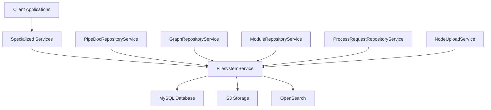
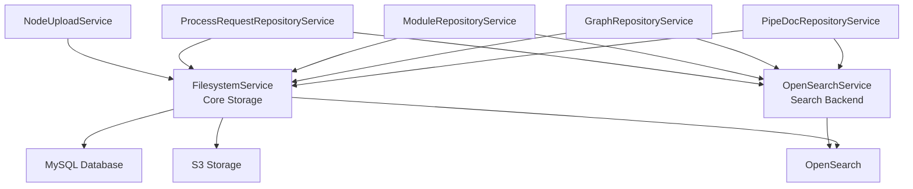

# Repository Service Architecture - Section 11: Specialized Services

## Overview

The Repository Service implements a **multi-service architecture** where specialized services are built on top of the core FilesystemService. These services provide domain-specific operations while delegating all storage operations to the FilesystemService backbone.

## Service Architecture Pattern



## Service Composition Pattern

All specialized services follow the same pattern:

1. **Receive domain-specific requests** (e.g., `CreatePipeDocRequest`)
2. **Transform to FilesystemService requests** (e.g., `CreateNodeRequest`)
3. **Call FilesystemService** for storage operations
4. **Transform responses** back to domain-specific types
5. **Add domain-specific operations** (search, export/import, etc.)

## Specialized Services

### 1. PipeDocRepositoryService

**Purpose**: Manage PipeDoc documents with domain-specific operations

**Key Operations**:
- `CreatePipeDoc()` → Calls `FilesystemService.CreateNode()` with PipeDoc payload
- `GetPipeDoc()` → Calls `FilesystemService.GetNode()` and deserializes PipeDoc
- `SearchPipeDocs()` → Calls OpenSearch service for PipeDoc-specific search
- `ExportPipeDocs()` → Batch export of PipeDoc documents

**Implementation Pattern**:
```java
@ApplicationScoped
public class PipeDocRepositoryServiceImpl implements PipeDocRepositoryService {
    
    @Inject
    FilesystemService filesystemService;
    
    @Inject
    OpenSearchService openSearchService;
    
    @Override
    public Uni<CreatePipeDocResponse> createPipeDoc(CreatePipeDocRequest request) {
        // Transform to FilesystemService request
        CreateNodeRequest nodeRequest = CreateNodeRequest.newBuilder()
            .setDrive(request.getDrive())
            .setName(request.getName())
            .setNodeTypeId(getPipeDocNodeTypeId())
            .setPayload(request.getPipeDoc())
            .setPayloadType("io.pipeline.data.v1.PipeDoc")
            .build();
        
        // Call FilesystemService
        return filesystemService.createNode(nodeRequest)
            .map(node -> CreatePipeDocResponse.newBuilder()
                .setStorageId(node.getDocumentId())
                .build());
    }
}
```

### 2. GraphRepositoryService

**Purpose**: Manage graph nodes and network topology

**Key Operations**:
- `CreateNode()` → Calls `FilesystemService.CreateNode()` with GraphNode payload
- `CreateGraph()` → Creates multiple nodes and relationships
- `ResolveNode()` → DNS-like node resolution
- `DetectLoops()` → Graph analysis operations

**Implementation Pattern**:
```java
@ApplicationScoped
public class GraphRepositoryServiceImpl implements GraphRepositoryService {
    
    @Inject
    FilesystemService filesystemService;
    
    @Override
    public Uni<GraphNode> createNode(CreateNodeRequest request) {
        // Transform to FilesystemService request
        CreateNodeRequest nodeRequest = CreateNodeRequest.newBuilder()
            .setDrive(request.getDrive())
            .setName(request.getName())
            .setNodeTypeId(getGraphNodeTypeId())
            .setPayload(request.getGraphNode())
            .setPayloadType("io.pipeline.config.v1.GraphNode")
            .build();
        
        // Call FilesystemService
        return filesystemService.createNode(nodeRequest)
            .map(node -> deserializeGraphNode(node.getPayload()));
    }
}
```

### 3. ModuleRepositoryService

**Purpose**: Manage module definitions and configurations

**Key Operations**:
- `CreateModule()` → Calls `FilesystemService.CreateNode()` with ModuleDefinition payload
- `FindModulesByType()` → Search modules by type
- `ExportModules()` → Batch export of module definitions

**Implementation Pattern**:
```java
@ApplicationScoped
public class ModuleRepositoryServiceImpl implements ModuleRepositoryService {
    
    @Inject
    FilesystemService filesystemService;
    
    @Override
    public Uni<ModuleDefinition> createModule(CreateModuleRequest request) {
        // Transform to FilesystemService request
        CreateNodeRequest nodeRequest = CreateNodeRequest.newBuilder()
            .setDrive(request.getDrive())
            .setName(request.getImplementationName())
            .setNodeTypeId(getModuleNodeTypeId())
            .setPayload(request.getModuleDefinition())
            .setPayloadType("io.pipeline.config.v1.ModuleDefinition")
            .build();
        
        // Call FilesystemService
        return filesystemService.createNode(nodeRequest)
            .map(node -> deserializeModuleDefinition(node.getPayload()));
    }
}
```

### 4. ProcessRequestRepositoryService

**Purpose**: Manage test data for module processing

**Key Operations**:
- `CreateProcessRequest()` → Calls `FilesystemService.CreateNode()` with ProcessRequest payload
- `CreateProcessResponse()` → Calls `FilesystemService.CreateNode()` with ProcessResponse payload
- `ExportProcessRequests()` → Batch export of test data

**Implementation Pattern**:
```java
@ApplicationScoped
public class ProcessRequestRepositoryServiceImpl implements ProcessRequestRepositoryService {
    
    @Inject
    FilesystemService filesystemService;
    
    @Override
    public Uni<CreateProcessRequestResponse> createProcessRequest(CreateProcessRequestRequest request) {
        // Transform to FilesystemService request
        CreateNodeRequest nodeRequest = CreateNodeRequest.newBuilder()
            .setDrive(request.getDrive())
            .setName(request.getName())
            .setNodeTypeId(getProcessRequestNodeTypeId())
            .setPayload(request.getProcessRequest())
            .setPayloadType("io.pipeline.data.module.ModuleProcessRequest")
            .build();
        
        // Call FilesystemService
        return filesystemService.createNode(nodeRequest)
            .map(node -> CreateProcessRequestResponse.newBuilder()
                .setStorageId(node.getDocumentId())
                .build());
    }
}
```

### 5. NodeUploadService

**Purpose**: Handle chunked file uploads for frontend applications

**Key Operations**:
- `InitiateUpload()` → Creates upload progress record
- `UploadChunks()` → Handles chunked uploads
- `GetUploadStatus()` → Tracks upload progress

**Implementation Pattern**:
```java
@ApplicationScoped
public class NodeUploadServiceImpl implements NodeUploadService {
    
    @Inject
    FilesystemService filesystemService;
    
    @Inject
    UploadProgressRepository uploadProgressRepository;
    
    @Override
    public Uni<InitiateUploadResponse> initiateUpload(InitiateUploadRequest request) {
        // Create upload progress record
        UploadProgress progress = new UploadProgress();
        progress.documentId = UUID.randomUUID().toString();
        progress.uploadId = UUID.randomUUID().toString();
        uploadProgressRepository.persist(progress);
        
        return Uni.createFrom().item(InitiateUploadResponse.newBuilder()
            .setNodeId(progress.documentId)
            .setUploadId(progress.uploadId)
            .setState(UploadState.UPLOAD_STATE_PENDING)
            .build());
    }
    
    @Override
    public Uni<UploadChunkResponse> uploadChunks(Multi<UploadChunkRequest> requests) {
        return requests.collect().asList()
            .map(chunkRequests -> {
                // Combine chunks and upload to FilesystemService
                byte[] combinedData = combineChunks(chunkRequests);
                
                CreateNodeRequest nodeRequest = CreateNodeRequest.newBuilder()
                    .setDrive(chunkRequests.get(0).getDrive())
                    .setName(chunkRequests.get(0).getName())
                    .setPayload(Any.pack(ByteString.copyFrom(combinedData)))
                    .build();
                
                return filesystemService.createNode(nodeRequest);
            });
    }
}
```

## Key Benefits

1. **Single Storage Interface**: Only FilesystemService accesses MySQL/S3
2. **Domain-Specific APIs**: Each service provides tailored operations
3. **Service Composition**: Specialized services compose FilesystemService operations
4. **Extensibility**: Easy to add new specialized services
5. **Consistency**: All services follow the same pattern
6. **Testability**: Each service can be tested independently
7. **Maintainability**: Changes to storage layer only affect FilesystemService

## Service Dependencies



## Implementation Notes

- **Protobuf Type Registry**: FilesystemService maintains a registry of supported protobuf types
- **Payload Serialization**: All payloads are stored as protobuf `Any` messages in S3
- **Event Publishing**: FilesystemService publishes events for all CRUD operations
- **Search Integration**: Specialized services call OpenSearch service for domain-specific search
- **Error Handling**: Consistent error handling across all services
- **Transaction Management**: FilesystemService handles all database transactions
