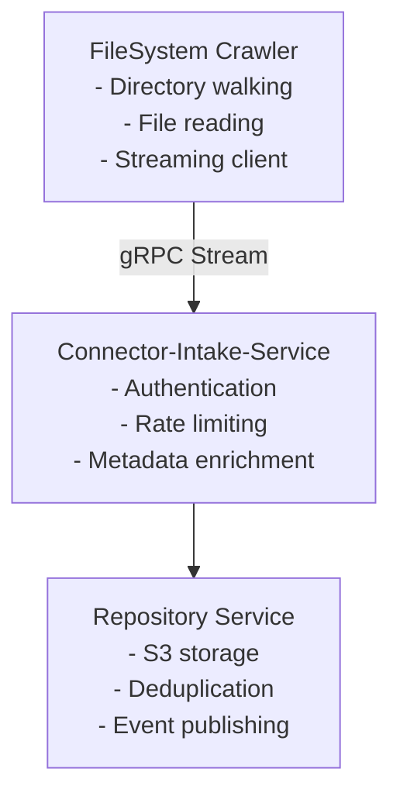

# RFC: FileSystem Crawler Implementation

## Overview

This RFC describes the implementation of a filesystem crawler that ingests documents from local or network filesystems into the pipeline repository service. The crawler is a simple streaming client that sends documents to the connector-intake service for processing.

## Architecture



## Implementation Steps

### Step 1: Connector Registration

Before a crawler can run, it must be registered with the admin service:

```bash
# Register the filesystem connector
grpcurl -plaintext -d '{
  "connector_name": "Production FileSystem Scanner",
  "connector_type": "filesystem",
  "account_id": "acct-12345",
  "s3_bucket": "customer-data",
  "s3_base_path": "connectors/filesystem/",
  "default_metadata": {
    "source": "production-fs",
    "environment": "prod"
  },
  "max_file_size": 104857600,
  "rate_limit_per_minute": 1000
}' localhost:50051 io.pipeline.connector.intake.ConnectorAdminService/RegisterConnector
```

Response:
```json
{
  "success": true,
  "connector_id": "conn-fs-prod-001",
  "api_key": "sk-1234567890abcdef",
  "message": "Connector registered successfully"
}
```

### Step 2: Crawler Implementation

#### 2.1 Configuration

```yaml
# crawler-config.yaml
connector:
  id: "conn-fs-prod-001"
  api_key: "sk-1234567890abcdef"
  intake_service_url: "localhost:50051"

filesystem:
  root_paths:
    - "/data/documents"
    - "/data/reports"

  include_patterns:
    - "*.pdf"
    - "*.docx"
    - "*.txt"
    - "*.md"

  exclude_patterns:
    - "*.tmp"
    - "~*"
    - ".DS_Store"

  max_file_size: 104857600  # 100MB
  follow_symlinks: false

crawl:
  batch_size: 100
  concurrent_files: 10
  checkpoint_interval: 60  # seconds
  resume_on_failure: true
```

#### 2.2 Core Crawler Class (overview, not a full dump)

This section describes the `FileSystemCrawler` at a high level to keep docs maintainable. We include focused, annotated snippets instead of a full Java class.

Key responsibilities
- Establish a gRPC stream to the intake service
- Send a session-start envelope with crawl metadata
- Walk configured root paths and stream documents
- Choose small-file vs. chunked upload path
- Handle completion and failures

Code snippets (annotated)

```text
// (1) Open the stream and start a session
var responseObserver = new ResponseHandler(crawlId);
var requestStream = intakeService.streamDocuments(responseObserver);
startSession(requestStream, crawlId); // (2)
```

Notes
1) The `ResponseHandler` implements gRPC callbacks (onNext/onError/onCompleted).
2) `startSession(...)` sends a `SessionStart` message with connector ID, API key, and crawl metadata.

```text
// (3) Walk a root path and emit files that match filters
try (var paths = Files.walk(rootPath)) {
  paths.filter(Files::isRegularFile)
       .filter(this::shouldInclude) // (4)
       .forEach(path -> sendDocument(path, rootPath, requestStream)); // (5)
}
```

Notes
3) `Files.walk` is used for simplicity; consider `FileVisitor` for very large trees.
4) `shouldInclude` checks include/exclude patterns and size limits from config.
5) `sendDocument` picks small vs. large-file path and writes to the stream.

```text
// (6) Small file: single message with raw bytes and checksum
byte[] content = Files.readAllBytes(file);
DocumentData doc = DocumentData.newBuilder()
    .setClientDocumentId(generateDocumentId(file)) // (7)
    .setFilename(file.getFileName().toString())
    .setMimeType(Files.probeContentType(file))
    .setRawData(ByteString.copyFrom(content))
    .setChecksum(calculateSHA256(content))
    .setChecksumType("SHA256")
    .build();
requestStream.onNext(DocumentIntakeRequest.newBuilder().setDocument(doc).build());
```

Notes
6) Avoid reading very large files fully; the large-file path streams in chunks.
7) `generateDocumentId` should be stable across crawls (e.g., UUID v5 of absolute path).

```text
// (8) Large file: chunked streaming with final checksum on the last chunk
try (InputStream is = Files.newInputStream(file)) {
  MessageDigest digest = MessageDigest.getInstance("SHA-256");
  byte[] buffer = new byte[CHUNK_SIZE];
  int n, chunkNo = 0;
  while ((n = is.read(buffer)) != -1) {
    digest.update(buffer, 0, n);
    boolean last = is.available() == 0; // (9)
    StreamingChunk chunk = StreamingChunk.newBuilder()
        .setDocumentRef(documentRef)
        .setChunkNumber(chunkNo++)
        .setData(ByteString.copyFrom(buffer, 0, n))
        .setIsLast(last)
        .build();
    DocumentData partial = DocumentData.newBuilder()
        .setChunk(chunk)
        .build();
    if (last) {
      partial = partial.toBuilder()
          .setChecksum(Base64.getEncoder().encodeToString(digest.digest()))
          .setChecksumType("SHA256")
          .build();
    }
    requestStream.onNext(DocumentIntakeRequest.newBuilder().setDocument(partial).build());
  }
}
```

Notes
8) Use constant-size chunks (e.g., 5 MB default) and backpressure if needed.
9) In production, prefer tracking bytes read vs. `available()` to determine the last chunk.

### Step 3: Progress Tracking with Heartbeat

```text
// (1) Send periodic heartbeats to report crawler status and receive commands
var exec = Executors.newSingleThreadScheduledExecutor();
exec.scheduleAtFixedRate(() -> {
  try {
    var req = HeartbeatRequest.newBuilder()
        .setSessionId(sessionId)
        .setCrawlId(crawlId)
        .setDocumentsQueued(documentsQueued.get())
        .setDocumentsProcessing(documentsProcessing.get())
        .putMetrics("memory_used_mb", String.valueOf(getMemoryUsedMB()))
        .putMetrics("cpu_percent", String.valueOf(getCpuPercent()))
        .build();
    var resp = intakeService.heartbeat(req);
    // (2) Respond to control-plane commands
    switch (resp.getCommand()) {
      case COMMAND_PAUSE -> pauseCrawl();
      case COMMAND_STOP -> stopCrawl();
      case COMMAND_THROTTLE -> reduceRate();
      case COMMAND_SPEED_UP -> increaseRate();
    }
    if (resp.getConfigUpdatesCount() > 0) {
      applyConfigUpdates(resp.getConfigUpdatesMap()); // (3)
    }
  } catch (Exception e) {
    LOG.warn("Heartbeat failed", e); // (4)
  }
}, 30, 30, TimeUnit.SECONDS);
```

Notes
1) Heartbeats should be lightweight and resilient to transient errors.
2) The intake service can remotely pause/stop/throttle/speed up the crawler.
3) Config updates allow toggling flags (e.g., rate limits, patterns) without restarts.
4) Do not crash on heartbeat errors; log and continue.

### Step 4: Orphan Detection

The crawler supports orphan detection to identify files that have been deleted:

```text
// (1) Enable document tracking at session start to collect orphans automatically
var start = StartCrawlSessionRequest.newBuilder()
    .setConnectorId(connectorId)
    .setApiKey(apiKey)
    .setCrawlId(crawlId)
    .setTrackDocuments(true)   // (2)
    .setDeleteOrphans(true)    // (3)
    .setMetadata(CrawlMetadata.newBuilder().setConnectorType("filesystem").build())
    .build();
var started = intakeService.startCrawlSession(start);

// ... perform crawl ...

var end = EndCrawlSessionRequest.newBuilder()
    .setSessionId(started.getSessionId())
    .setCrawlId(crawlId)
    .setSummary(CrawlSummary.newBuilder()
        .setDocumentsFound(totalFound)
        .setDocumentsProcessed(totalProcessed)
        .setDocumentsFailed(totalFailed)
        .setBytesProcessed(totalBytes)
        .setStarted(crawlStartTime)
        .setCompleted(Timestamp.now())
        .build())
    .build();
var ended = intakeService.endCrawlSession(end);
LOG.info("Crawl completed. Orphans found: {}, deleted: {}",
    ended.getOrphansFound(), ended.getOrphansDeleted());
```

Notes
1) Orphan detection is only meaningful if the repository tracks document identities per crawl.
2) `trackDocuments` keeps a set of discovered IDs; the server derives orphans at session end.
3) With `deleteOrphans=true`, the server performs deletions automatically.

## Error Handling

### Retry Strategy

```text
// (1) Retry transient failures with exponential backoff; do not retry permanent ones
int attempt = 0, backoffMs = 1000;
while (attempt < 3) {
  try {
    sendDocument(file, stream);
    break; // success
  } catch (TransientException e) {
    attempt++;
    if (attempt >= 3) { recordFailure(file, e); break; }
    LOG.warn("Attempt {} failed for {}, retrying in {}ms", attempt, file, backoffMs);
    Thread.sleep(backoffMs);
    backoffMs *= 2; // (2)
  } catch (PermanentException e) {
    recordFailure(file, e);
    break; // (3)
  }
}
```

Notes
1) Bound retries and add jitter in production to avoid thundering herds.
2) Exponential backoff with an upper cap (e.g., 30s) is recommended.
3) Permanent errors (validation, unsupported type) should be surfaced without retries.

### Checkpoint and Resume

```text
// (1) Persist processed IDs to support resume-on-failure
var checkpoint = CheckpointData.newBuilder()
    .setCrawlId(crawlId)
    .setTimestamp(Timestamp.now())
    .addAllProcessedFiles(processedFiles)
    .setLastProcessedPath(currentPath)
    .build();
Files.write(checkpointFile, checkpoint.toByteArray());

// (2) On startup, load and seed the in-memory set
var data = Files.exists(checkpointFile) ? Files.readAllBytes(checkpointFile) : null;
if (data != null) {
  var loaded = CheckpointData.parseFrom(data);
  processedFiles.addAll(loaded.getProcessedFilesList());
}
```

Notes
1) Consider rotating or compacting checkpoints for very large crawls.
2) `shouldSkip` compares the stable `documentId` to avoid duplicate work.

## Performance Considerations

### 1. Memory Management

- Stream large files in chunks (5MB default)
- Use bounded queues for file processing
- Monitor memory usage via heartbeat

### 2. Rate Limiting

- Respect rate limits from intake service
- Implement adaptive rate control
- Back off on throttle commands

### 3. Parallelization

```text
// (1) Parallelize file processing with a bounded thread-pool and semaphore rate-limit
var pool = Executors.newFixedThreadPool(concurrency);
var limiter = new Semaphore(rateLimit);
try (var paths = Files.walk(rootPath)) {
  paths.parallel()
       .filter(Files::isRegularFile)
       .filter(this::shouldInclude)
       .forEach(file -> {
         try {
           limiter.acquire();
           pool.submit(() -> {
             try { processFile(file); } finally { limiter.release(); }
           });
         } catch (InterruptedException ie) { Thread.currentThread().interrupt(); }
       });
}
```

Notes
1) Prefer work-queue designs with backpressure for better control under load.
2) Consider limiting parallelism by directory to avoid hot-spots on network filesystems.

## Monitoring and Metrics

### Metrics to Track

1. **Crawl Progress**
   - Files discovered
   - Files processed
   - Files failed
   - Bytes processed

2. **Performance**
   - Files per second
   - Bytes per second
   - Average file size
   - Processing latency

3. **Errors**
   - Transient failures
   - Permanent failures
   - Network errors
   - Permission errors

### Logging

```text
// Structured logging with context
LOG.info("Document processed",           // (1)
    kv("document_id", documentId),      // (2)
    kv("file_path", file.toString()),   // (3)
    kv("size_bytes", fileSize),         // (4)
    kv("mime_type", mimeType),          // (5)
    kv("duration_ms", processingTime)); // (6)
```

Notes
1) Use a structured logger (e.g., Logstash) to emit machine-parseable fields.
2) `document_id` is the stable client-side identifier.
3) `file_path` can be absolute or relative to root depending on privacy needs.
4) `size_bytes` helps with throughput and backpressure metrics.
5) `mime_type` is useful for downstream parsing decisions.
6) `duration_ms` measures end-to-end processing time for a single file.

## Security Considerations

1. **API Key Management**
   - Store API keys securely (environment variables or secret manager)
   - Rotate keys regularly
   - Never log API keys

2. **File Access**
   - Run with minimal required permissions
   - Validate file paths to prevent directory traversal
   - Handle symbolic links carefully

3. **Content Validation**
   - Verify file sizes before reading
   - Scan for malicious content if required
   - Validate MIME types

## Deployment

### Docker Container

```dockerfile
FROM openjdk:17-slim

WORKDIR /app

COPY target/filesystem-crawler.jar app.jar
COPY config/crawler-config.yaml config.yaml

ENV JAVA_OPTS="-Xmx2g -XX:+UseG1GC"

ENTRYPOINT ["java", "-jar", "app.jar", "--config", "config.yaml"]
```

### Kubernetes Deployment

```yaml
apiVersion: batch/v1
kind: CronJob
metadata:
  name: filesystem-crawler
spec:
  schedule: "0 2 * * *"  # Daily at 2 AM
  jobTemplate:
    spec:
      template:
        spec:
          containers:
          - name: crawler
            image: filesystem-crawler:latest
            env:
            - name: CONNECTOR_ID
              valueFrom:
                secretKeyRef:
                  name: crawler-secrets
                  key: connector-id
            - name: API_KEY
              valueFrom:
                secretKeyRef:
                  name: crawler-secrets
                  key: api-key
            volumeMounts:
            - name: data
              mountPath: /data
              readOnly: true
          volumes:
          - name: data
            persistentVolumeClaim:
              claimName: shared-data-pvc
```

## Testing

### Unit Tests

```java
@Test
public void testDocumentIdGeneration() {
    Path file1 = Paths.get("/data/test.txt");
    Path file2 = Paths.get("/data/test.txt");
    Path file3 = Paths.get("/data/other.txt");

    String id1 = crawler.generateDocumentId(file1);
    String id2 = crawler.generateDocumentId(file2);
    String id3 = crawler.generateDocumentId(file3);

    // Same file should generate same ID
    assertEquals(id1, id2);

    // Different files should generate different IDs
    assertNotEquals(id1, id3);
}
```

### Integration Tests

```java
@Test
public void testEndToEndCrawl() {
    // Start mock intake service
    MockIntakeService mockService = new MockIntakeService();

    // Create test files
    Path testDir = Files.createTempDirectory("crawl-test");
    Files.write(testDir.resolve("test1.txt"), "content1".getBytes());
    Files.write(testDir.resolve("test2.pdf"), "content2".getBytes());

    // Run crawler
    FileSystemCrawler crawler = new FileSystemCrawler(mockService);
    crawler.crawl(Arrays.asList(testDir));

    // Verify
    assertEquals(2, mockService.getReceivedDocuments().size());
    assertTrue(mockService.sessionStarted());
    assertTrue(mockService.sessionCompleted());
}
```

## Future Enhancements

1. **Incremental Crawling**
   - Track file modification times
   - Skip unchanged files
   - Use filesystem watch events

2. **Content Extraction**
   - Extract text from PDFs
   - Parse structured documents
   - Generate thumbnails

3. **Advanced Filtering**
   - Content-based filtering
   - Duplicate detection
   - Language detection

4. **Cloud Storage Support**
   - S3 filesystem crawler
   - Azure Blob crawler
   - Google Cloud Storage crawler

## Conclusion

The filesystem crawler provides a robust, scalable solution for ingesting documents from filesystems into the pipeline. Its simple streaming architecture, combined with the centralized authentication and rate limiting of the connector-intake service, makes it easy to deploy and manage at scale.