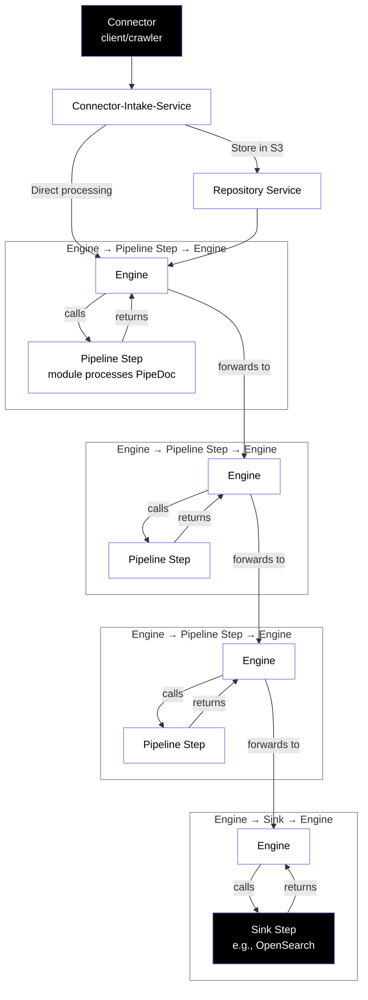
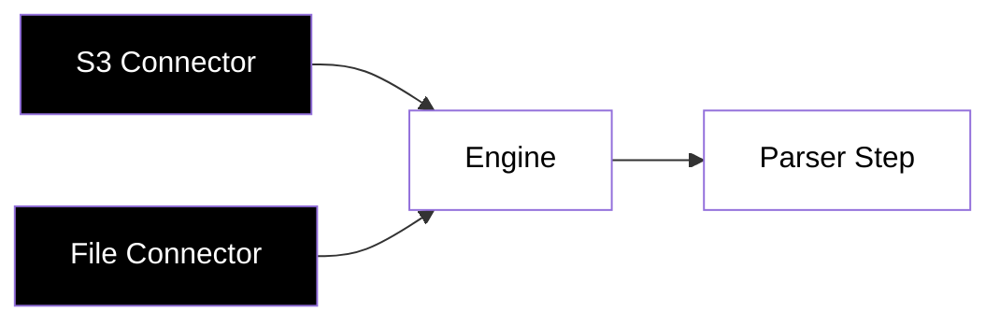
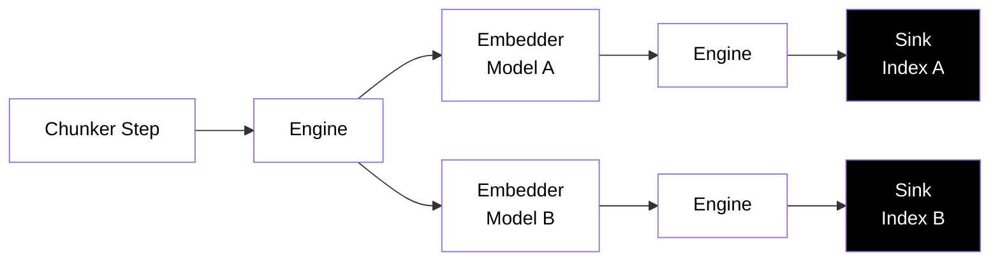
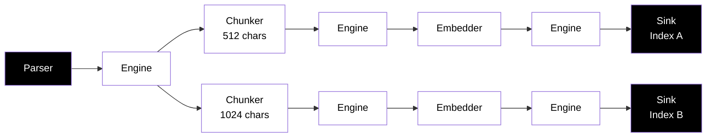

# Document Journey Through the Pipeline System

## Overview

One of the best ways to understand the indexing system and how it simplifies index processing is to follow the data journey taken by documents that get processing.

This document tracks the end-to-end journey of documents through the Pipestream Platform, from initial ingestion to final indexing in OpenSearch. We'll follow two concrete examples to illustrate different entry points and processing patterns:

1. **PDF from S3 Crawl** - Got an s3 bucket you'd like to scan and index? This example demonstrates repository-based storage with Kafka-triggered processing
2. **Video File Streamed** - Demonstrates streaming protocol for large files with direct engine invocation

## Key Concepts

### Introduction: The engine, Repository service, Processing Modules, and Pipeline network

#### What is a pipeline?

The Pipestream AI architecture's simplicity can be understood by understanding how a pipeline processor works.  

When documents come into a pipeline, they are processed and usually go through a series of steps that are universal to most search engines:

* Data Loading / Ingestion
* Data Transformation
* Data Enhancement
* Data Digest

What is specific to our engine:


* **Data Loading**: Digital asset is ingested
* **Data Transformation**: Digital asset is transformed to text (parsing)
* **Data Enhancement**: Text is enhanced for semantic and advanced search engine processing
    * AI summaries, chunking, embeddings, NLP processing, categorization are all part of this process
* **Sink**: Data is sent to a search engine

When in the context of AI language and search engine processing, the Pipestream AI is designed for text processing.  Although the same architecture can be extended to handle other document types directly, this engine will take digital assets and transform them into text.

The data models are specialized for this style of processing.  So any data chunk one has, the Pipestream AI hopes to interpret for processing.

#### The core services

The Pipestream Platform consists of several core services that work together to process documents through the pipeline:

* **Connectors**: A collection of services (connector-admin, connector-intake-service, and account-service) that handle document ingestion from various sources. Connectors discover, authenticate, and stream documents into the platform.

* **Repository Service**: Manages document storage in S3 and maintains metadata in a database. It provides document persistence, retrieval, and publishes events when documents are stored or updated.

* **Pipeline Engine**: The orchestration layer that routes documents through the processing network. It manages the flow between processing steps, handles routing decisions, and coordinates transport (gRPC or Kafka) between modules.

* **Processing Modules**: Specialized processors that transform and enhance documents. These include parsers (extract text from various formats), chunkers (split text into semantic chunks), embedders (generate vector embeddings), and other processors that enhance document data.

* **Sink**: The final destination where processed documents are indexed. The OpenSearch sink indexes documents with their metadata, text content, and vector embeddings, making them searchable.


### Network Graph Architecture

The Pipestream Platform operates as a **network graph**, not a linear pipeline. The **Pipeline Engine** acts as the central routing hub, orchestrating data flow between processing nodes (modules). Key characteristics:

- **Fan-in**: Multiple inputs can converge on the same processing step (e.g., multiple connectors feeding into one parser)
- **Fan-out**: The engine can route a single document to multiple destinations (e.g., A/B testing with different embedders)
- **Dynamic Routing**: Routing decisions are made at runtime based on pipeline configuration stored in Consul
- **Transport Flexibility**: Each step can accept input via gRPC or Kafka, and output via gRPC or Kafka

### Data Structures

- **PipeStream**: The execution envelope that carries routing metadata, processing history, and audit trail. This is engine-internal and not exposed to modules.
- **PipeDoc**: The actual document payload that modules process. Contains document data, search metadata, binary assets, and processing results (chunks, embeddings).

### Processing Flow Pattern

The general flow pattern through the Pipestream Platform:



Each pipeline step can:
- Accept input from gRPC or Kafka
- Process the PipeDoc
- Return results to the Engine
- The Engine then routes to the next step(s) based on configuration

---

## Example 1: PDF from S3 Crawl

### Journey Overview

This example demonstrates a document that goes through repository storage and is triggered via Kafka event.

### Step-by-Step Journey

#### 1. Document Discovery (S3 Crawl Connector)

- **Actor**: S3 Crawl Connector (client/crawler)
- **Action**: Discovers PDF file in S3 bucket: `s3://my-bucket/documents/report.pdf`
- **Metadata Captured**: 
  - Filename: `report.pdf`
  - Path: `documents/report.pdf`
  - MIME type: `application/pdf`
  - Size: 2.5 MB
  - Last modified timestamp

#### 2. Intake Service (Connector-Intake-Service)

- **Transport**: gRPC call from connector to `connector-intake-service`
- **Request**: `DocumentIntakeRequest` with:
  - Session info (connector ID, API key, crawl ID)
  - Document data (raw bytes for small files, or streaming chunks for large files)
  - File metadata
- **Processing**: 
  - Validates connector credentials
  - Calculates SHA256 hash for integrity
  - Enriches metadata with session information
- **Decision Point**: 
  - Small file (< threshold): Process in-memory
  - Large file: Use streaming protocol

#### 3. Repository Storage (Repository Service)

- **Transport**: gRPC call from connector-intake-service to repository-service
- **Action**: Stores document in S3
- **Storage Details**:
  - S3 bucket: Configured per connector
  - S3 key: `{connectorId}/{filename}` or `{connectorId}/{path}`
  - Metadata stored in database (document ID, S3 key, SHA256, etc.)
- **Response**: Returns document ID (UUID) and S3 key
- **Kafka Event**: Repository service publishes `RepositoryEvent` to Kafka topic `repository-document-events-in`
  - Event contains: document ID, account ID, event type (CREATE/UPDATE/DELETE)

#### 4. Pipeline Engine Entry (Kafka Consumer)

- **Trigger**: Engine consumes `RepositoryEvent` from Kafka
- **Action**: Engine looks up pipeline configuration to determine entry point
- **Payload Hydration**: 
  - Engine retrieves document metadata from repository service
  - For large documents, PipeDoc contains S3 storage reference instead of raw data
  - Engine hydrates PipeDoc from S3 when needed for processing
- **PipeStream Creation**: Engine creates PipeStream wrapping PipeDoc:
  ```protobuf
  PipeStream {
    stream_id: "uuid-1234"
    document: PipeDoc {
      doc_id: "uuid-5678"
      search_metadata: { ... }
      blobBag: {
        blob: {
          storage_ref: "s3://bucket/key"  // Reference, not raw data
        }
      }
    }
    current_node_id: "parser-step-01"
    hop_count: 0
    processing_path: []
  }
  ```

#### 5. Parser Step (Module Processing)

- **Transport**: Engine sends PipeStream to parser module via gRPC
- **Module Receives**: Only PipeDoc (engine hides PipeStream complexity)
- **Parser Processing**:
  - Retrieves PDF from S3 using storage reference
  - Extracts text content using Apache Tika
  - Extracts metadata (title, author, creation date, etc.)
  - Returns PipeDoc with:
    - `search_metadata.body`: Extracted text
    - `search_metadata.title`: Document title
    - `search_metadata.metadata`: Additional metadata map
- **Response**: Module returns `ModuleProcessResponse` with updated PipeDoc

#### 6. Engine Routing Decision

- **Engine Receives**: Updated PipeDoc from parser
- **Configuration Lookup**: Engine checks pipeline config for parser step outputs
- **Routing**: Based on `outputs` map in step configuration, engine routes to next step(s)
- **Example Configuration**:
  ```json
  {
    "stepName": "parser-step-01",
    "outputs": {
      "chunker-step-01": {
        "targetStepName": "chunker-step-01",
        "transportType": "GRPC"
      }
    }
  }
  ```
- **PipeStream Update**: Engine updates PipeStream:
  - `current_node_id`: "chunker-step-01"
  - `hop_count`: 1
  - `processing_path`: ["parser-step-01"]

#### 7. Chunker Step (First Chunking Strategy)

- **Transport**: Engine sends PipeStream to chunker module via gRPC
- **Chunker Processing**:
  - Reads text from `search_metadata.body`
  - Applies chunking algorithm (e.g., character-based with 512 char chunks, 50 char overlap)
  - Creates chunks with unique IDs
- **PipeDoc Update**: Adds `SemanticProcessingResult` to `search_metadata.semantic_results`:
  ```protobuf
  SemanticProcessingResult {
    result_id: "chunk-result-1"
    source_field_name: "body"
    chunk_config_id: "chunk-512-char"
    result_set_name: "body_chunks_512_char"
    chunks: [
      SemanticChunk {
        chunk_id: "chunk-1"
        chunk_number: 0
        embedding_info: {
          text_content: "First 512 characters..."
        }
      },
      // ... more chunks
    ]
  }
  ```

#### 8. Engine Routes to Embedder

- **Routing**: Engine routes to embedder step based on configuration
- **PipeStream Update**: `current_node_id`: "embedder-step-01", `hop_count`: 2

#### 9. Embedder Step

- **Transport**: Engine sends PipeStream to embedder module via gRPC
- **Embedder Processing**:
  - Reads chunks from `semantic_results`
  - Generates embeddings using configured model (e.g., "minilm-l6-v2")
  - Updates each chunk's `embedding_info.vector` field
- **PipeDoc Update**: Updates existing `SemanticProcessingResult`:
  ```protobuf
  SemanticProcessingResult {
    // ... previous fields
    embedding_config_id: "minilm-l6-v2"
    chunks: [
      SemanticChunk {
        embedding_info: {
          text_content: "First 512 characters..."
          vector: [0.123, -0.456, ...]  // 384-dimensional vector
        }
      }
    ]
  }
  ```

#### 10. Multiple Chunking Strategies (Fan-out Example)

**Note**: The pipeline can route to multiple chunkers with different strategies. This demonstrates fan-out:

- **Engine Routing**: After parser, engine routes to TWO chunker steps in parallel:
  - `chunker-step-01`: 512 char chunks
  - `chunker-step-02`: 1024 char chunks
- **Parallel Processing**: Both chunkers process the same document simultaneously
- **Results**: PipeDoc accumulates multiple `SemanticProcessingResult` entries:
  ```protobuf
  search_metadata {
    semantic_results: [
      SemanticProcessingResult { result_set_name: "body_chunks_512_char", ... },
      SemanticProcessingResult { result_set_name: "body_chunks_1024_char", ... }
    ]
  }
  ```
- **Embedding**: Each result set can be routed to different embedders or the same embedder

#### 11. OpenSearch Sink Step

- **Transport**: Engine routes to OpenSearch sink module via gRPC
- **Sink Processing**:
  - Converts PipeDoc to OpenSearch document format
  - Determines index name from document type
  - Ensures index and field mappings exist (creates if needed)
  - Indexes document with all semantic results (chunks and embeddings)
- **Index Structure**: 
  - Main document fields: `title`, `body`, `metadata`
  - Vector fields: One per `result_set_name` (e.g., `body_chunks_512_char_vector`)
  - Each vector field contains embeddings for all chunks in that result set

#### 12. Final State

- **OpenSearch**: Document is searchable with:
  - Full-text search on `body` and `title`
  - Semantic search using vector fields
  - Hybrid search combining both
- **Metadata**: All processing history tracked in PipeStream (available for audit/debugging)

---

## Example 2: Video File Streamed Upload

### Journey Overview

This example demonstrates a large video file that uses streaming protocol and may bypass repository storage for direct processing.

### Step-by-Step Journey

#### 1. File Upload (Frontend/Connector)

- **Actor**: User uploads video file via frontend or connector client
- **File**: `presentation.mp4`, 500 MB
- **Transport**: HTTP POST to web-proxy, which creates gRPC stream to connector-intake-service

#### 2. Streaming Protocol (Connector-Intake-Service)

- **Protocol**: 3-chunk streaming protocol
  - **Header Chunk**: Contains `Blob` with metadata and S3 storage reference
  - **Data Chunks**: Raw file content streamed in chunks (no buffering)
  - **Footer Chunk**: Contains `BlobMetadata` with final SHA256, size, S3 ETag
- **Processing**: 
  - Chunks streamed directly to S3 via repository-service
  - SHA256 calculated incrementally
  - No full file loaded into memory

#### 3. Storage Decision Point

**Option A: Store in Repository (Kafka Trigger)**
- Repository service stores video in S3
- Publishes Kafka event
- Engine consumes event and processes (similar to PDF example)

**Option B: Direct Engine Call (No Storage)**
- Connector-intake-service calls engine directly via gRPC
- PipeDoc contains S3 storage reference
- Processing happens immediately without Kafka

For this example, we'll show **Option B** (direct engine call).

#### 4. Direct Engine Invocation

- **Transport**: gRPC call from connector-intake-service to engine
- **Request**: `ProcessRequest` with PipeDoc containing:
  - `doc_id`: Generated UUID
  - `blobBag.blob.storage_ref`: S3 reference
  - `search_metadata`: Basic metadata (filename, MIME type, size)
- **Engine**: Creates PipeStream and routes to first pipeline step

#### 5. Video Parser Step

- **Module**: Video parser (may extract frames, transcripts, metadata)
- **Processing**:
  - Retrieves video from S3
  - Extracts metadata (duration, resolution, codec, etc.)
  - May extract key frames or generate transcript
- **PipeDoc Update**: Adds extracted content to `search_metadata`

#### 6. Transcript Chunking (If Transcript Available)

- **Chunker Step**: If parser extracted transcript, chunker processes it
- **Multiple Strategies**: Can apply different chunking to transcript vs metadata
- **Results**: Multiple `SemanticProcessingResult` entries for different content types

#### 7. Embedding Generation

- **Embedder Step**: Generates embeddings for:
  - Transcript chunks (if available)
  - Video metadata (title, description, etc.)
- **Multiple Models**: Can use different embedding models for different content types

#### 8. OpenSearch Sink

- **Indexing**: Video document indexed with:
  - Metadata fields (duration, resolution, etc.)
  - Transcript text (if available)
  - Vector fields for semantic search
- **Search Capabilities**: Users can search by transcript content semantically

---

## Network Topology Examples

### Fan-In: Multiple Connectors to Single Parser



Multiple connectors can feed into the same parser step. The engine handles routing from multiple sources.

### Fan-Out: Single Document to Multiple Embedders (A/B Testing)



**Result: 2 separate vector sets** - The same chunked document is sent to multiple embedders in parallel for A/B testing. Each path produces one vector set in separate indexes.

### Parallel Processing: Multiple Chunking Strategies (Separate Paths)



**Result: 2 separate vector sets** - The engine routes to multiple chunkers in parallel, each creating different chunk sizes, which then flow to embedders and sinks independently. Each path produces one vector set in separate indexes.

### Sequential Processing: Accumulating Chunks and Embeddings (Single Index)


**Result: 6 vector sets (2 chunking strategies × 3 embeddings) in a single index** - Processing is sequential within a document:
1. **Chunking phase**: Both chunking strategies are applied sequentially, accumulating all chunks in the PipeDoc
2. **Embedding phase**: All three embedding models are applied sequentially to all accumulated chunks
3. **Single index**: All vector sets are indexed together in one index

**Key characteristics**:
- Chunking and embedding must be done **in-order** (sequential) within each document
- Different documents can be processed **in parallel**
- All chunks from all chunking strategies receive embeddings from all embedding models
- All results accumulate in the same PipeDoc and are indexed together

---

## Technical Details

### PipeStream vs PipeDoc Separation

- **PipeStream**: Engine-internal structure
  - Routing metadata (`current_node_id`, `target_step_name`)
  - Processing history (`processing_path`, `hop_count`)
  - Audit trail and error information
  - **Never exposed to modules**

- **PipeDoc**: Module-facing structure
  - Document data and content
  - Processing results (chunks, embeddings)
  - Search metadata
  - **What modules see and process**

### Transport Mechanisms

- **gRPC**: 
  - Synchronous, request-response
  - Used for in-memory processing (small documents)
  - 2GB size limit
  - Low latency

- **Kafka**: 
  - Asynchronous, message-based
  - Used for large documents or high-throughput scenarios
  - Documents stored in S3, only references in Kafka messages
  - Enables fan-out and decoupling

### Payload Hydration Strategy

- **Small Documents**: Full PipeDoc sent via gRPC
- **Large Documents**: PipeDoc contains S3 `storage_ref`
- **On-Demand Hydration**: Engine retrieves from S3 when module needs full payload
- **Module Transparency**: Modules can work with either in-memory data or S3 references

### Multiple Chunking and Embedding

- **Accumulation**: Each chunking operation adds a new `SemanticProcessingResult` to the PipeDoc
- **Independent Processing**: Different result sets can be routed to different embedders
- **OpenSearch Integration**: Each `result_set_name` becomes a separate vector field in OpenSearch
- **Search Flexibility**: Users can search across different chunk sizes and embedding models

---

## Summary

The Pipestream Platform provides a flexible, network-based architecture for document processing:

1. **Multiple Entry Points**: Documents can enter via connectors, direct API calls, or Kafka events
2. **Flexible Storage**: Documents can be stored in S3 or processed in-memory
3. **Network Routing**: Engine orchestrates flow through configurable network graph
4. **Fan-in/Fan-out**: Supports complex topologies with multiple inputs and outputs
5. **Transport Flexibility**: Each step can use gRPC or Kafka
6. **Multiple Processing**: Same document can be chunked/embedded multiple times with different strategies
7. **Final Destination**: All processing converges on sinks (e.g., OpenSearch) for searchability

The system is designed for high throughput, rewindability, and flexibility in processing strategies.

